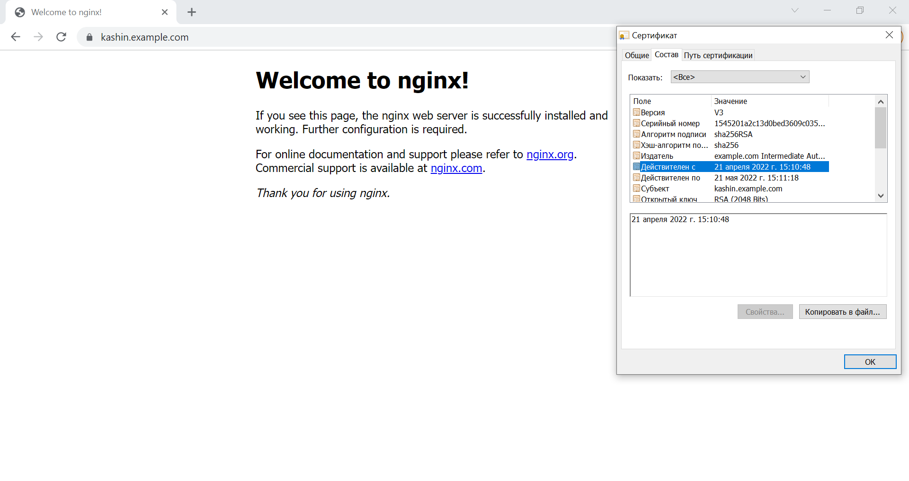
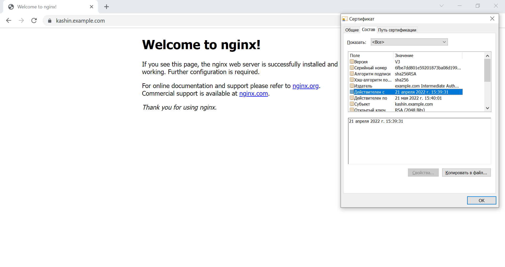

# Курсовая работа по итогам модуля "DevOps и системное администрирование"

## 1. Создайте виртуальную машину Linux.
*Решение:*  
- Установил Oracle VM VirtualBox, Vagrant
- Настройка. Содержимое Vagrantfile:
  ```
  Vagrant.configure("2") do |config|
      config.vm.box = "bento/ubuntu-20.04"
      config.vm.network "private_network", ip: "192.168.33.16"
  end
  ```
- Запуск виртуальной машины:
```shell
PS C:\!MyData\DevOps\CourseWork\Vagrant> vagrant up
Bringing machine 'default' up with 'virtualbox' provider...
==> default: Importing base box 'bento/ubuntu-20.04'...
...

PS C:\!MyData\DevOps\CourseWork\Vagrant> vagrant ssh
Welcome to Ubuntu 20.04.3 LTS (GNU/Linux 5.4.0-91-generic x86_64)

 * Documentation:  https://help.ubuntu.com
 * Management:     https://landscape.canonical.com
 * Support:        https://ubuntu.com/advantage

  System information as of Thu 21 Apr 2022 08:15:30 AM UTC

  System load:  0.79               Processes:             126
  Usage of /:   11.3% of 30.88GB   Users logged in:       0
  Memory usage: 20%                IPv4 address for eth0: 10.0.2.15
  Swap usage:   0%                 IPv4 address for eth1: 192.168.33.16


This system is built by the Bento project by Chef Software
More information can be found at https://github.com/chef/bento
```
- Обновляем все предустановленные пакеты до последних версий
```shell
sudo apt update
sudo apt upgrade
```
## 2. Установите ufw и разрешите к этой машине сессии на порты 22 и 443, при этом трафик на интерфейсе localhost (lo) должен ходить свободно на все порты.
*Решение:*  
- Установка:
    ```shell
    vagrant@vagrant:~$ sudo apt install ufw
    Reading package lists... Done
    Building dependency tree
    Reading state information... Done
    ufw is already the newest version (0.36-6ubuntu1).
    0 upgraded, 0 newly installed, 0 to remove and 0 not upgraded.
    ```
- Настройка:
  ```shell
  vagrant@vagrant:~$ sudo ufw allow 22/tcp
  Rules updated
  Rules updated (v6)
  vagrant@vagrant:~$ sudo ufw allow 443/tcp
  Rules updated
  Rules updated (v6)
  vagrant@vagrant:~$ sudo ufw allow openSSH
  Rule added
  Rule added (v6)
  vagrant@vagrant:~$ sudo ufw allow "Nginx Full"
  Rule added
  Rule added (v6)
  vagrant@vagrant:~$ sudo ufw enable
  vagrant@vagrant:~$ sudo ufw status verbose
  Status: active
  Logging: on (low)
  Default: deny (incoming), allow (outgoing), disabled (routed)
  New profiles: skip
  
  To                         Action      From
  --                         ------      ----
  22/tcp                     ALLOW IN    Anywhere
  443/tcp                    ALLOW IN    Anywhere
  22/tcp (OpenSSH)           ALLOW IN    Anywhere
  80,443/tcp (Nginx Full)    ALLOW IN    Anywhere
  22/tcp (v6)                ALLOW IN    Anywhere (v6)
  443/tcp (v6)               ALLOW IN    Anywhere (v6)
  22/tcp (OpenSSH (v6))      ALLOW IN    Anywhere (v6)
  80,443/tcp (Nginx Full (v6)) ALLOW IN    Anywhere (v6)
  ```

## 3. Установите hashicorp vault.
*Решение:*  
- Установка (предварительно включил VPN)
  ```shell
  vagrant@vagrant:~$ curl -fsSL https://apt.releases.hashicorp.com/gpg | sudo apt-key add -
  OK
  vagrant@vagrant:~$ sudo apt-add-repository "deb [arch=amd64] https://apt.releases.hashicorp.com $(lsb_release -cs) main"
  Get:1 https://apt.releases.hashicorp.com focal InRelease [16.3 kB]
  Get:2 https://apt.releases.hashicorp.com focal/main amd64 Packages [50.7 kB]
  Hit:3 http://us.archive.ubuntu.com/ubuntu focal InRelease
  Get:4 http://us.archive.ubuntu.com/ubuntu focal-updates InRelease [114 kB]
  Get:5 http://us.archive.ubuntu.com/ubuntu focal-backports InRelease [108 kB]
  Get:6 http://us.archive.ubuntu.com/ubuntu focal-security InRelease [114 kB]
  Get:7 http://us.archive.ubuntu.com/ubuntu focal-updates/main amd64 Packages [1,712 kB]
  Get:8 http://us.archive.ubuntu.com/ubuntu focal-updates/main Translation-en [320 kB]
  Get:9 http://us.archive.ubuntu.com/ubuntu focal-updates/restricted amd64 Packages [917 kB]
  Get:10 http://us.archive.ubuntu.com/ubuntu focal-updates/restricted Translation-en [131 kB]
  Get:11 http://us.archive.ubuntu.com/ubuntu focal-updates/universe amd64 Packages [918 kB]
  Get:12 http://us.archive.ubuntu.com/ubuntu focal-updates/universe Translation-en [205 kB]
  Get:13 http://us.archive.ubuntu.com/ubuntu focal-updates/multiverse amd64 Packages [24.4 kB]
  Get:14 http://us.archive.ubuntu.com/ubuntu focal-updates/multiverse Translation-en [7,336 B]
  Get:15 http://us.archive.ubuntu.com/ubuntu focal-backports/main amd64 Packages [42.2 kB]
  Get:16 http://us.archive.ubuntu.com/ubuntu focal-backports/main Translation-en [10.1 kB]
  Get:17 http://us.archive.ubuntu.com/ubuntu focal-backports/universe amd64 Packages [22.7 kB]
  Get:18 http://us.archive.ubuntu.com/ubuntu focal-backports/universe Translation-en [15.5 kB]
  Get:19 http://us.archive.ubuntu.com/ubuntu focal-security/main amd64 Packages [1,385 kB]
  Get:20 http://us.archive.ubuntu.com/ubuntu focal-security/main Translation-en [240 kB]
  Get:21 http://us.archive.ubuntu.com/ubuntu focal-security/restricted amd64 Packages [859 kB]
  Get:22 http://us.archive.ubuntu.com/ubuntu focal-security/restricted Translation-en [122 kB]
  Get:23 http://us.archive.ubuntu.com/ubuntu focal-security/universe amd64 Packages [698 kB]
  Get:24 http://us.archive.ubuntu.com/ubuntu focal-security/universe Translation-en [124 kB]
  Get:25 http://us.archive.ubuntu.com/ubuntu focal-security/multiverse amd64 Packages [20.7 kB]
  Get:26 http://us.archive.ubuntu.com/ubuntu focal-security/multiverse Translation-en [5,196 B]
  Fetched 8,184 kB in 23s (363 kB/s)
  Reading package lists... Done
  vagrant@vagrant:~$ sudo apt-get update && sudo apt-get install vault
  Hit:1 http://us.archive.ubuntu.com/ubuntu focal InRelease
  Hit:2 https://apt.releases.hashicorp.com focal InRelease
  Hit:3 http://us.archive.ubuntu.com/ubuntu focal-updates InRelease
  Hit:4 http://us.archive.ubuntu.com/ubuntu focal-backports InRelease
  Hit:5 http://us.archive.ubuntu.com/ubuntu focal-security InRelease
  Reading package lists... Done
  Reading package lists... Done
  Building dependency tree
  Reading state information... Done
  The following NEW packages will be installed:
    vault
  0 upgraded, 1 newly installed, 0 to remove and 98 not upgraded.
  Need to get 70.4 MB of archives.
  After this operation, 191 MB of additional disk space will be used.
  Get:1 https://apt.releases.hashicorp.com focal/main amd64 vault amd64 1.10.0 [70.4 MB]
  Fetched 70.4 MB in 14s (5,151 kB/s)
  Selecting previously unselected package vault.
  (Reading database ... 40620 files and directories currently installed.)
  Preparing to unpack .../vault_1.10.0_amd64.deb ...
  Unpacking vault (1.10.0) ...
  Setting up vault (1.10.0) ...
  Generating Vault TLS key and self-signed certificate...
  Generating a RSA private key
  ..............................................................................................++++
  ........................++++
  writing new private key to 'tls.key'
  -----
  Vault TLS key and self-signed certificate have been generated in '/opt/vault/tls'.
  ```
- Проверка
  ```shell
  vagrant@vagrant:~$ vault
  Usage: vault <command> [args]
  
  Common commands:
      read        Read data and retrieves secrets
      write       Write data, configuration, and secrets
      delete      Delete secrets and configuration
      list        List data or secrets
      login       Authenticate locally
      agent       Start a Vault agent
      server      Start a Vault server
      status      Print seal and HA status
      unwrap      Unwrap a wrapped secret
  
  Other commands:
      audit                Interact with audit devices
      auth                 Interact with auth methods
      debug                Runs the debug command
      kv                   Interact with Vault's Key-Value storage
      lease                Interact with leases
      monitor              Stream log messages from a Vault server
      namespace            Interact with namespaces
      operator             Perform operator-specific tasks
      path-help            Retrieve API help for paths
      plugin               Interact with Vault plugins and catalog
      policy               Interact with policies
      print                Prints runtime configurations
      secrets              Interact with secrets engines
      ssh                  Initiate an SSH session
      token                Interact with tokens
      version-history      Prints the version history of the target Vault server
  ```
## 4. Cоздайте центр сертификации по инструкции ([ссылка](https://learn.hashicorp.com/tutorials/vault/pki-engine?in=vault/secrets-management)) и выпустите сертификат для использования его в настройке веб-сервера nginx (срок жизни сертификата - месяц).
*Решение:*  
- Запускаем сервер Vault в отдельном теминале
```shell
vagrant@vagrant:~$ vault server -dev -dev-root-token-id root
==> Vault server configuration:

             Api Address: http://127.0.0.1:8200
                     Cgo: disabled
         Cluster Address: https://127.0.0.1:8201
              Go Version: go1.17.7
              Listener 1: tcp (addr: "127.0.0.1:8200", cluster address: "127.0.0.1:8201", max_request_duration: "1m30s", max_request_size: "33554432", tls: "disabled")
               Log Level: info
                   Mlock: supported: true, enabled: false
           Recovery Mode: false
                 Storage: inmem
                 Version: Vault v1.10.0
             Version Sha: 7738ec5d0d6f5bf94a809ee0f6ff0142cfa525a6

==> Vault server started! Log data will stream in below:

2022-04-21T10:07:53.809Z [INFO]  proxy environment: http_proxy="" https_proxy="" no_proxy=""
2022-04-21T10:07:53.810Z [WARN]  no `api_addr` value specified in config or in VAULT_API_ADDR; falling back to detection if possible, but this value should be manually set
2022-04-21T10:07:53.816Z [INFO]  core: Initializing versionTimestamps for core
2022-04-21T10:07:53.819Z [INFO]  core: security barrier not initialized
2022-04-21T10:07:53.819Z [INFO]  core: security barrier initialized: stored=1 shares=1 threshold=1
2022-04-21T10:07:53.824Z [INFO]  core: post-unseal setup starting
2022-04-21T10:07:53.827Z [INFO]  core: loaded wrapping token key
2022-04-21T10:07:53.827Z [INFO]  core: Recorded vault version: vault version=1.10.0 upgrade time="2022-04-21 10:07:53.827135144 +0000 UTC"
2022-04-21T10:07:53.828Z [INFO]  core: successfully setup plugin catalog: plugin-directory=""
2022-04-21T10:07:53.828Z [INFO]  core: no mounts; adding default mount table
2022-04-21T10:07:53.830Z [INFO]  core: successfully mounted backend: type=cubbyhole path=cubbyhole/
2022-04-21T10:07:53.832Z [INFO]  core: successfully mounted backend: type=system path=sys/
2022-04-21T10:07:53.836Z [INFO]  core: successfully mounted backend: type=identity path=identity/
2022-04-21T10:07:53.841Z [INFO]  core: successfully enabled credential backend: type=token path=token/
2022-04-21T10:07:53.842Z [INFO]  core: restoring leases
2022-04-21T10:07:53.845Z [INFO]  rollback: starting rollback manager
2022-04-21T10:07:53.846Z [INFO]  expiration: lease restore complete
2022-04-21T10:07:53.846Z [INFO]  identity: entities restored
2022-04-21T10:07:53.846Z [INFO]  identity: groups restored
2022-04-21T10:07:54.812Z [INFO]  core: post-unseal setup complete
2022-04-21T10:07:54.812Z [INFO]  core: root token generated
2022-04-21T10:07:54.812Z [INFO]  core: pre-seal teardown starting
2022-04-21T10:07:54.812Z [INFO]  rollback: stopping rollback manager
2022-04-21T10:07:54.812Z [INFO]  core: pre-seal teardown complete
2022-04-21T10:07:54.812Z [INFO]  core.cluster-listener.tcp: starting listener: listener_address=127.0.0.1:8201
2022-04-21T10:07:54.812Z [INFO]  core.cluster-listener: serving cluster requests: cluster_listen_address=127.0.0.1:8201
2022-04-21T10:07:54.812Z [INFO]  core: post-unseal setup starting
2022-04-21T10:07:54.813Z [INFO]  core: loaded wrapping token key
2022-04-21T10:07:54.813Z [INFO]  core: successfully setup plugin catalog: plugin-directory=""
2022-04-21T10:07:54.813Z [INFO]  core: successfully mounted backend: type=system path=sys/
2022-04-21T10:07:54.813Z [INFO]  core: successfully mounted backend: type=identity path=identity/
2022-04-21T10:07:54.813Z [INFO]  core: successfully mounted backend: type=cubbyhole path=cubbyhole/
2022-04-21T10:07:54.814Z [INFO]  core: successfully enabled credential backend: type=token path=token/
2022-04-21T10:07:54.815Z [INFO]  core: restoring leases
2022-04-21T10:07:54.815Z [INFO]  rollback: starting rollback manager
2022-04-21T10:07:54.815Z [INFO]  expiration: lease restore complete
2022-04-21T10:07:54.815Z [INFO]  identity: entities restored
2022-04-21T10:07:54.815Z [INFO]  identity: groups restored
2022-04-21T10:07:54.815Z [INFO]  core: post-unseal setup complete
2022-04-21T10:07:54.815Z [INFO]  core: vault is unsealed
2022-04-21T10:07:54.817Z [INFO]  expiration: revoked lease: lease_id=auth/token/root/hbc8b34d0e417cf4efca713e87ee0863f1a4f6a18a491d0af41986782bb017188
2022-04-21T10:07:54.825Z [INFO]  core: successful mount: namespace="" path=secret/ type=kv
2022-04-21T10:07:54.833Z [INFO]  secrets.kv.kv_20235384: collecting keys to upgrade
2022-04-21T10:07:54.834Z [INFO]  secrets.kv.kv_20235384: done collecting keys: num_keys=1
2022-04-21T10:07:54.835Z [INFO]  secrets.kv.kv_20235384: upgrading keys finished
WARNING! dev mode is enabled! In this mode, Vault runs entirely in-memory
and starts unsealed with a single unseal key. The root token is already
authenticated to the CLI, so you can immediately begin using Vault.

You may need to set the following environment variable:

    $ export VAULT_ADDR='http://127.0.0.1:8200'

The unseal key and root token are displayed below in case you want to
seal/unseal the Vault or re-authenticate.

Unseal Key: rvjNdm5z4kAdvJfbIJgQZLxxGazZq5ZApTtyZJ8exo0=
Root Token: root

Development mode should NOT be used in production installations!
```
- В рабочем терминале устанавливаем связь с сервером Vault
```shell
vagrant@vagrant:~$ export VAULT_ADDR=http://127.0.0.1:8200
vagrant@vagrant:~$ export VAULT_TOKEN=root
```
- Создаем корневой сертификат центра сертификации:
```shell
vagrant@vagrant:~$ vault secrets enable pki
Success! Enabled the pki secrets engine at: pki/
vagrant@vagrant:~$ vault secrets tune -max-lease-ttl=87600h pki
Success! Tuned the secrets engine at: pki/
vagrant@vagrant:~$ vault write -field=certificate pki/root/generate/internal \
>      common_name="example.com" \
>      ttl=87600h > CA_cert.crt
vagrant@vagrant:~$ vault write pki/config/urls \
>      issuing_certificates="$VAULT_ADDR/v1/pki/ca" \
>      crl_distribution_points="$VAULT_ADDR/v1/pki/crl"
Success! Data written to: pki/config/urls
```
- Содаем промежутночный сертификат центра сертификации
```shell
vagrant@vagrant:~$ vault secrets enable -path=pki_int pki
Success! Enabled the pki secrets engine at: pki_int/
vagrant@vagrant:~$ vault secrets tune -max-lease-ttl=43800h pki_int
Success! Tuned the secrets engine at: pki_int/
...
vagrant@vagrant:~$ sudo apt install jq
...
vagrant@vagrant:~$ vault write -format=json pki_int/intermediate/generate/internal
>      common_name="example.com Intermediate Authority"      
>      | jq -r '.data.csr' > pki_intermediate.csr
vagrant@vagrant:~$ vault write -format=json pki/root/sign-intermediate csr=@pki_intermediate.csr \
>      format=pem_bundle ttl="43800h" \
>      | jq -r '.data.certificate' > intermediate.cert.pem
vagrant@vagrant:~$ vault write pki_int/intermediate/set-signed certificate=@intermediate.cert.pem
Success! Data written to: pki_int/intermediate/set-signed
```
- Создаем роль example-dot-com
```shell
vagrant@vagrant:~$ vault write pki_int/roles/example-dot-com \
>      allowed_domains="example.com" \
>      allow_subdomains=true \
>      max_ttl="720h"
Success! Data written to: pki_int/roles/example-dot-com
```
- Создаем сертификат для домена `kashin.example.com` и сохраняем его в файлы
```shell
vagrant@vagrant:~$ vault write -format=json pki_int/issue/example-dot-com \
>  common_name="kashin.example.com" \
>  alt_names="kashin.example.com" \
>  ttl="720h" > kashin.example.com.crt
vagrant@vagrant:~$ cat kashin.example.com.crt | jq -r .data.certificate > kashin.example.com.crt.pem
vagrant@vagrant:~$ cat kashin.example.com.crt | jq -r .data.issuing_ca >> kashin.example.com.crt.pem
vagrant@vagrant:~$ cat kashin.example.com.crt | jq -r .data.private_key > kashin.example.com.crt.key
```

## 5. Установите корневой сертификат созданного центра сертификации в доверенные в хостовой системе.
- Копируем сертификаты на хостовую машину
```shell
vagrant@vagrant:~$ cp CA_cert.crt /vagrant/
vagrant@vagrant:~$ cp intermediate.cert.pem /vagrant/
vagrant@vagrant:~$ cp kashin.example.com.crt.pem /vagrant/
```
- Устанавливаем сертификаты нашего ЦС на хостовой машине (Win10)

 
## 6. Установите nginx.
```shell
vagrant@vagrant:~$ sudo apt install nginx
```
После установки на хостовой машине по `http://IP вирутальной машины` открывается приветсвенная страница nginx.


## 7. По инструкции ([ссылка](https://nginx.org/en/docs/http/configuring_https_servers.html)) настройте nginx на https, используя ранее подготовленный сертификат:
- В настойки nginx добавляем ссылку на сертификат и включаем HTTPS (отключаем HTTP)
```shell
vagrant@vagrant:~$ sudo nano /etc/nginx/sites-available/default
server {
        listen 443 ssl default_server;
        server_name kashin.example.com;
        ssl_certificate /home/vagrant/kashin.example.com.crt.pem;
        ssl_certificate_key /home/vagrant/kashin.example.com.crt.key;
        ...
```
- Проверяем корректность настроек, перезапускаем nginx
```shell
vagrant@vagrant:~$ sudo nginx -t
nginx: the configuration file /etc/nginx/nginx.conf syntax is ok
nginx: configuration file /etc/nginx/nginx.conf test is successful
vagrant@vagrant:~$ sudo systemctl restart nginx
```

## 8. Откройте в браузере на хосте https адрес страницы, которую обслуживает сервер nginx.
Т.к. сертификат выдан на доменное имя kashin.example.com, а не на IP виртуальной машины, на хостовой машине в файл 
`C:\Windows\System32\drivers\etc\hosts` была добавлена строчка `192.168.33.16	kashin.example.com`

- Google Chrome


- FireFox (потребовалось предварительно установить корневой и промежуточный сертификат в FireFox)


## 9. Создайте скрипт, который будет генерировать новый сертификат в vault:
  - генерируем новый сертификат так, чтобы не переписывать конфиг nginx;
  - перезапускаем nginx для применения нового сертификата.

*Решение:*  
- Создаю файл
```shell
vagrant@vagrant:~$ touch kashin.example.com.sert.maker.sh
```
- Делаю его исполняемым
```shell
vagrant@vagrant:~$ chmod +x kashin.example.com.sert.maker.sh
```
- Содержимое файла:
```shell
#!/usr/bin/env bash
cd /home/vagrant
export VAULT_ADDR=http://127.0.0.1:8200
export VAULT_TOKEN=root

vault write -format=json pki_int/issue/example-dot-com common_name="kashin.example.com" alt_names="kashin.example.com" ttl="720h" > >
if [ "$?" -eq "0" ]
then
cat kashin.example.com.crt | jq -r .data.certificate > kashin.example.com.crt.pem
cat kashin.example.com.crt | jq -r .data.issuing_ca >> kashin.example.com.crt.pem
cat kashin.example.com.crt | jq -r .data.private_key > kashin.example.com.crt.key
sudo systemctl restart nginx
echo "New certificate created!"
else
echo "Error while creating a new certificate."
fi
``` 
- Проверяем что скрипт работает
```shell
vagrant@vagrant:~$ bash kashin.example.com.sert.maker.sh
New certificate created! 
```
- Через браузер на хостовой машине убеждаемся что kashin.example.com доступен по HTTPS, время начала жизни сертификата обновилось.


## 10. Поместите скрипт в crontab, чтобы сертификат обновлялся какого-то числа каждого месяца в удобное для вас время.
- Устанавливаем автозапуск каждые 5 минут
```shell
vagrant@vagrant:~$ crontab -e
no crontab for vagrant - using an empty one

Select an editor.  To change later, run 'select-editor'.
  1. /bin/nano        <---- easiest
  2. /usr/bin/vim.basic
  3. /usr/bin/vim.tiny
  4. /bin/ed

Choose 1-4 [1]: 1

добавил в файл строку:
*/5 * * * * /home/vagrant/kashin.example.com.sert.maker.sh

crontab: installing new crontab
```
- Чере 5 минут проверяем что сертификат изменился.


