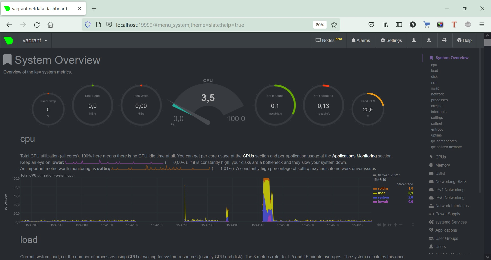

# Домашнее задание к занятию "3.4. Операционные системы, лекция 2"

### 1. На лекции мы познакомились с [node_exporter](https://github.com/prometheus/node_exporter/releases). В демонстрации его исполняемый файл запускался в background. Этого достаточно для демо, но не для настоящей production-системы, где процессы должны находиться под внешним управлением. Используя знания из лекции по systemd, создайте самостоятельно простой [unit-файл](https://www.freedesktop.org/software/systemd/man/systemd.service.html) для node_exporter:
* поместите его в автозагрузку,
* предусмотрите возможность добавления опций к запускаемому процессу через внешний файл (посмотрите, например, на `systemctl cat cron`),
* удостоверьтесь, что с помощью systemctl процесс корректно стартует, завершается, а после перезагрузки автоматически поднимается.  

*Ответ:*  
1. Скачал и распаковал архив с node_exporter 1.3.1. в дирикторию /opt/node_exporter
```shell
vagrant@vagrant:/$ sudo mkdir -p /opt/node_exporter
vagrant@vagrant:/$ cd /opt/node_exporter
vagrant@vagrant:/opt/node_exporter$ sudo wget https://github.com/prometheus/node_exporter/releases/download/v1.3.1/node_exporter-1.3.1.linux-amd64.tar.gz -P /opt/node_exporter
    ...
    Saving to: ‘/opt/node_exporter/node_exporter-1.3.1.linux-amd64.tar.gz’
    node_exporter-1.3.1.linux-amd64.t 100%[==========================================================>]   8.61M   790KB/s    in 13s
    2022-02-17 08:56:59 (686 KB/s) - ‘/opt/node_exporter/node_exporter-1.3.1.linux-amd64.tar.gz’ saved [9033415/9033415]

vagrant@vagrant:/tmp$ tar -zxpvf node_exporter-1.3.1.linux-amd64.tar.gz

... удаляем лишние файлы и дириктории, в итоге получаем:

vagrant@vagrant:/opt/node_exporter$ ls -l
total 17820
    -rw-r--r-- 1 3434 3434    11357 Dec  5 11:15 LICENSE
    -rwxr-xr-x 1 3434 3434 18228926 Dec  5 11:10 node_exporter
    -rw-r--r-- 1 3434 3434      463 Dec  5 11:15 NOTICE

```
2. Создаю системного пользователя из-под которого будет запускаться node_exporter 
```shell
sudo useradd -rs /bin/false node_exporter_usr
```
назначаю владельцем файла node_exporter созданного пользователя node_exporter_usr
```shell
sudo chown node_exporter_usr:node_exporter_usr /opt/node_exporter/node_exporter
```
3. Создаю служебный файл в systemd для node_exporter.
```shell
sudo touch /etc/systemd/system/node_exporter.service
```
открываю его на редактирование 
```shell
sudo nano /etc/systemd/system/node_exporter.service
```
меняю содержание на следующее
```shell
[Unit]
Description=Node Exporter
After=network.target

[Service]
User=node_exporter_usr
Group=node_exporter_usr
Type=simple
ExecStart=/opt/node_exporter/node_exporter

[Install]
WantedBy=multi-user.target
```
4. Перезапускаем systemd
```shell
sudo systemctl daemon-reload
```
5. Запускаю node_exporter
```shell
sudo systemctl start node_exporter
```
6. Проверяю что node_exporter запустился и работает
```shell
vagrant@vagrant:/opt/node_exporter$ sudo systemctl status node_exporter
● node_exporter.service - Node Exporter
     Loaded: loaded (/etc/systemd/system/node_exporter.service; disabled; vendor preset: enabled)
     Active: active (running) since Thu 2022-02-17 12:21:39 UTC; 5s ago
   Main PID: 9807 (node_exporter)
      Tasks: 5 (limit: 1071)
     Memory: 13.7M
     CGroup: /system.slice/node_exporter.service
             └─9807 /opt/node_exporter/node_exporter
    ...
```
7. Добавляю node_eporter в автозагрузку
```shell
vagrant@vagrant:/opt/node_exporter$ sudo systemctl enable node_exporter
Created symlink /etc/systemd/system/multi-user.target.wants/node_exporter.service → /etc/systemd/system/node_exporter.service.
```
8. Выключаю node_eporter
```shell
vagrant@vagrant:/opt/node_exporter$ sudo systemctl stop node_exporter
vagrant@vagrant:/opt/node_exporter$ sudo systemctl status node_exporter
● node_exporter.service - Node Exporter
     Loaded: loaded (/etc/systemd/system/node_exporter.service; enabled; vendor preset: enabled)
     Active: inactive (dead) since Thu 2022-02-17 12:39:09 UTC; 4s ago
    Process: 9807 ExecStart=/opt/node_exporter/node_exporter (code=killed, signal=TERM)
   Main PID: 9807 (code=killed, signal=TERM)
   ...
   Feb 17 12:39:09 vagrant systemd[1]: Stopping Node Exporter...
   Feb 17 12:39:09 vagrant systemd[1]: node_exporter.service: Succeeded.
   Feb 17 12:39:09 vagrant systemd[1]: Stopped Node Exporter.
```
9. Проверяю что после перезапуска node_eporter автоматически запускается
```shell
vagrant halt
vagrant up
vagrant ssh

vagrant@vagrant:~$ sudo systemctl status node_exporter
● node_exporter.service - Node Exporter
     Loaded: loaded (/etc/systemd/system/node_exporter.service; enabled; vendor preset: enabled)
     Active: active (running) since Thu 2022-02-17 12:48:06 UTC; 32s ago
   Main PID: 637 (node_exporter)
      Tasks: 4 (limit: 1071)
     Memory: 14.7M
     CGroup: /system.slice/node_exporter.service
             └─637 /opt/node_exporter/node_exporter
```
10. Создаю конфигурационный файл для node_exporter
```shell
sudo touch /opt/node_exporter/node_exporter_options
```
Записываю в него параметры с которыми будет запускаться node_exporter
```shell
OPTIONS="--log.level=debug"
```
Все возможные параметры можно найти здесь:
```
/opt/node_exporter/node_exporter --help
```

11. Изменяю служебный файл в systemd для node_exporter для запуска с параметрами.  
Добавляю путь к файлу с переменными окружения EnvironmentFile=.  
И в ExecStart= в строку запуска добавляю название переменной ($OPTIONS) вместо которой при запуске будет подставляться ее значение из файла EnvironmentFile.
```shell
sudo nano /etc/systemd/system/node_exporter.service
```
```shell
[Unit]
Description=Node Exporter
After=network.target

[Service]
User=node_exporter_usr
Group=node_exporter_usr
Type=simple
EnvironmentFile=/opt/node_exporter/node_exporter_options
ExecStart=/opt/node_exporter/node_exporter $OPTIONS

[Install]
WantedBy=multi-user.target
```
12. Проверяю что после перезапуска node_exporter стартует с новыми параметрами
```shell
vagrant@vagrant:~$ sudo systemctl status node_exporter
● node_exporter.service - Node Exporter
     Loaded: loaded (/etc/systemd/system/node_exporter.service; enabled; vendor preset: enabled)
     Active: active (running) since Thu 2022-02-17 17:45:22 UTC; 7s ago
   Main PID: 2248 (node_exporter)
      Tasks: 5 (limit: 1071)
     Memory: 2.4M
     CGroup: /system.slice/node_exporter.service
             └─2248 /opt/node_exporter/node_exporter --log.level=debug
    ...
```
### 2. Ознакомьтесь с опциями node_exporter и выводом `/metrics` по-умолчанию. Приведите несколько опций, которые вы бы выбрали для базового мониторинга хоста по CPU, памяти, диску и сети.
*Ответ:*  
Выводим метрики
```shell
curl localhost:9100/metrics
```
Поиском по словам "cpu", "memory", "disk", "network" находим нужные метрики:  

- CPU:
```shell
    node_cpu_seconds_total{cpu="0",mode="idle"} 
    node_cpu_seconds_total{cpu="0",mode="system"} 
    node_cpu_seconds_total{cpu="0",mode="user"}
    node_cpu_seconds_total{cpu="1",mode="idle"} 
    node_cpu_seconds_total{cpu="1",mode="system"} 
    node_cpu_seconds_total{cpu="1",mode="user"}
    process_cpu_seconds_total
```
- Память:
```shell
    node_memory_MemAvailable_bytes 
    node_memory_MemFree_bytes
    node_memory_MemTotal_bytes
```
- Диск:
```shell
    node_disk_io_time_seconds_total{device="sda"} 
    node_disk_read_time_seconds_total{device="sda"} 
    node_disk_write_time_seconds_total{device="sda"}
    node_disk_read_bytes_total{device="sda"} 
    node_disk_written_bytes_total{device="sda"}
```
- Сеть:
```shell
    node_network_receive_errs_total{device="eth0"} 
    node_network_receive_bytes_total{device="eth0"} 
    node_network_transmit_bytes_total{device="eth0"}
    node_network_transmit_errs_total{device="eth0"}
```

### 3. Установите в свою виртуальную машину [Netdata](https://github.com/netdata/netdata). Воспользуйтесь [готовыми пакетами](https://packagecloud.io/netdata/netdata/install) для установки (`sudo apt install -y netdata`). После успешной установки:
* в конфигурационном файле `/etc/netdata/netdata.conf` в секции [web] замените значение с localhost на `bind to = 0.0.0.0`,
* добавьте в Vagrantfile проброс порта Netdata на свой локальный компьютер и сделайте `vagrant reload`:
```shell
    config.vm.network "forwarded_port", guest: 19999, host: 19999
```
* После успешной перезагрузки в браузере *на своем ПК* (не в виртуальной машине) вы должны суметь зайти на `localhost:19999`. Ознакомьтесь с метриками, которые по умолчанию собираются Netdata и с комментариями, которые даны к этим метрикам.  

*Ответ:*  
Все получилось.


### 4. Можно ли по выводу `dmesg` понять, осознает ли ОС, что загружена не на настоящем оборудовании, а на системе виртуализации?
*Ответ:*  
Да, ОС понимает что загружена в виртуальной среде.
```shell
vagrant@vagrant:~$ dmesg | grep virt
[    0.009091] CPU MTRRs all blank - virtualized system.
[    0.269952] Booting paravirtualized kernel on KVM
[    6.293780] systemd[1]: Detected virtualization oracle.
```
### 5. Как настроен sysctl `fs.nr_open` на системе по-умолчанию? Узнайте, что означает этот параметр. Какой другой существующий лимит не позволит достичь такого числа (`ulimit --help`)?
*Ответ:*  
```shell
vagrant@vagrant:~$ sysctl fs.nr_open
fs.nr_open = 1048576
```
Этот параметр означает максимальное количество файловых дескрипторов, которые может выделить процесс. Значение по умолчанию — 1024*1024 (1048576).  
Данного значения не позволит достичь другое ограничение:
```shell
vagrant@vagrant:~$ ulimit -n
1024
```

### 6. Запустите любой долгоживущий процесс (не `ls`, который отработает мгновенно, а, например, `sleep 1h`) в отдельном неймспейсе процессов; покажите, что ваш процесс работает под PID 1 через `nsenter`. Для простоты работайте в данном задании под root (`sudo -i`). Под обычным пользователем требуются дополнительные опции (`--map-root-user`) и т.д.  
*Ответ:*  
```shell
vagrant@vagrant:~$ sudo -i
root@vagrant:~# unshare -f --pid --mount-proc sleep 15m &
[1] 33711
root@vagrant:~# ps aux | grep 15m
root       33711  0.0  0.0   5480   592 pts/0    S    17:47   0:00 unshare -f --pid --mount-proc sleep 15m
root       33712  0.0  0.0   5476   520 pts/0    S    17:47   0:00 sleep 15m
root       33714  0.0  0.0   6300   672 pts/0    S+   17:47   0:00 grep --color=auto 15m
root@vagrant:~# nsenter --target 33712 --pid --mount
root@vagrant:/# ps aux
USER         PID %CPU %MEM    VSZ   RSS TTY      STAT START   TIME COMMAND
root           1  0.0  0.0   5476   520 pts/0    S    17:47   0:00 sleep 15m
root           2  0.0  0.4   7236  4100 pts/0    S    17:48   0:00 -bash
root          13  0.0  0.3   8892  3324 pts/0    R+   17:48   0:00 ps aux
```

### 7. Найдите информацию о том, что такое `:(){ :|:& };:`. Запустите эту команду в своей виртуальной машине Vagrant с Ubuntu 20.04 (**это важно, поведение в других ОС не проверялось**). Некоторое время все будет "плохо", после чего (минуты) – ОС должна стабилизироваться. Вызов `dmesg` расскажет, какой механизм помог автоматической стабилизации. Как настроен этот механизм по-умолчанию, и как изменить число процессов, которое можно создать в сессии?
*Ответ:*  
`:(){ :|:& };:` - Это называется форк-бомбой. Функция `:`, которая вызывает рекурсивно сама себя.
Чтоб стало нагляднее что происходит можно `:` переименовать например в `foo`
```
foo()
{
 foo | foo&
}; foo
```
Таким образом возникает очень большое количество процессов в сессии.  
В выводе `dmesg` виден механизм который помог ОС стабилизироваться.
```shell
[ 8594.883664] cgroup: fork rejected by pids controller in /user.slice/user-1000.slice/session-3.scope
```
`Systemd` создает `cgroup` для каждого пользователя, и все процессы пользователя принадлежат к одной и той же `cgroup`.  
`Cgroups` — это механизм Linux для установки ограничений на системные ресурсы, такие как максимальное количество процессов, циклов ЦП, использование ОЗУ и т.д.  
Это другой, более современный уровень ограничения ресурсов, чем `ulimit`.  

Чтобы посмотреть разрешенное количество процессов необходимо выполнить следующую команду (user-uid взял из предыдущего вывода `dmesg`):  
```shell
vagrant@vagrant:~$ systemctl status user-1000.slice
● user-1000.slice - User Slice of UID 1000
     Loaded: loaded
    Drop-In: /usr/lib/systemd/system/user-.slice.d
             └─10-defaults.conf
     Active: active since Fri 2022-02-18 08:51:20 UTC; 5h 17min ago
       Docs: man:user@.service(5)
      Tasks: 7 (limit: 2356)
     Memory: 44.5M
     ...
```
По-умолчанию, максимальное количество задач, которые systemd разрешает каждому пользователю, составляет 33% от «общесистемного максимума» ( sysctl kernel.threads-max);  
```shell
vagrant@vagrant:~$ sysctl kernel.threads-max
kernel.threads-max = 7142
```
7142 * 0.33 = 2356  

Изменить это ограничение можно такими способами:
* Для всех пользователей. Нужно изменить TasksMax= в файле   
`sudo nano /usr/lib/systemd/system/user-.slice.d/10-defaults.conf`  
```shell
#  SPDX-License-Identifier: LGPL-2.1+
#
#  This file is part of systemd.
#
#  systemd is free software; you can redistribute it and/or modify it
#  under the terms of the GNU Lesser General Public License as published by
#  the Free Software Foundation; either version 2.1 of the License, or
#  (at your option) any later version.

[Unit]
Description=User Slice of UID %j
Documentation=man:user@.service(5)
After=systemd-user-sessions.service
StopWhenUnneeded=yes

[Slice]
TasksMax=33%
```
* Чтобы настроить лимит для конкретного пользователя (который будет применен немедленно, а также сохранен в /etc/systemd/system.control), запустите:
`systemctl [--runtime] set-property user-<uid>.slice TasksMax=<value>`
* Если мы хотим изменить ограничение для каждого пользователя, можено их указать в файле `/etc/systemd/system/user-.slice.d/15-limits.conf`. Но изменения потребуют рестарта systemd.
