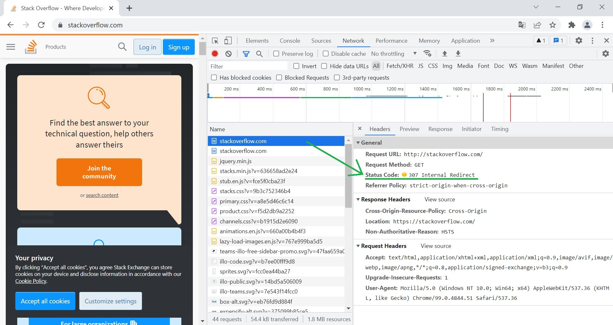
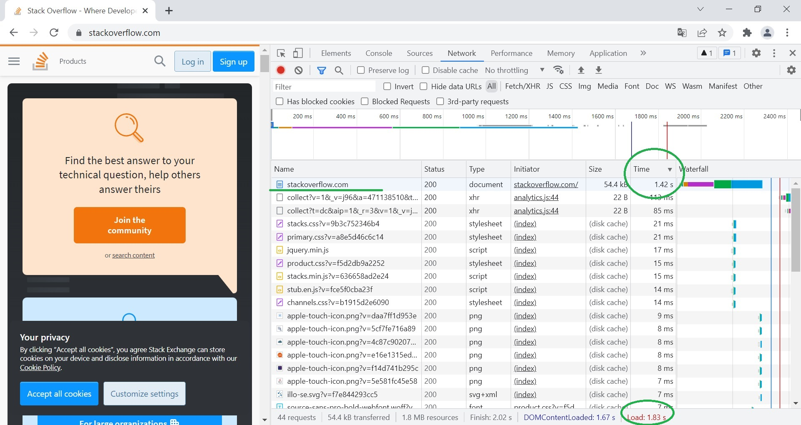
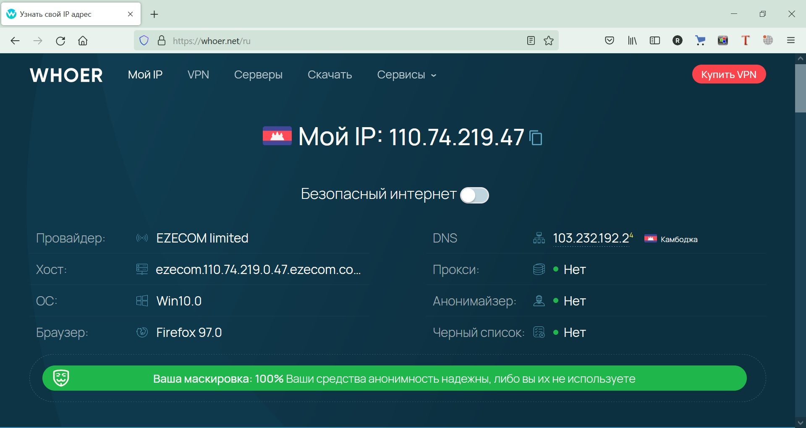

# Домашнее задание к занятию "3.6. Компьютерные сети, лекция 1"

### 1. Работа c HTTP через телнет.
- Подключитесь утилитой телнет к сайту stackoverflow.com
`telnet stackoverflow.com 80`
- отправьте HTTP запрос
```bash
GET /questions HTTP/1.0
HOST: stackoverflow.com
[press enter]
[press enter]
```
- В ответе укажите полученный HTTP код, что он означает?  

*Ответ:*  
```shell
vagrant@vagrant:~$ telnet stackoverflow.com 80
Trying 151.101.1.69...
Connected to stackoverflow.com.
Escape character is '^]'.
GET /questoins HTTP/1.0
HOST: stackoverflow.com

HTTP/1.1 301 Moved Permanently
cache-control: no-cache, no-store, must-revalidate
location: https://stackoverflow.com/questoins
x-request-guid: 48acf8e7-59d9-4614-a424-f31accf30be4
feature-policy: microphone 'none'; speaker 'none'
content-security-policy: upgrade-insecure-requests; frame-ancestors 'self' https://stackexchange.com
Accept-Ranges: bytes
Date: Wed, 02 Mar 2022 09:40:39 GMT
Via: 1.1 varnish
Connection: close
X-Served-By: cache-qpg1249-QPG
X-Cache: MISS
X-Cache-Hits: 0
X-Timer: S1646214039.773720,VS0,VE242
Vary: Fastly-SSL
X-DNS-Prefetch-Control: off
Set-Cookie: prov=47f2f71f-ac79-764a-ffd3-0c1911fcc87a; domain=.stackoverflow.com; expires=Fri, 01-Jan-2055 00:00:00 GMT; path=/; HttpOnly

Connection closed by foreign host.
```
Код состояния HTTP 301 или Moved Permanently — стандартный код ответа HTTP, получаемый в ответ от сервера в ситуации, когда запрошенный ресурс был на постоянной основе перемещён в новое месторасположение, и указывающий на то, что текущие ссылки, использующие данный URL, должны быть обновлены.

### 2. Повторите задание 1 в браузере, используя консоль разработчика F12.
- откройте вкладку `Network`
- отправьте запрос http://stackoverflow.com
- найдите первый ответ HTTP сервера, откройте вкладку `Headers`
- укажите в ответе полученный HTTP код.
- проверьте время загрузки страницы, какой запрос обрабатывался дольше всего?
- приложите скриншот консоли браузера в ответ.  

*Ответ:*  
* Полученный HTTP код: Status Code: `301 Moved Permanently` (в первый раз), а потом `307 Internal Redirect`
* Общее время загрузки 1,87 сек
* Дольше всего обрабатывался запрос `GET https://stackoverflow.com/`, 1,42 сек





### 3. Какой IP адрес у вас в интернете?
*Ответ:*  
110.74.219.47


### 4. Какому провайдеру принадлежит ваш IP адрес? Какой автономной системе AS? Воспользуйтесь утилитой `whois`
*Ответ:*  
Провайдер: EZECOM limited  
AS: 38901  

```shell
vagrant@vagrant:~$ whois  110.74.219.47
% [whois.apnic.net]
% Whois data copyright terms    http://www.apnic.net/db/dbcopyright.html

% Information related to '110.74.192.0 - 110.74.223.255'

% Abuse contact for '110.74.192.0 - 110.74.223.255' is 'irt@ezecomcorp.com'

inetnum:        110.74.192.0 - 110.74.223.255
netname:        EZECOMNET
descr:          EZECOM limited
country:        KH
org:            ORG-EL1-AP
admin-c:        KC1521-AP
tech-c:         KC1521-AP
abuse-c:        AE259-AP
status:         ALLOCATED PORTABLE
remarks:        --------------------------------------------------------
remarks:        To report network abuse, please contact mnt-irt
remarks:        For troubleshooting, please contact tech-c and admin-c
remarks:        Report invalid contact via www.apnic.net/invalidcontact
remarks:        --------------------------------------------------------
mnt-by:         APNIC-HM
mnt-lower:      MAINT-EZECOM-KH
mnt-routes:     MAINT-EZECOM-KH
mnt-irt:        IRT-EZECOM-KH
last-modified:  2021-06-14T04:18:07Z
source:         APNIC

irt:            IRT-EZECOM-KH
address:        Executive Suites,Cambodiana
e-mail:         irt@ezecomcorp.com
abuse-mailbox:  irt@ezecomcorp.com
admin-c:        KC1521-AP
tech-c:         KC1521-AP
auth:           # Filtered
remarks:        irt@ezecomcorp.com was validated on 2022-01-19
mnt-by:         MAINT-EZECOM-KH
last-modified:  2022-01-19T02:12:21Z
source:         APNIC

organisation:   ORG-EL1-AP
org-name:       EZECOM limited
country:        KH
address:        # 7D, Chamber Of Commerce,
address:        Russian Blvd,
phone:          +855-23-888181
fax-no:         +855-23-882961
e-mail:         cto@telcotech.com.kh
mnt-ref:        APNIC-HM
mnt-by:         APNIC-HM
last-modified:  2017-10-11T01:28:41Z
source:         APNIC

role:           ABUSE EZECOMKH
address:        Executive Suites,Cambodiana
country:        ZZ
phone:          +000000000
e-mail:         irt@ezecomcorp.com
admin-c:        KC1521-AP
tech-c:         KC1521-AP
nic-hdl:        AE259-AP
remarks:        Generated from irt object IRT-EZECOM-KH
remarks:        irt@ezecomcorp.com was validated on 2022-01-19
abuse-mailbox:  irt@ezecomcorp.com
mnt-by:         APNIC-ABUSE
last-modified:  2022-01-19T02:13:11Z
source:         APNIC

person:         Koemleang Chea
address:        Cambodia Chamber of Commerce, Cambodia
country:        KH
phone:          +85578777270
e-mail:         koemleang.chea@telcotech.com.kh
nic-hdl:        KC1521-AP
mnt-by:         MAINT-EZECOM-KH
last-modified:  2021-06-14T04:17:34Z
source:         APNIC

% Information related to '110.74.219.0/24AS38901'

route:          110.74.219.0/24
origin:         AS38901
descr:          EZECOM limited
                #7D, Chamber Of Commerce,
                Russian Blvd,
mnt-by:         MAINT-EZECOM-KH
last-modified:  2019-10-01T09:31:01Z
source:         APNIC

% This query was served by the APNIC Whois Service version 1.88.15-SNAPSHOT (WHOIS-JP3)
```

### 5. Через какие сети проходит пакет, отправленный с вашего компьютера на адрес 8.8.8.8? Через какие AS? Воспользуйтесь утилитой `traceroute`
*Ответ:*  
```shell
vagrant@vagrant:~$ traceroute 8.8.8.8
traceroute to 8.8.8.8 (8.8.8.8), 30 hops max, 60 byte packets
 1  _gateway (10.0.2.2)  0.140 ms  0.273 ms  0.196 ms
 2  * * *
 3  * * *
 4  * * *
 5  * * *
 6  * * *
 7  * * *
 8  * * *
 9  * * *
10  * * *
11  * * *
12  * * *
13  * * *
14  * * *
15  * * *
16  * * *
17  * * *
18  * * *
19  * * *
20  * * *
21  * * *
22  * * *
23  * * *
24  * * *
25  * * *
26  * * *
27  * * *
28  * * *
29  * * *
30  * * *
vagrant@vagrant:~$
```

### 6. Повторите задание 5 в утилите `mtr`. На каком участке наибольшая задержка - delay?
*Ответ:*  
Наибольшая срелдняя задержка на участке  `6. 172.16.16.41`
```shell
                                                       My traceroute  [v0.93]
vagrant (10.0.2.15)                                                                                         2022-03-08T16:31:10+0000
Keys:  Help   Display mode   Restart statistics   Order of fields   quit
                                                                                            Packets               Pings
 Host                                    Loss%   Snt   Last   Avg  Best  Wrst StDev
 1. _gateway                              0.0%     8    0.5   0.7   0.4   1.4   0.3
 2. 192.168.2.1                           0.0%     7   24.5  13.9   7.6  24.5   5.3
 3. 10.10.3.4                             0.0%     7   16.6  14.5   8.7  21.7   4.6
 4. 10.10.3.1                             0.0%     7   58.8  46.3  22.6  68.6  17.4
 5. 172.16.100.1                          0.0%     7   40.4  53.2  13.9 153.4  47.8
 6. 172.16.16.41                         14.3%     7   87.4  89.2  47.6 197.3  55.6
 7. 175.28.0.38                           0.0%     7   37.8  79.7  33.7 208.2  61.0
 8. 108.170.250.1                         0.0%     7   47.3  56.0  30.7 135.2  36.0
 9. 142.250.62.57                         0.0%     7   47.3  55.5  34.3  88.1  17.6
10. dns.google                            0.0%     7   79.5  51.6  29.9  81.5  21.3
```
### 7. Какие DNS сервера отвечают за доменное имя dns.google? Какие A записи? воспользуйтесь утилитой `dig`
*Ответ:*  
Сервера отвечающие за доменное имя dns.google: ns2.zdns.google, ns1.zdns.google, ns4.zdns.google, ns3.zdns.google.
А записи: 8.8.4.4, 8.8.8.8

```shell
vagrant@vagrant:~$ dig +trace dns.google

; <<>> DiG 9.16.1-Ubuntu <<>> +trace dns.google
;; global options: +cmd
.                       238550  IN      NS      k.root-servers.net.
.                       238550  IN      NS      e.root-servers.net.
.                       238550  IN      NS      i.root-servers.net.
.                       238550  IN      NS      b.root-servers.net.
.                       238550  IN      NS      d.root-servers.net.
.                       238550  IN      NS      c.root-servers.net.
.                       238550  IN      NS      a.root-servers.net.
.                       238550  IN      NS      g.root-servers.net.
.                       238550  IN      NS      j.root-servers.net.
.                       238550  IN      NS      m.root-servers.net.
.                       238550  IN      NS      h.root-servers.net.
.                       238550  IN      NS      f.root-servers.net.
.                       238550  IN      NS      l.root-servers.net.
;; Received 262 bytes from 127.0.0.53#53(127.0.0.53) in 124 ms

google.                 172800  IN      NS      ns-tld1.charlestonroadregistry.com.
google.                 172800  IN      NS      ns-tld2.charlestonroadregistry.com.
google.                 172800  IN      NS      ns-tld3.charlestonroadregistry.com.
google.                 172800  IN      NS      ns-tld4.charlestonroadregistry.com.
google.                 172800  IN      NS      ns-tld5.charlestonroadregistry.com.
google.                 86400   IN      DS      6125 8 2 80F8B78D23107153578BAD3800E9543500474E5C30C29698B40A3DB2 3ED9DA9F
google.                 86400   IN      RRSIG   DS 8 1 86400 20220321140000 20220308130000 9799 . Q4fhKL9zYTbrLAzy92dGtDuCUm22kZBvGOpysaaWZQ+48GJedLhvKLAK fU4O8kUsdD1iYgkZVelvXPCS135lV1lNoAKvaNMlHlomW6ywzEhSm7Gj z4ixW8CR+2Mj3xO026n+l/ur9oV2En2Xz1LVcRE/2I7otWMxJ0s5qpfT uh9Iv4X+na+eaj0MF8HF03rMK8Bmhw0j6V95cB4uW9iLX4qlb1o2CABC yFwj+ldBr/jsu8VuiVBp6ClcXz3hzfXt8cQKT8SbEGbb8Q+mnFIUb95N Qe4zraLRo1/HDQOU2jmlyos0fnuZAdCbsIDd0iUapfpCetGyLXS/EBON 8w4Dag==
;; Received 730 bytes from 192.203.230.10#53(e.root-servers.net) in 152 ms

dns.google.             10800   IN      NS      ns2.zdns.google.
dns.google.             10800   IN      NS      ns1.zdns.google.
dns.google.             10800   IN      NS      ns4.zdns.google.
dns.google.             10800   IN      NS      ns3.zdns.google.
dns.google.             3600    IN      DS      56044 8 2 1B0A7E90AA6B1AC65AA5B573EFC44ABF6CB2559444251B997103D2E4 0C351B08
dns.google.             3600    IN      RRSIG   DS 8 2 3600 20220326203418 20220304203418 17214 google. Fd871VGs1DEieyjQ+epIkvENniQvBxKezeMr6wPcZmXxCurgE7sPvrIY fsMSeKREwhw8Ew0sUOWaBnh3NG7IhikZZkL0BYjMqayuuQWUTTIAWRV/ SaKltCPplqyJGOK7Xe1mbJreA8DFgtGDo6ZeFIBa6JoGIY5lMHK6rz5a +4w=
;; Received 506 bytes from 216.239.34.105#53(ns-tld2.charlestonroadregistry.com) in 40 ms

dns.google.             900     IN      A       8.8.4.4
dns.google.             900     IN      A       8.8.8.8
dns.google.             900     IN      RRSIG   A 8 2 900 20220328183509 20220306183509 1965 dns.google. gJewVm2v7IaBuQeqk6g+TOP+tgqPnvMcQgM4L0f0wiropdfQPe1nSosO ySEgnO1uFRiraHIvpr6MD5vnBQwARNFzXNMFVCmEpLE2IGhmY7Muj0VL 5aBAIYakkqeuYJ9Exaj+22n4WqPLxezr//CK7InxWI3VI/vMmnDLa4VY oIQ=
;; Received 241 bytes from 216.239.36.114#53(ns3.zdns.google) in 84 ms
```
### 8. Проверьте PTR записи для IP адресов из задания 7. Какое доменное имя привязано к IP? воспользуйтесь утилитой `dig`
*Ответ:*  
На оба адреса PTR запись `dns.google.`

```shell
vagrant@vagrant:~$ dig -x 8.8.4.4

; <<>> DiG 9.16.1-Ubuntu <<>> -x 8.8.4.4
;; global options: +cmd
;; Got answer:
;; ->>HEADER<<- opcode: QUERY, status: NOERROR, id: 25163
;; flags: qr rd ra; QUERY: 1, ANSWER: 1, AUTHORITY: 0, ADDITIONAL: 1

;; OPT PSEUDOSECTION:
; EDNS: version: 0, flags:; udp: 65494
;; QUESTION SECTION:
;4.4.8.8.in-addr.arpa.          IN      PTR

;; ANSWER SECTION:
4.4.8.8.in-addr.arpa.   66725   IN      PTR     dns.google.

;; Query time: 132 msec
;; SERVER: 127.0.0.53#53(127.0.0.53)
;; WHEN: Tue Mar 08 17:07:30 UTC 2022
;; MSG SIZE  rcvd: 73
```
```shell
vagrant@vagrant:~$ dig -x 8.8.8.8

; <<>> DiG 9.16.1-Ubuntu <<>> -x 8.8.8.8
;; global options: +cmd
;; Got answer:
;; ->>HEADER<<- opcode: QUERY, status: NOERROR, id: 32182
;; flags: qr rd ra; QUERY: 1, ANSWER: 1, AUTHORITY: 0, ADDITIONAL: 1

;; OPT PSEUDOSECTION:
; EDNS: version: 0, flags:; udp: 65494
;; QUESTION SECTION:
;8.8.8.8.in-addr.arpa.          IN      PTR

;; ANSWER SECTION:
8.8.8.8.in-addr.arpa.   4931    IN      PTR     dns.google.

;; Query time: 4 msec
;; SERVER: 127.0.0.53#53(127.0.0.53)
;; WHEN: Tue Mar 08 17:07:35 UTC 2022
;; MSG SIZE  rcvd: 73
```