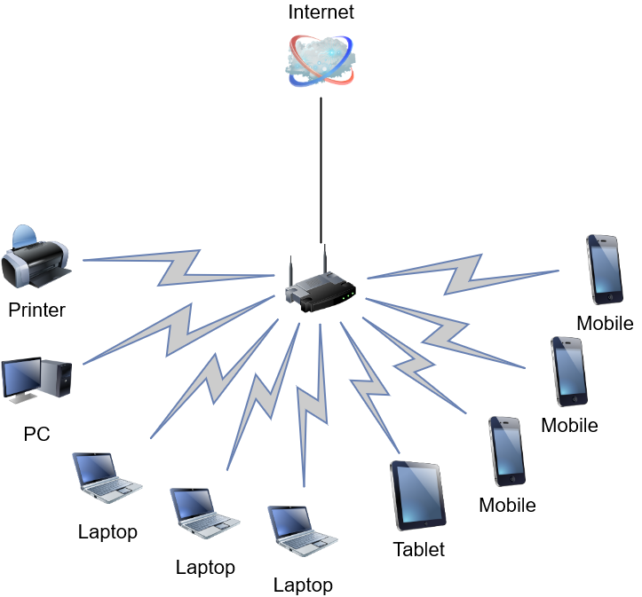

# Домашнее задание к занятию "3.8. Компьютерные сети, лекция 3"

### 1. Подключитесь к публичному маршрутизатору в интернет. Найдите маршрут к вашему публичному IP
```
telnet route-views.routeviews.org
Username: rviews
show ip route x.x.x.x/32
show bgp x.x.x.x/32
```
*Ответ:*  
```shell
route-views>show ip route  213.87.89.109
Routing entry for 213.87.80.0/20, supernet
  Known via "bgp 6447", distance 20, metric 0
  Tag 2497, type external
  Last update from 202.232.0.2 7w0d ago
  Routing Descriptor Blocks:
  * 202.232.0.2, from 202.232.0.2, 7w0d ago
      Route metric is 0, traffic share count is 1
      AS Hops 2
      Route tag 2497
      MPLS label: none

route-views>show bgp  213.87.89.109
BGP routing table entry for 213.87.80.0/20, version 278511841
Paths: (23 available, best #18, table default)
  Not advertised to any peer
  Refresh Epoch 1
  6939 8359
    64.71.137.241 from 64.71.137.241 (216.218.252.164)
      Origin IGP, localpref 100, valid, external
      path 7FE02CF368B8 RPKI State valid
      rx pathid: 0, tx pathid: 0
  Refresh Epoch 1
  3333 8359
    193.0.0.56 from 193.0.0.56 (193.0.0.56)
      Origin IGP, localpref 100, valid, external
      Community: 8359:5500 8359:16012 8359:55277
      path 7FE14107B028 RPKI State valid
      rx pathid: 0, tx pathid: 0
  Refresh Epoch 1
  53767 174 174 3356 8359
    162.251.163.2 from 162.251.163.2 (162.251.162.3)
      Origin IGP, localpref 100, valid, external
      Community: 174:21000 174:22013 53767:5000
      path 7FE02AB3A140 RPKI State valid
      rx pathid: 0, tx pathid: 0
  Refresh Epoch 1
  701 3356 8359
    137.39.3.55 from 137.39.3.55 (137.39.3.55)
      Origin IGP, localpref 100, valid, external
      path 7FE0E1C1FC40 RPKI State valid
      rx pathid: 0, tx pathid: 0
  Refresh Epoch 1
  3356 8359
    4.68.4.46 from 4.68.4.46 (4.69.184.201)
      Origin IGP, metric 0, localpref 100, valid, external
      Community: 3356:2 3356:22 3356:100 3356:123 3356:507 3356:901 3356:2111 8359:5500 8359:16012 8359:55277
      path 7FE0BAF87D98 RPKI State valid
      rx pathid: 0, tx pathid: 0
  Refresh Epoch 1
  8283 8359
    94.142.247.3 from 94.142.247.3 (94.142.247.3)
      Origin IGP, metric 0, localpref 100, valid, external
      Community: 8283:1 8283:101 8283:102 8283:103 8359:5500 8359:16012 8359:55277
      unknown transitive attribute: flag 0xE0 type 0x20 length 0x30
        value 0000 205B 0000 0000 0000 0001 0000 205B
              0000 0005 0000 0001 0000 205B 0000 0005
              0000 0002 0000 205B 0000 0005 0000 0003

      path 7FE0A162E838 RPKI State valid
      rx pathid: 0, tx pathid: 0
  Refresh Epoch 1
  4901 6079 8359
    162.250.137.254 from 162.250.137.254 (162.250.137.254)
      Origin IGP, localpref 100, valid, external
      Community: 65000:10100 65000:10300 65000:10400
      path 7FE0A85583C8 RPKI State valid
      rx pathid: 0, tx pathid: 0
  Refresh Epoch 1
  101 3356 8359
    209.124.176.223 from 209.124.176.223 (209.124.176.223)
      Origin IGP, localpref 100, valid, external
      Community: 101:20100 101:20110 101:22100 3356:2 3356:22 3356:100 3356:123 3356:507 3356:901 3356:2111 8359:5500 8359:16012 8359:55277
      Extended Community: RT:101:22100
      path 7FE07C928DF8 RPKI State valid
      rx pathid: 0, tx pathid: 0
  Refresh Epoch 1
  57866 3356 8359
    37.139.139.17 from 37.139.139.17 (37.139.139.17)
      Origin IGP, metric 0, localpref 100, valid, external
      Community: 3356:2 3356:22 3356:100 3356:123 3356:507 3356:901 3356:2111 8359:5500 8359:16012 8359:55277
      path 7FE18B643288 RPKI State valid
      rx pathid: 0, tx pathid: 0
  Refresh Epoch 1
  852 3356 8359
    154.11.12.212 from 154.11.12.212 (96.1.209.43)
      Origin IGP, metric 0, localpref 100, valid, external
      path 7FE02218EF20 RPKI State valid
      rx pathid: 0, tx pathid: 0
  Refresh Epoch 1
  1351 8359 8359
    132.198.255.253 from 132.198.255.253 (132.198.255.253)
      Origin IGP, localpref 100, valid, external
      path 7FE09DB39AD0 RPKI State valid
      rx pathid: 0, tx pathid: 0
  Refresh Epoch 1
  20130 6939 8359
    140.192.8.16 from 140.192.8.16 (140.192.8.16)
      Origin IGP, localpref 100, valid, external
      path 7FE0AC3D8BF0 RPKI State valid
      rx pathid: 0, tx pathid: 0
  Refresh Epoch 1
  3549 3356 8359
    208.51.134.254 from 208.51.134.254 (67.16.168.191)
      Origin IGP, metric 0, localpref 100, valid, external
      Community: 3356:2 3356:22 3356:100 3356:123 3356:507 3356:901 3356:2111 3549:2581 3549:30840 8359:5500 8359:16012 8359:55277
      path 7FE1340E8430 RPKI State valid
      rx pathid: 0, tx pathid: 0
  Refresh Epoch 1
  20912 3257 3356 8359
    212.66.96.126 from 212.66.96.126 (212.66.96.126)
      Origin IGP, localpref 100, valid, external
      Community: 3257:8070 3257:30515 3257:50001 3257:53900 3257:53902 20912:65004
      path 7FE036F62230 RPKI State valid
      rx pathid: 0, tx pathid: 0
  Refresh Epoch 1
  3303 8359
    217.192.89.50 from 217.192.89.50 (138.187.128.158)
      Origin IGP, localpref 100, valid, external
      Community: 3303:1004 3303:1006 3303:1030 3303:3054 8359:5500 8359:16012 8359:55277
      path 7FE096138998 RPKI State valid
      rx pathid: 0, tx pathid: 0
  Refresh Epoch 1
  7018 3356 8359
    12.0.1.63 from 12.0.1.63 (12.0.1.63)
      Origin IGP, localpref 100, valid, external
      Community: 7018:5000 7018:37232
      path 7FE170647F28 RPKI State valid
      rx pathid: 0, tx pathid: 0
  Refresh Epoch 1
  3561 3910 3356 8359
    206.24.210.80 from 206.24.210.80 (206.24.210.80)
      Origin IGP, localpref 100, valid, external
      path 7FE0A9AC16D0 RPKI State valid
      rx pathid: 0, tx pathid: 0
  Refresh Epoch 2
  2497 8359
    202.232.0.2 from 202.232.0.2 (58.138.96.254)
      Origin IGP, localpref 100, valid, external, best
      path 7FE104C6FA20 RPKI State valid
      rx pathid: 0, tx pathid: 0x0
  Refresh Epoch 1
  7660 2516 1299 8359
    203.181.248.168 from 203.181.248.168 (203.181.248.168)
      Origin IGP, localpref 100, valid, external
      Community: 2516:1030 7660:9001
      path 7FE014C68470 RPKI State valid
      rx pathid: 0, tx pathid: 0
  Refresh Epoch 1
  3257 3356 8359
    89.149.178.10 from 89.149.178.10 (213.200.83.26)
      Origin IGP, metric 10, localpref 100, valid, external
      Community: 3257:8794 3257:30043 3257:50001 3257:54900 3257:54901
      path 7FE032F4E4E8 RPKI State valid
      rx pathid: 0, tx pathid: 0
  Refresh Epoch 1
  49788 12552 8359
    91.218.184.60 from 91.218.184.60 (91.218.184.60)
      Origin IGP, localpref 100, valid, external
      Community: 12552:12000 12552:12100 12552:12101 12552:22000
      Extended Community: 0x43:100:1
      path 7FE14A73DF30 RPKI State valid
      rx pathid: 0, tx pathid: 0
  Refresh Epoch 1
  1221 4637 3356 8359
    203.62.252.83 from 203.62.252.83 (203.62.252.83)
      Origin IGP, localpref 100, valid, external
      path 7FE104BC09F8 RPKI State valid
      rx pathid: 0, tx pathid: 0
  Refresh Epoch 1
  19214 3257 3356 8359
    208.74.64.40 from 208.74.64.40 (208.74.64.40)
      Origin IGP, localpref 100, valid, external
      Community: 3257:8108 3257:30048 3257:50002 3257:51200 3257:51203
      path 7FE11C675F90 RPKI State valid
      rx pathid: 0, tx pathid: 0
```
### 2. Создайте dummy0 интерфейс в Ubuntu. Добавьте несколько статических маршрутов. Проверьте таблицу маршрутизации.
*Ответ:*  
- `vagrant@vagrant:~$ sudo ip link add dummy0 type dummy` - создал
- `vagrant@vagrant:~$ sudo ip addr add 192.168.1.150/24 dev dummy0`
`vagrant@vagrant:~$ sudo ip addr add 169.254.1.1/32 dev dummy0` - добавил адресов
- Таблица маршрутизации:
```shell
vagrant@vagrant:~$ ip add
1: lo: <LOOPBACK,UP,LOWER_UP> mtu 65536 qdisc noqueue state UNKNOWN group default qlen 1000
    link/loopback 00:00:00:00:00:00 brd 00:00:00:00:00:00
    inet 127.0.0.1/8 scope host lo
       valid_lft forever preferred_lft forever
    inet6 ::1/128 scope host
       valid_lft forever preferred_lft forever
2: eth0: <BROADCAST,MULTICAST,UP,LOWER_UP> mtu 1500 qdisc fq_codel state UP group default qlen 1000
    link/ether 08:00:27:b1:28:5d brd ff:ff:ff:ff:ff:ff
    inet 10.0.2.15/24 brd 10.0.2.255 scope global dynamic eth0
       valid_lft 86049sec preferred_lft 86049sec
    inet6 fe80::a00:27ff:feb1:285d/64 scope link
       valid_lft forever preferred_lft forever
3: dummy0: <BROADCAST,NOARP> mtu 1500 qdisc noop state DOWN group default qlen 1000
    link/ether b6:f4:b3:3c:af:6b brd ff:ff:ff:ff:ff:ff
    inet 192.168.1.150/24 scope global dummy0
       valid_lft forever preferred_lft forever
    inet 169.254.1.1/32 scope global dummy0
       valid_lft forever preferred_lft forever
```

### 3. Проверьте открытые TCP порты в Ubuntu, какие протоколы и приложения используют эти порты? Приведите несколько примеров.
*Ответ:*  
```shell
vagrant@vagrant:~$ sudo ss -ltpn
State      Recv-Q     Send-Q         Local Address:Port         Peer Address:Port     Process
LISTEN     0          4096           127.0.0.53%lo:53                0.0.0.0:*         users:(("systemd-resolve",pid=659,fd=13))
LISTEN     0          128                  0.0.0.0:22                0.0.0.0:*         users:(("sshd",pid=720,fd=3))
LISTEN     0          128                     [::]:22                   [::]:*         users:(("sshd",pid=720,fd=4))
```
Используются протоколы `SSH`, приложение `systemd-resolved` — служба systemd, выполняющая разрешение сетевых имён для локальных приложений.

### 4. Проверьте используемые UDP сокеты в Ubuntu, какие протоколы и приложения используют эти порты?
*Ответ:*  
```shell
vagrant@vagrant:~$ sudo ss -paun
State      Recv-Q     Send-Q          Local Address:Port         Peer Address:Port    Process
UNCONN     0          0               127.0.0.53%lo:53                0.0.0.0:*        users:(("systemd-resolve",pid=659,fd=12))
UNCONN     0          0              10.0.2.15%eth0:68                0.0.0.0:*        users:(("systemd-network",pid=625,fd=17))
```
Используются приложения:
- `systemd-resolved` — служба systemd, выполняющая разрешение сетевых имён для локальных приложений.
- `systemd-networkd` — системный демон для управления сетевыми настройками. Его задачей является обнаружение и настройка сетевых устройств по мере их появления, а также создание виртуальных сетевых устройств

### 5. Используя diagrams.net, создайте L3 диаграмму вашей домашней сети или любой другой сети, с которой вы работали. 
*Ответ:*  
