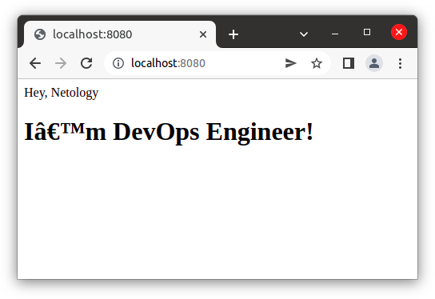

# Домашнее задание к занятию "5.3. Введение. Экосистема. Архитектура. Жизненный цикл Docker контейнера"

## Задача 1

Сценарий выполнения задачи:

- создайте свой репозиторий на https://hub.docker.com;
- выберете любой образ, который содержит веб-сервер Nginx;
- создайте свой fork образа;
- реализуйте функциональность:
запуск веб-сервера в фоне с индекс-страницей, содержащей HTML-код ниже:
```
<html>
<head>
Hey, Netology
</head>
<body>
<h1>I’m DevOps Engineer!</h1>
</body>
</html>
```
Опубликуйте созданный форк в своем репозитории и предоставьте ответ в виде ссылки на https://hub.docker.com/username_repo.

### Ответ:
- Зарегистрировался на https://hub.docker.com
- Создал публичный репозиторий `ruslasusla/netology_devops_kashin`
- Установил на хостоваой машине Docker
  ```
  ruslan@ruslan-notebook:~$ sudo apt install docker.io
  ```
- Загрузил официальный образ Nginx
  ```shell
  ruslan@ruslan-notebook:~$ sudo docker pull nginx:1.22.0
  1.22.0: Pulling from library/nginx
  42c077c10790: Pull complete 
  dedc95281b4f: Pull complete 
  919c6c8c0471: Pull complete 
  7075bb870b9e: Pull complete 
  e93f5d620ba9: Pull complete 
  90a8adeea75b: Pull complete 
  Digest: sha256:f00db45b878cd3c18671bcb062fce4bfb365b82fd97d89dfaff2ab7b9fb66b80
  Status: Downloaded newer image for nginx:1.22.0
  docker.io/library/nginx:1.22.0
  ```
- Создал в отдельной директории html файл index.html с содержимым:
  ```html
  <html>
  <head>
  Hey, Netology
  </head>
  <body>
  <h1>I’m DevOps Engineer!</h1>
  </body>
  </html>
  ```
- Создал в этой же директории Dockerfile:
  ```dockerfile
  FROM nginx:1.22.0
  
  COPY ./index.html /usr/share/nginx/html
  ```
- Создал свой fork образа
  ```shell
  ruslan@ruslan-notebook:~/myData/DevOps/DevopsHomework/src_05.03_task_1$ sudo docker build -t ruslasusla/netology_devops_kashin:v1.0.0 .
  Sending build context to Docker daemon  3.072kB
  Step 1/2 : FROM nginx:1.22.0
   ---> f9c88cc1c21a
  Step 2/2 : COPY ./index.html /usr/share/nginx/html
   ---> 1a2d657e40b5
  Successfully built 1a2d657e40b5
  Successfully tagged ruslasusla/netology_devops_kashin:v1.0.0
  ```
- Запустил созданный образ
  ```shell
  ruslan@ruslan-notebook:~$ sudo docker run --name kashin_nginx -d -p 8080:80 ruslasusla/netology_devops_kashin:v1.0.0
  9fdf2894d116ee78aef04122462edca9d0e9700d19ebde5a59816316c3ede385
  ```
- Проверил что все работает корректно
  ```shell
  ruslan@ruslan-notebook:~$ curl http://localhost:8080/
    <html>
    <head>
    Hey, Netology
    </head>
    <body>
    <h1>I’m DevOps Engineer!</h1>
    </body>
    </html>
  ``` 



- Загрузил образ в свой репозиторий
  ```shell
  ruslan@ruslan-notebook:~$ sudo docker login -u ruslasusla
  Password: 
  Login Succeeded
  
  ruslan@ruslan-notebook:~$ sudo docker push ruslasusla/netology_devops_kashin:v1.0.0
  The push refers to repository [docker.io/ruslasusla/netology_devops_kashin]
  8508be06ff44: Pushed 
  b470eef4f5d8: Mounted from library/nginx 
  043c34f72e3d: Mounted from library/nginx 
  daef241ddc79: Mounted from library/nginx 
  53ae93fa7fcc: Mounted from library/nginx 
  e83a53e226df: Mounted from library/nginx 
  ad6562704f37: Mounted from library/nginx 
  v1.0.0: digest: sha256:4283cf47821fd710bc2ad5fa4b00d20daca064f6076e8d22a93386a5080053bd size: 1777
   
  ```

- Репозиторий: <https://hub.docker.com/repository/docker/ruslasusla/netology_devops_kashin>


## Задача 2

Посмотрите на сценарий ниже и ответьте на вопрос:
"Подходит ли в этом сценарии использование Docker контейнеров или лучше подойдет виртуальная машина, физическая машина? Может быть возможны разные варианты?"

Детально опишите и обоснуйте свой выбор.

--

Сценарий:

- Высоконагруженное монолитное java веб-приложение;
- Nodejs веб-приложение;
- Мобильное приложение c версиями для Android и iOS;
- Шина данных на базе Apache Kafka;
- Elasticsearch кластер для реализации логирования продуктивного веб-приложения - три ноды elasticsearch, два logstash и две ноды kibana;
- Мониторинг-стек на базе Prometheus и Grafana;
- MongoDB, как основное хранилище данных для java-приложения;
- Gitlab сервер для реализации CI/CD процессов и приватный (закрытый) Docker Registry.

### Ответ:
1. **Высоконагруженное монолитное java веб-приложение** - java работает в своей виртаульной машине (Java Virtual Machine), поэтому излишняя виртуализация здесь ни к чему. Использовать нужно физический сервер.
2. **Nodejs веб-приложение** - Docker подходит. Упростит создание тестовых стендов и ускорит выпуски релизов.
3. **Мобильное приложение c версиями для Android и iOS** - Docker подходит, ускорит тестирование под различными версиями
мобильных ОС.
4. **Шина данных на базе Apache Kafka** - Docker подходит. Поозволит реализовать хорошую отказоустойчивость.
5. **Elasticsearch кластер для реализации логирования продуктивного веб-приложения** - Docker подходит. Потому что микросервисы, а для них Docker подходит идеально.
6. **Мониторинг-стек на базе Prometheus и Grafana** - Docker подходит для данного сценария.
7. **MongoDB, как основное хранилище данных для java-приложения** - Лучше для СУБД использовать физический сервер без лишней вирутализации.
8. **Gitlab сервер для реализации CI/CD процессов и приватный (закрытый) Docker Registry** - Можно использовать Docker, можно виртуалку или полноценный сервер.

## Задача 3

- Запустите первый контейнер из образа ***centos*** c любым тэгом в фоновом режиме, подключив папку ```/data``` из текущей рабочей директории на хостовой машине в ```/data``` контейнера;
- Запустите второй контейнер из образа ***debian*** в фоновом режиме, подключив папку ```/data``` из текущей рабочей директории на хостовой машине в ```/data``` контейнера;
- Подключитесь к первому контейнеру с помощью ```docker exec``` и создайте текстовый файл любого содержания в ```/data```;
- Добавьте еще один файл в папку ```/data``` на хостовой машине;
- Подключитесь во второй контейнер и отобразите листинг и содержание файлов в ```/data``` контейнера.

### Ответ:
- ```shell
  ruslan@ruslan-notebook:~$ sudo docker run -dit -v ~/data:/data --name kashin_centos centos
  [sudo] password for ruslan: 
  Unable to find image 'centos:latest' locally
  latest: Pulling from library/centos
  a1d0c7532777: Pull complete 
  Digest: sha256:a27fd8080b517143cbbbab9dfb7c8571c40d67d534bbdee55bd6c473f432b177
  Status: Downloaded newer image for centos:latest
  87f07cfb736986c7111c15096a83f9e004db30fb4d6d77c7ad7a701c5059c650
  ```
- ```shell
  ruslan@ruslan-notebook:~$ sudo docker run -dit -v ~/data:/data --name kashin_debian debian
  Unable to find image 'debian:latest' locally
  latest: Pulling from library/debian
  e756f3fdd6a3: Pull complete 
  Digest: sha256:3f1d6c17773a45c97bd8f158d665c9709d7b29ed7917ac934086ad96f92e4510
  Status: Downloaded newer image for debian:latest
  ba4980ea0849578d6894d5d2a4b85f06b2245dd96411c4f3730758d5dc9961b9
  ```
- ```shell
  CONTAINER ID   IMAGE     COMMAND       CREATED              STATUS              PORTS     NAMES
  ba4980ea0849   debian    "bash"        About a minute ago   Up About a minute             kashin_debian
  87f07cfb7369   centos    "/bin/bash"   3 minutes ago        Up 3 minutes                  kashin_centos
  ```
- ```shell
  ruslan@ruslan-notebook:~$ sudo docker exec -ti kashin_centos bash
  [root@87f07cfb7369 /]# echo "this is centos file" > /data/centos_file.txt
  [root@87f07cfb7369 /]# exit
  exit
  ```
- ```shell
  ruslan@ruslan-notebook:~$ echo "this is host file" > ~/data/host_file.txt
  ```
- ```shell
  ruslan@ruslan-notebook:~$ sudo docker exec -ti kashin_debian bash
  root@ba4980ea0849:/# cd data
  root@ba4980ea0849:/data# ls
  centos_file.txt  host_file.txt
  ```