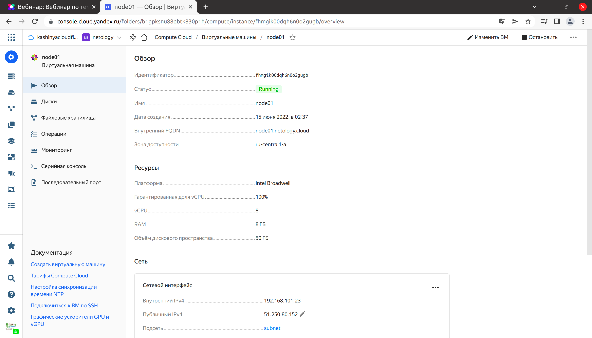

# Домашнее задание к занятию "5.4. Оркестрация группой Docker контейнеров на примере Docker Compose"

## Задача 1

Создать собственный образ операционной системы с помощью Packer.   
Для получения зачета, вам необходимо предоставить:  
Скриншот страницы, как на слайде из презентации (слайд 37).

### Ответ:
- Установил утилиту **yc** `(yandex.cloud)`:
    ```shell
    ruslan@ruslan-notebook:~$ curl -sSL https://storage.yandexcloud.net/yandexcloud-yc/install.sh | bash
    Downloading yc 0.91.0
      % Total    % Received % Xferd  Average Speed   Time    Time     Time  Current
                                     Dload  Upload   Total   Spent    Left  Speed
    100 86.5M  100 86.5M    0     0  10.4M      0  0:00:08  0:00:08 --:--:-- 10.9M
    Yandex Cloud CLI 0.91.0 linux/amd64
    
    yc PATH has been added to your '/home/ruslan/.bashrc' profile
    yc bash completion has been added to your '/home/ruslan/.bashrc' profile.
    Now we have zsh completion. Type "echo 'source /home/ruslan/yandex-cloud/completion.zsh.inc' >>  ~/.zshrc" to install itTo complete installation, start a new shell (exec -l $SHELL) or type 'source "/home/ruslan/.bashrc"' in the current one
    ```
  ```shell
  ruslan@ruslan-notebook:~$ yc --version
  Yandex Cloud CLI 0.91.0 linux/amd64
  ```
- Авторизовался:
  ```shell
  ruslan@ruslan-notebook:~$ yc config list
  token: AQAAAAAD3p7tAATuwVm9jh3h7kBDv_eahqTD778
  cloud-id: b1g8iii5fc0rhcs2hhva
  folder-id: b1gpksnu88qbtk830p1h
  compute-default-zone: ru-central1-a
  ```
- Создал сеть и подсеть
  ```shell
  ruslan@ruslan-notebook:~$ yc vpc network create --name net --labels my-label=netology --description "my first network via yc"
  id: enpgmat161k0r55grbvu
  folder_id: b1gpksnu88qbtk830p1h
  created_at: "2022-06-14T22:00:16Z"
  name: net
  description: my first network via yc
  labels:
    my-label: netology
  ```
  ```shell
  ruslan@ruslan-notebook:~$ yc vpc subnet create --name my-subnet-a --zone ru-central1-a --range 10.1.2.0/24 --network-name net --description "my first subnet via yc"
  id: e9b8tm6japhsv0qgd4s8
  folder_id: b1gpksnu88qbtk830p1h
  created_at: "2022-06-14T22:02:23Z"
  name: my-subnet-a
  description: my first subnet via yc
  network_id: enpgmat161k0r55grbvu
  zone_id: ru-central1-a
  v4_cidr_blocks:
  - 10.1.2.0/24
  ```
- Установил Packer
  ```shell
  ruslan@ruslan-notebook:~$ sudo apt install packer
  ...
  ruslan@ruslan-notebook:~$ packer --version
  1.8.1
  ```
- Отредактировал файл centos-7-base.json, внес в него свои данные (подсеть, папку, токен)
- Создал образа ОС в Yandex.Cloud
  ```shell
  ruslan@ruslan-notebook:~/myData/DevOps/DevopsHomework/src_05.04/packer$ packer validate centos-7-base.json
  The configuration is valid.
  ruslan@ruslan-notebook:~/myData/DevOps/DevopsHomework/src_05.04/packer$ packer build centos-7-base.json
  yandex: output will be in this color.
  
  ==> yandex: Creating temporary RSA SSH key for instance...
  
  ...
  ==> yandex: Stopping instance...
  ==> yandex: Deleting instance...
      yandex: Instance has been deleted!
  ==> yandex: Creating image: centos-7-base
  ==> yandex: Waiting for image to complete...
  ==> yandex: Success image create...
  ==> yandex: Destroying boot disk...
      yandex: Disk has been deleted!
  Build 'yandex' finished after 1 minute 42 seconds.
  
  ==> Wait completed after 1 minute 42 seconds
  
  ==> Builds finished. The artifacts of successful builds are:
  --> yandex: A disk image was created: centos-7-base (id: fd8erfr8a6nir4vartqn) with family name centos
  ruslan@ruslan-notebook:~/myData/DevOps/DevopsHomework/src_05.04/packer$ yc compute image list
  +----------------------+---------------+--------+----------------------+--------+
  |          ID          |     NAME      | FAMILY |     PRODUCT IDS      | STATUS |
  +----------------------+---------------+--------+----------------------+--------+
  | fd8erfr8a6nir4vartqn | centos-7-base | centos | f2ed6g56rfbepn59jt09 | READY  |
  +----------------------+---------------+--------+----------------------+--------+
  ```

  

## Задача 2

Создать вашу первую виртуальную машину в Яндекс.Облаке.  
Для получения зачета, вам необходимо предоставить:  
Скриншот страницы свойств созданной ВМ, как на примере ниже:

### Ответ:  
- Установил Terraform
  ```shell
  ruslan@ruslan-notebook:~$ terraform --version
  Terraform v1.2.2
  on linux_amd64
  ```
- Удалил сеть и подсеть
  ```shell
  ruslan@ruslan-notebook:~$ yc vpc subnet delete --name my-subnet-a && yc vpc network delete --name net
  done (2s)
  ```
- Отредактировал файл `variablec.tf`
- Создал сервисный аккаунт, назначил ему права `editor`
- Сгенерировал ключ для сервисного аккаунта:
  ```shell
  ruslan@ruslan-notebook:~/myData/DevOps/DevopsHomework/src_05.04_task_2/terraform$ yc iam key create --service-account-name netologyhomework --output key.json
  id: ajecpnqhv23ijvh5o10n
  service_account_id: ajedniu97cn9qo7ruoam
  created_at: "2022-06-14T23:10:50.525613571Z"
  key_algorithm: RSA_2048
  ```
- Выполнил `ssh-keygen` (ругалось на отсутсвие файла ~/.ssh/id_rsa.pub)
- Проверил конфигурационный файлы Terraform на валидность:
  ```shell
  ruslan@ruslan-notebook:~/myData/DevOps/DevopsHomework/src_05.04_task_2/terraform$ terraform validate
  Success! The configuration is valid.
  ```
- Создаю ВМ в Yandex.Cloud:
  ```shell
  ruslan@ruslan-notebook:~/myData/DevOps/DevopsHomework/src_05.04_task_2/terraform$ terraform apply
  ...
  Apply complete! Resources: 3 added, 0 changed, 0 destroyed.
  
  Outputs:
  
  external_ip_address_node01_yandex_cloud = "51.250.80.152"
  internal_ip_address_node01_yandex_cloud = "192.168.101.23"
  ```
  


## Задача 3

Создать ваш первый готовый к боевой эксплуатации компонент мониторинга, состоящий из стека микросервисов.   
Для получения зачета, вам необходимо предоставить:  
Скриншот работающего веб-интерфейса Grafana с текущими метриками, как на примере ниже

### Ответ:  
- Полученный IP = `51.250.80.152` вставляем в файл `inventory` для `Ansible`
- Запускаем `Ansible`
  ```shell
  ruslan@ruslan-notebook:~/myData/DevOps/DevopsHomework/src_05.04_task_3/ansible$ ansible-playbook provision.yml
  ```
- Заходим на Grafana `http://51.250.80.152:3000/`, смотрим метрики
  


- Удаляю все из Яндекс.Облака, чтобы не ело деньги
  ```shell
  ruslan@ruslan-notebook:~/myData/DevOps/DevopsHomework/src_05.04_task_2/terraform$ terraform destroy -auto-approve
  yandex_vpc_network.default: Refreshing state... [id=enpvhq5khdi7hic95k8j]
  yandex_vpc_subnet.default: Refreshing state... [id=e9b834muto42obj9i1oa]
  yandex_compute_instance.node01: Refreshing state... [id=fhmgik00dqh6n0o2gugb]
  ...
  Destroy complete! Resources: 3 destroyed.
  
  ruslan@ruslan-notebook:~$ yc compute image delete --id fd8erfr8a6nir4vartqn
  done (10s)
   
  ```