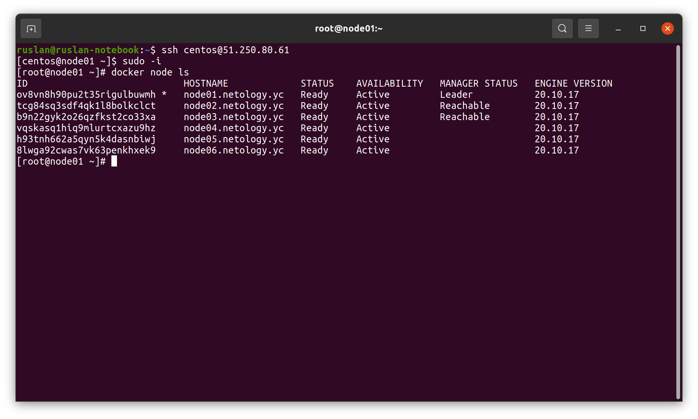
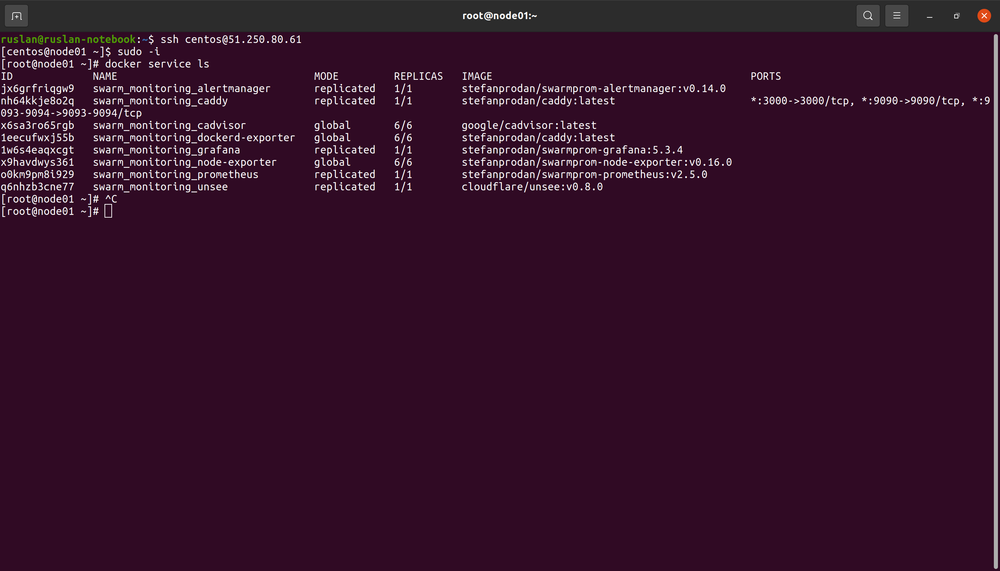

# Домашнее задание к занятию "5.5. Оркестрация кластером Docker контейнеров на примере Docker Swarm"

## Задача 1
Дайте письменые ответы на следующие вопросы:
- В чём отличие режимов работы сервисов в Docker Swarm кластере: replication и global?
- Какой алгоритм выбора лидера используется в Docker Swarm кластере?
- Что такое Overlay Network?

### Ответ:  
- При **global** сервисы запускаются на всех нодах кластера, при **replication** сервисы запускаются на указанном 
количестве нод.
- Лидер выбирается по алгоритму **RAFT**.
- **Overlay Network** - это логическая сеть создаваемая поверх имеющейся. в Docker Swarm overlay сеть используется для обмена трафиком между менеджерами и между воркерами и менеджерами.

## Задача 2

Создать ваш первый Docker Swarm кластер в Яндекс.Облаке

Для получения зачета, вам необходимо предоставить скриншот из терминала (консоли), с выводом команды:
```
docker node ls
```
### Ответ:  
- Авторизовался в YC:
    ```shell
    ruslan@ruslan-notebook:~$ yc config list
    token: AQAAAAAD3p7tAATuwVm9jh3h7kBDv_eahqTD778
    cloud-id: b1g8iii5fc0rhcs2hhva
    folder-id: b1gpksnu88qbtk830p1h
    compute-default-zone: ru-central1-a
    ```
- Создал сеть и подсеть
    ```shell
    ruslan@ruslan-notebook:~$ yc vpc network create --name net --labels my-label=netology --description "my first network via yc"
    id: enp4p55351hdkohncuf2
    folder_id: b1gpksnu88qbtk830p1h
    created_at: "2022-06-19T08:48:45Z"
    name: net
    description: my first network via yc
    labels:
      my-label: netology
    ```
    ```shell
    ruslan@ruslan-notebook:~$ yc vpc subnet create --name my-subnet-a --zone ru-central1-a --range 10.1.2.0/24 --network-name net --description "my first subnet via yc"
    id: e9b7r73c96ocpt67gouq
    folder_id: b1gpksnu88qbtk830p1h
    created_at: "2022-06-19T08:49:05Z"
    name: my-subnet-a
    description: my first subnet via yc
    network_id: enp4p55351hdkohncuf2
    zone_id: ru-central1-a
    v4_cidr_blocks:
    - 10.1.2.0/24
    ```
- Отредактировал файл centos-7-base.json, внес в него свои данные (подсеть, папку, токен)
- Создал образа ОС в Yandex.Cloud
    ```shell
    ruslan@ruslan-notebook:~/myData/DevOps/DevopsHomework/src_05.05/packer$ packer build centos-7-base.json
    yandex: output will be in this color.
    ==> yandex: Creating temporary RSA SSH key for instance...
    ...
    ==> Builds finished. The artifacts of successful builds are:
    --> yandex: A disk image was created: centos-7-base (id: fd8evf7mghrg3r4t2412) with family name centos
    ruslan@ruslan-notebook:~/myData/DevOps/DevopsHomework/src_05.05/packer$ yc compute image list
    +----------------------+---------------+--------+----------------------+--------+
    |          ID          |     NAME      | FAMILY |     PRODUCT IDS      | STATUS |
    +----------------------+---------------+--------+----------------------+--------+
    | fd8evf7mghrg3r4t2412 | centos-7-base | centos | f2ed6g56rfbepn59jt09 | READY  |
    +----------------------+---------------+--------+----------------------+--------+
    ```
- Удаляем подсеть и сеть, которую использовали для сборки образа ОС.
  ```shell
  ruslan@ruslan-notebook:~$ yc vpc subnet delete --name my-subnet-a && yc vpc network delete --name net
  done (1s)
  ```
- Отредактировал файл `variablec.tf` (вставил свои ID)
- Перешел в папку Terraform выполнил `terraform init` предварительно включив VPN.
  ```shell
  ruslan@ruslan-notebook:~/myData/DevOps/DevopsHomework/src_05.05/terraform$ terraform init
  
  Initializing the backend...
  
  Initializing provider plugins...
  - Finding latest version of hashicorp/local...
  - Finding latest version of yandex-cloud/yandex...
  - Finding latest version of hashicorp/null...
  - Installing yandex-cloud/yandex v0.75.0...
  - Installed yandex-cloud/yandex v0.75.0 (self-signed, key ID E40F590B50BB8E40)
  - Installing hashicorp/null v3.1.1...
  - Installed hashicorp/null v3.1.1 (signed by HashiCorp)
  - Installing hashicorp/local v2.2.3...
  - Installed hashicorp/local v2.2.3 (signed by HashiCorp)
  ...
  Terraform has been successfully initialized!
  ```
- Положил в папку Terraform файл key.json из прошлого ДЗ (сервисный аккаунт с правами editor остался в облаке без изменений с прошлого ДЗ).
- Создал ВМ в Yandex.Cloud:
  ```shell
  ruslan@ruslan-notebook:~/myData/DevOps/DevopsHomework/src_05.05/terraform$ terraform validate
  Success! The configuration is valid.
  ruslan@ruslan-notebook:~/myData/DevOps/DevopsHomework/src_05.05/terraform$ terraform plan
  Plan: 13 to add, 0 to change, 0 to destroy.
  ruslan@ruslan-notebook:~/myData/DevOps/DevopsHomework/src_05.05/terraform$ terraform apply -auto-approve
  ...
  Apply complete! Resources: 13 added, 0 changed, 0 destroyed.
  
  Outputs:
  
  external_ip_address_node01 = "51.250.80.61"
  external_ip_address_node02 = "51.250.84.30"
  external_ip_address_node03 = "51.250.94.52"
  external_ip_address_node04 = "51.250.75.34"
  external_ip_address_node05 = "51.250.95.78"
  external_ip_address_node06 = "51.250.91.156"
  internal_ip_address_node01 = "192.168.101.11"
  internal_ip_address_node02 = "192.168.101.12"
  internal_ip_address_node03 = "192.168.101.13"
  internal_ip_address_node04 = "192.168.101.14"
  internal_ip_address_node05 = "192.168.101.15"
  internal_ip_address_node06 = "192.168.101.16"
  ```
- Перехожу в node01 и выполняю команду `docker node ls`
  ```shell
  ruslan@ruslan-notebook:~$ ssh centos@51.250.80.61
  [centos@node01 ~]$ sudo -i
  [root@node01 ~]# docker node ls
  ID                            HOSTNAME             STATUS    AVAILABILITY   MANAGER STATUS   ENGINE VERSION
  ov8vn8h90pu2t35rigulbuwmh *   node01.netology.yc   Ready     Active         Leader           20.10.17
  tcg84sq3sdf4qk1l8bolkclct     node02.netology.yc   Ready     Active         Reachable        20.10.17
  b9n22gyk2o26qzfkst2co33xa     node03.netology.yc   Ready     Active         Reachable        20.10.17
  vqskasq1hiq9mlurtcxazu9hz     node04.netology.yc   Ready     Active                          20.10.17
  h93tnh662a5qyn5k4dasnbiwj     node05.netology.yc   Ready     Active                          20.10.17
  8lwga92cwas7vk63penkhxek9     node06.netology.yc   Ready     Active                          20.10.17
  [root@node01 ~]# 
  ```
    

## Задача 3

Создать ваш первый, готовый к боевой эксплуатации кластер мониторинга, состоящий из стека микросервисов.

Для получения зачета, вам необходимо предоставить скриншот из терминала (консоли), с выводом команды:
```
docker service ls
```
### Ответ:  
- ```shell
  ruslan@ruslan-notebook:~$ ssh centos@51.250.80.61
  [centos@node01 ~]$ sudo -i
  [root@node01 ~]# docker service ls
  ID             NAME                                MODE         REPLICAS   IMAGE                                          PORTS
  jx6grfriqgw9   swarm_monitoring_alertmanager       replicated   1/1        stefanprodan/swarmprom-alertmanager:v0.14.0    
  nh64kkje8o2q   swarm_monitoring_caddy              replicated   1/1        stefanprodan/caddy:latest                      *:3000->3000/tcp, *:9090->9090/tcp, *:9093-9094->9093-9094/tcp
  x6sa3ro65rgb   swarm_monitoring_cadvisor           global       6/6        google/cadvisor:latest                         
  1eecufwxj55b   swarm_monitoring_dockerd-exporter   global       6/6        stefanprodan/caddy:latest                      
  1w6s4eaqxcgt   swarm_monitoring_grafana            replicated   1/1        stefanprodan/swarmprom-grafana:5.3.4           
  x9havdwys361   swarm_monitoring_node-exporter      global       6/6        stefanprodan/swarmprom-node-exporter:v0.16.0   
  o0km9pm8i929   swarm_monitoring_prometheus         replicated   1/1        stefanprodan/swarmprom-prometheus:v2.5.0       
  q6nhzb3cne77   swarm_monitoring_unsee              replicated   1/1        cloudflare/unsee:v0.8.0  
  ```
  


- Удаляю все из Яндекс.Облака, чтобы не ело деньги
  ```shell
  ruslan@ruslan-notebook:~$ cd /home/ruslan/myData/DevOps/DevopsHomework/src_05.05/terraform
  ruslan@ruslan-notebook:~/myData/DevOps/DevopsHomework/src_05.05/terraform$ terraform destroy -auto-approve
  ...
  Destroy complete! Resources: 13 destroyed.
    
  ruslan@ruslan-notebook:~$ yc compute image delete --id fd8evf7mghrg3r4t2412
  done (10s)
  ```