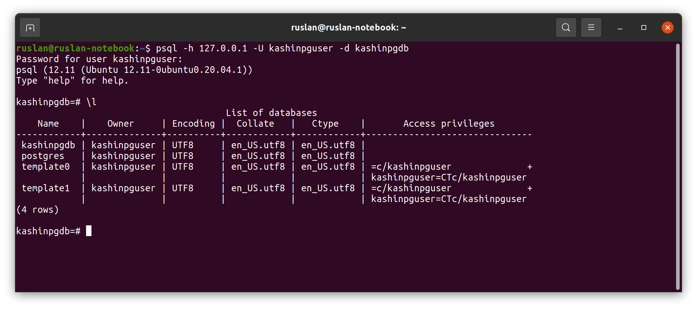
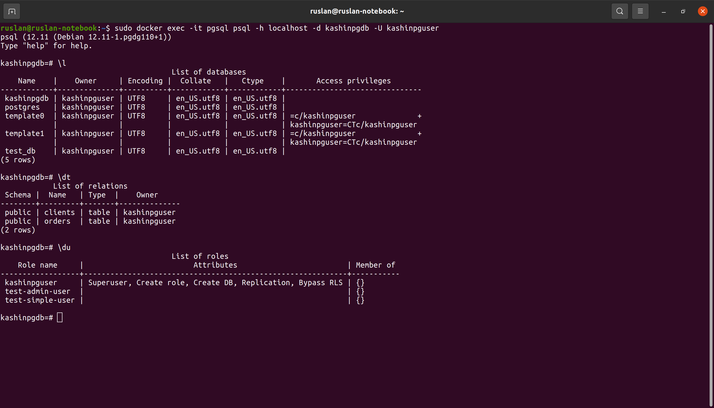
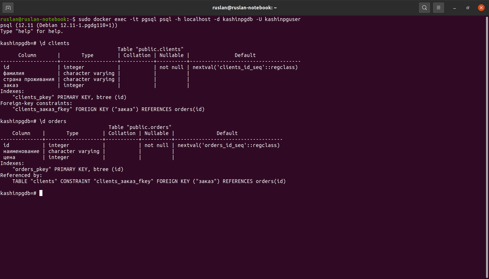
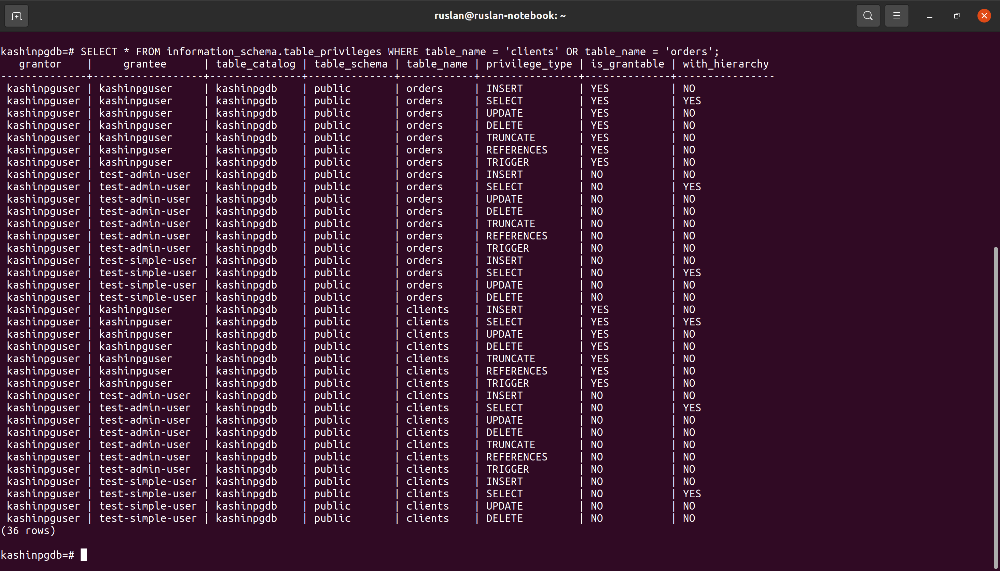

# Домашнее задание к занятию "6.2. SQL"

## Задача 1

Используя docker поднимите инстанс PostgreSQL (версию 12) c 2 volume, 
в который будут складываться данные БД и бэкапы.
Приведите получившуюся команду или docker-compose манифест.

### Ответ:  

- ```shell
    ruslan@ruslan-notebook:~$ sudo docker pull postgres:12
    ```
- ```shell
    ruslan@ruslan-notebook:~$ sudo docker volume create pg_data
    pg_data
    ruslan@ruslan-notebook:~$ sudo docker volume create pg_backup
    pg_backup
    ```
- ```shell
    ruslan@ruslan-notebook:~$ sudo docker run --rm --name pgsql -e POSTGRES_DB=kashinpgdb -e POSTGRES_USER=kashin -e POSTGRES_PASSWORD=postgres -ti -p 5432:5432 -v pg_data:/var/lib/postgresql/data -v pg_backup:/var/lib/postgresql/backup postgres:12
    ```
или

- файл `docker-compose.yaml`
  ```yaml
  version: "2.4"
  
  volumes:
    pg_data: {}
    pg_backup: {}
  
  services:
    postgres:
      image: postgres:12
      container_name: pgsql
      environment:
        POSTGRES_DB: "kashinpgdb"
        POSTGRES_USER: "kashin"
        POSTGRES_PASSWORD: "postgres"
      volumes:
        - pg_data:/var/lib/postgresql/data/
        - pg_backup:/var/lib/postgresql/backup
      ports:
        - "5432:5432"
  ```
- ```shell
  ruslan@ruslan-notebook:~/myData/DevOps/DevopsHomework/src_06.02$ sudo docker-compose up -d
  ```


## Задача 2

В БД из задачи 1: 
- создайте пользователя test-admin-user и БД test_db
- в БД test_db создайте таблицу orders и clients (спeцификация таблиц ниже)
- предоставьте привилегии на все операции пользователю test-admin-user на таблицы БД test_db
- создайте пользователя test-simple-user  
- предоставьте пользователю test-simple-user права на SELECT/INSERT/UPDATE/DELETE данных таблиц БД test_db

Таблица orders:
- id (serial primary key)
- наименование (string)
- цена (integer)

Таблица clients:
- id (serial primary key)
- фамилия (string)
- страна проживания (string, index)
- заказ (foreign key orders)

Приведите:
- итоговый список БД после выполнения пунктов выше,
- описание таблиц (describe)
- SQL-запрос для выдачи списка пользователей с правами над таблицами test_db
- список пользователей с правами над таблицами test_db

### Ответ:  
- ```
  kashinpgdb=# CREATE USER "test-admin-user"; CREATE DATABASE test_db;
  CREATE ROLE
  CREATE DATABASE
  ```
- ```
  kashinpgdb=# CREATE TABLE orders (                                  
  id SERIAL PRIMARY KEY,                                            
  наименование VARCHAR,                                                
  цена INTEGER                                                      
  );                                                                
  CREATE TABLE
  ```
- ```
  kashinpgdb=# CREATE TABLE clients (
  id SERIAL PRIMARY KEY,
  фамилия VARCHAR,
  "страна проживания" VARCHAR,
  заказ INT,
  FOREIGN KEY (заказ) REFERENCES orders (id)
  );
  CREATE TABLE
  ```
- ```
  kashinpgdb=# GRANT ALL ON orders, clients TO "test-admin-user";
  GRANT
  ```
- ```
  kashinpgdb=# CREATE USER "test-simple-user";
  CREATE ROLE
  ```
- ```
  kashinpgdb=# GRANT SELECT, INSERT, UPDATE, DELETE ON orders, clients TO "test-simple-user";
  GRANT
  ```




## Задача 3

Используя SQL синтаксис - наполните таблицы следующими тестовыми данными:

Таблица orders

|Наименование|цена|
|------------|----|
|Шоколад| 10 |
|Принтер| 3000 |
|Книга| 500 |
|Монитор| 7000|
|Гитара| 4000|

Таблица clients

|ФИО|Страна проживания|
|------------|----|
|Иванов Иван Иванович| USA |
|Петров Петр Петрович| Canada |
|Иоганн Себастьян Бах| Japan |
|Ронни Джеймс Дио| Russia|
|Ritchie Blackmore| Russia|

Используя SQL синтаксис:
- вычислите количество записей для каждой таблицы 
- приведите в ответе:
    - запросы 
    - результаты их выполнения.

### Ответ:  
- ```
  kashinpgdb=# INSERT INTO orders (наименование, цена) VALUES
  ('Шоколад', 10),
  ('Принтер', 3000),
  ('Книга', 500),
  ('Монитор', 7000),
  ('Гитара', 4000);
  INSERT 0 5
  ```
- ```
  kashinpgdb=# INSERT INTO clients (фамилия, "страна проживания") VALUES
  ('Иванов Иван Иванович', 'USA'),
  ('Петров Петр Петрович', 'Canada'),
  ('Иоганн Себастьян Бах', 'Japan'),
  ('Ронни Джеймс Дио', 'Russia'),
  ('Ritchie Blackmore', 'Russia');
  INSERT 0 5
  ```
- ```
  kashinpgdb=# SELECT COUNT(*) FROM orders;
   count 
  -------
       5
  (1 row)
  
  kashinpgdb=# SELECT COUNT(*) FROM clients;
   count 
  -------
       5
  (1 row)
  ```
## Задача 4

Часть пользователей из таблицы clients решили оформить заказы из таблицы orders.

Используя foreign keys свяжите записи из таблиц, согласно таблице:

|ФИО|Заказ|
|------------|----|
|Иванов Иван Иванович| Книга |
|Петров Петр Петрович| Монитор |
|Иоганн Себастьян Бах| Гитара |

Приведите SQL-запросы для выполнения данных операций.

Приведите SQL-запрос для выдачи всех пользователей, которые совершили заказ, а также вывод данного запроса.
 
Подсказка - используйте директиву `UPDATE`.

### Ответ:
```shell
kashinpgdb=# UPDATE clients SET "заказ" = 3 WHERE id = 1; UPDATE clients SET "заказ" = 4 WHERE id = 2; UPDATE clients SET "заказ" = 5 WHERE id = 3;
UPDATE 1
UPDATE 1
UPDATE 1
kashinpgdb=# SELECT * FROM clients WHERE заказ IS NOT NULL;
 id |       фамилия        | страна проживания | заказ 
----+----------------------+-------------------+-------
  1 | Иванов Иван Иванович | USA               |     3
  2 | Петров Петр Петрович | Canada            |     4
  3 | Иоганн Себастьян Бах | Japan             |     5
(3 rows)

```

## Задача 5

Получите полную информацию по выполнению запроса выдачи всех пользователей из задачи 4 
(используя директиву EXPLAIN).
Приведите получившийся результат и объясните что значат полученные значения.

### Ответ:  
```shell
kashinpgdb=# SELECT * FROM clients WHERE заказ IS NOT NULL;
 id |       фамилия        | страна проживания | заказ 
----+----------------------+-------------------+-------
  1 | Иванов Иван Иванович | USA               |     3
  2 | Петров Петр Петрович | Canada            |     4
  3 | Иоганн Себастьян Бах | Japan             |     5
(3 rows)

kashinpgdb=# EXPLAIN SELECT * FROM clients WHERE заказ IS NOT NULL;
                        QUERY PLAN                         
-----------------------------------------------------------
 Seq Scan on clients  (cost=0.00..18.10 rows=806 width=72)
   Filter: ("заказ" IS NOT NULL)
(2 rows)

```
Результат показывает стоимость (нагрузку на исполнение) запроса, и фильтрацию по полю "заказ" - сколько строк отфильтровано.

## Задача 6

Создайте бэкап БД test_db и поместите его в volume, предназначенный для бэкапов (см. Задачу 1).

Остановите контейнер с PostgreSQL (но не удаляйте volumes).

Поднимите новый пустой контейнер с PostgreSQL.

Восстановите БД test_db в новом контейнере.

Приведите список операций, который вы применяли для бэкапа данных и восстановления. 

---

### Как cдавать задание

Выполненное домашнее задание пришлите ссылкой на .md-файл в вашем репозитории.

---
