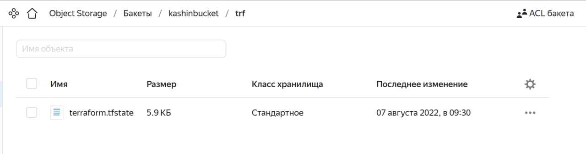
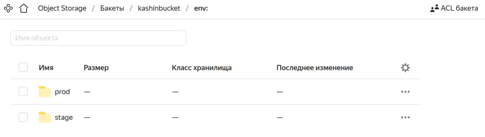
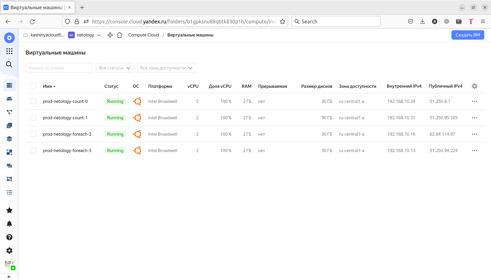

# Домашнее задание к занятию "7.3. Основы и принцип работы Терраформ"

## Задача 1. Создадим бэкэнд в S3 (необязательно, но крайне желательно).

Если в рамках предыдущего задания у вас уже есть аккаунт AWS, то давайте продолжим знакомство со взаимодействием
терраформа и aws. 

1. Создайте s3 бакет, iam роль и пользователя от которого будет работать терраформ. Можно создать отдельного пользователя,
а можно использовать созданного в рамках предыдущего задания, просто добавьте ему необходимы права, как описано 
[здесь](https://www.terraform.io/docs/backends/types/s3.html).
1. Зарегистрируйте бэкэнд в терраформ проекте как описано по ссылке выше. 

### Ответ:   
Работать в AWS по прежнему возможности нет, поэтому будем все делать в YandexCloud по инструкции - https://cloud.yandex.ru/docs/tutorials/infrastructure-management/terraform-state-storage.
- Создал бакет по инструкции - https://cloud.yandex.ru/docs/storage/operations/buckets/create

  

- Роль взял из предыдущих ДЗ, сгенерировал статический ключ.
- Файлы tf взял из предыдущего ДЗ, дополнил файл `privider.tf` информацией о `backend "s3"`
    ```
    terraform {
      required_providers {
        yandex = {
          source = "terraform-registry.storage.yandexcloud.net/yandex-cloud/yandex"
        }
      }
      required_version = ">= 0.13"
      
      backend "s3" {
        endpoint   = "storage.yandexcloud.net"
        bucket     = "kashinbucket"
        region     = "ru-central1"
        key        = "trf/terraform.tfstate"
        access_key = "..."
        secret_key = "..."
    
        skip_region_validation      = true
        skip_credentials_validation = true
      }
    }
    
    # <настройки провайдера с нашими переменными >
    
    provider "yandex" {
      token = var.yc_token
      cloud_id  = var.yc_cloud_id
      folder_id = var.yc_folder_id
      zone = var.yc_zone
    }
    ```
- Выполнил `terraform init`, `terraform plan`, `terraform apply`
    ```
    Apply complete! Resources: 3 added, 0 changed, 0 destroyed.
    ```
- Проверил что в бакет лег файл стейтов.
  
  
- Выполнил `terraform destroy`.
    ```
    Destroy complete! Resources: 3 destroyed.
    ```

## Задача 2. Инициализируем проект и создаем воркспейсы. 

1. Выполните `terraform init`:
    * если был создан бэкэнд в S3, то терраформ создат файл стейтов в S3 и запись в таблице 
dynamodb.
    * иначе будет создан локальный файл со стейтами.  
1. Создайте два воркспейса `stage` и `prod`.
1. В уже созданный `aws_instance` добавьте зависимость типа инстанса от вокспейса, что бы в разных ворскспейсах 
использовались разные `instance_type`.
1. Добавим `count`. Для `stage` должен создаться один экземпляр `ec2`, а для `prod` два. 
1. Создайте рядом еще один `aws_instance`, но теперь определите их количество при помощи `for_each`, а не `count`.
1. Что бы при изменении типа инстанса не возникло ситуации, когда не будет ни одного инстанса добавьте параметр
жизненного цикла `create_before_destroy = true` в один из рессурсов `aws_instance`.
1. При желании поэкспериментируйте с другими параметрами и рессурсами.

В виде результата работы пришлите:
* Вывод команды `terraform workspace list`.
* Вывод команды `terraform plan` для воркспейса `prod`.  

### Ответ:  
- Выполнил `terraform init`
- Создал воркспейсы `stage` и `prod`
    ```shell
    ruslan@ruslan-notebook:~/myData/DevOps/DevopsHomework/src_07.03/Terraform$ terraform workspace list
    * default
    
    ruslan@ruslan-notebook:~/myData/DevOps/DevopsHomework/src_07.03/Terraform$ terraform workspace new stage
    Created and switched to workspace "stage"!
    
    You're now on a new, empty workspace. Workspaces isolate their state,
    so if you run "terraform plan" Terraform will not see any existing state
    for this configuration.
    ruslan@ruslan-notebook:~/myData/DevOps/DevopsHomework/src_07.03/Terraform$ terraform workspace new prod
    Created and switched to workspace "prod"!
    
    You're now on a new, empty workspace. Workspaces isolate their state,
    so if you run "terraform plan" Terraform will not see any existing state
    for this configuration.
    ruslan@ruslan-notebook:~/myData/DevOps/DevopsHomework/src_07.03/Terraform$ terraform workspace list
      default
    * prod
      stage
    ```
    
- Дополнил `main.tf`
    ```
    resource "yandex_compute_instance" "netology-count" {
         
        count = local.instance_count[terraform.workspace]
        name = "${terraform.workspace}-netology-count-${count.index}"
    
        resources {
           cores  = local.vm_cores[terraform.workspace]
           memory = local.vm_memory[terraform.workspace]
        }
             
        boot_disk {
          initialize_params {
             image_id = "fd81n37q9kgufk6rb4c0"
           }
        }
       
        network_interface {
           subnet_id = yandex_vpc_subnet.my-subnet.id
           nat       = true
        }
       
        metadata = {
           ssh-keys = "ubuntu:${file("~/.ssh/id_rsa.pub")}"
        }
    
        lifecycle {
           create_before_destroy = true
        }
    
    }
    
    resource "yandex_compute_instance" "netology-foreach" {
         
        for_each = local.vm_foreach[terraform.workspace]
        name = "${terraform.workspace}-netology-foreach-${each.key}"
    
        resources {
           cores  = each.value.cores
           memory = each.value.memory
        }
    
        boot_disk {
          initialize_params {
             image_id = "fd81n37q9kgufk6rb4c0"
           }
        }
       
        network_interface {
           subnet_id = yandex_vpc_subnet.my-subnet.id
           nat       = true
        }
       
        metadata = {
           ssh-keys = "ubuntu:${file("~/.ssh/id_rsa.pub")}"
        }
        
        lifecycle {
           create_before_destroy = true
        }
    } 
      
    resource "yandex_vpc_network" "my-network" {
         name = "my-network"
    }
       
    resource "yandex_vpc_subnet" "my-subnet" {
         name           = "my-subnet"
         zone           = var.yc_zone
         network_id     = yandex_vpc_network.my-network.id
         v4_cidr_blocks = ["192.168.10.0/24"]
    }
       
    locals {
      instance_count = {
        "stage"=1
        "prod"=2
      }
      vm_cores = {
        "stage"=1
        "prod"=2
      }
      vm_memory = {
        "stage"=1
        "prod"=2
      }
      vm_foreach = {
        stage = {
          "1" = { cores = "1", memory = "1" }
        }
        prod = {
          "3" = { cores = "2", memory = "2" },
          "2" = { cores = "2", memory = "2" }
        }
      }
    }   
    ```
- Выполнил `terraform plan` и `terraform apply`. Проверил результат в облаке.
    ```
    ruslan@ruslan-notebook:~/myData/DevOps/DevopsHomework/src_07.03/Terraform$ terraform plan
    
    Terraform used the selected providers to generate the following execution plan. Resource actions are indicated with the following symbols:
      + create
    
    Terraform will perform the following actions:
    
      # yandex_compute_instance.netology-count[0] will be created
      + resource "yandex_compute_instance" "netology-count" {
          + created_at                = (known after apply)
          + folder_id                 = (known after apply)
          + fqdn                      = (known after apply)
          + hostname                  = (known after apply)
          + id                        = (known after apply)
          + metadata                  = {
              + "ssh-keys" = <<-EOT
                    ubuntu:ssh-rsa *** ruslan@ruslan-notebook
                EOT
            }
          + name                      = "prod-netology-count-0"
          + network_acceleration_type = "standard"
          + platform_id               = "standard-v1"
          + service_account_id        = (known after apply)
          + status                    = (known after apply)
          + zone                      = (known after apply)
    
          + boot_disk {
              + auto_delete = true
              + device_name = (known after apply)
              + disk_id     = (known after apply)
              + mode        = (known after apply)
    
              + initialize_params {
                  + block_size  = (known after apply)
                  + description = (known after apply)
                  + image_id    = "fd81n37q9kgufk6rb4c0"
                  + name        = (known after apply)
                  + size        = (known after apply)
                  + snapshot_id = (known after apply)
                  + type        = "network-hdd"
                }
            }
    
          + network_interface {
              + index              = (known after apply)
              + ip_address         = (known after apply)
              + ipv4               = true
              + ipv6               = (known after apply)
              + ipv6_address       = (known after apply)
              + mac_address        = (known after apply)
              + nat                = true
              + nat_ip_address     = (known after apply)
              + nat_ip_version     = (known after apply)
              + security_group_ids = (known after apply)
              + subnet_id          = (known after apply)
            }
    
          + placement_policy {
              + placement_group_id = (known after apply)
            }
    
          + resources {
              + core_fraction = 100
              + cores         = 2
              + memory        = 2
            }
    
          + scheduling_policy {
              + preemptible = (known after apply)
            }
        }
    
      # yandex_compute_instance.netology-count[1] will be created
      + resource "yandex_compute_instance" "netology-count" {
          + created_at                = (known after apply)
          + folder_id                 = (known after apply)
          + fqdn                      = (known after apply)
          + hostname                  = (known after apply)
          + id                        = (known after apply)
          + metadata                  = {
              + "ssh-keys" = <<-EOT
                    ubuntu:ssh-rsa *** ruslan@ruslan-notebook
                EOT
            }
          + name                      = "prod-netology-count-1"
          + network_acceleration_type = "standard"
          + platform_id               = "standard-v1"
          + service_account_id        = (known after apply)
          + status                    = (known after apply)
          + zone                      = (known after apply)
    
          + boot_disk {
              + auto_delete = true
              + device_name = (known after apply)
              + disk_id     = (known after apply)
              + mode        = (known after apply)
    
              + initialize_params {
                  + block_size  = (known after apply)
                  + description = (known after apply)
                  + image_id    = "fd81n37q9kgufk6rb4c0"
                  + name        = (known after apply)
                  + size        = (known after apply)
                  + snapshot_id = (known after apply)
                  + type        = "network-hdd"
                }
            }
    
          + network_interface {
              + index              = (known after apply)
              + ip_address         = (known after apply)
              + ipv4               = true
              + ipv6               = (known after apply)
              + ipv6_address       = (known after apply)
              + mac_address        = (known after apply)
              + nat                = true
              + nat_ip_address     = (known after apply)
              + nat_ip_version     = (known after apply)
              + security_group_ids = (known after apply)
              + subnet_id          = (known after apply)
            }
    
          + placement_policy {
              + placement_group_id = (known after apply)
            }
    
          + resources {
              + core_fraction = 100
              + cores         = 2
              + memory        = 2
            }
    
          + scheduling_policy {
              + preemptible = (known after apply)
            }
        }
    
      # yandex_compute_instance.netology-foreach["2"] will be created
      + resource "yandex_compute_instance" "netology-foreach" {
          + created_at                = (known after apply)
          + folder_id                 = (known after apply)
          + fqdn                      = (known after apply)
          + hostname                  = (known after apply)
          + id                        = (known after apply)
          + metadata                  = {
              + "ssh-keys" = <<-EOT
                    ubuntu:ssh-rsa *** ruslan@ruslan-notebook
                EOT
            }
          + name                      = "prod-netology-foreach-2"
          + network_acceleration_type = "standard"
          + platform_id               = "standard-v1"
          + service_account_id        = (known after apply)
          + status                    = (known after apply)
          + zone                      = (known after apply)
    
          + boot_disk {
              + auto_delete = true
              + device_name = (known after apply)
              + disk_id     = (known after apply)
              + mode        = (known after apply)
    
              + initialize_params {
                  + block_size  = (known after apply)
                  + description = (known after apply)
                  + image_id    = "fd81n37q9kgufk6rb4c0"
                  + name        = (known after apply)
                  + size        = (known after apply)
                  + snapshot_id = (known after apply)
                  + type        = "network-hdd"
                }
            }
    
          + network_interface {
              + index              = (known after apply)
              + ip_address         = (known after apply)
              + ipv4               = true
              + ipv6               = (known after apply)
              + ipv6_address       = (known after apply)
              + mac_address        = (known after apply)
              + nat                = true
              + nat_ip_address     = (known after apply)
              + nat_ip_version     = (known after apply)
              + security_group_ids = (known after apply)
              + subnet_id          = (known after apply)
            }
    
          + placement_policy {
              + placement_group_id = (known after apply)
            }
    
          + resources {
              + core_fraction = 100
              + cores         = 2
              + memory        = 2
            }
    
          + scheduling_policy {
              + preemptible = (known after apply)
            }
        }
    
      # yandex_compute_instance.netology-foreach["3"] will be created
      + resource "yandex_compute_instance" "netology-foreach" {
          + created_at                = (known after apply)
          + folder_id                 = (known after apply)
          + fqdn                      = (known after apply)
          + hostname                  = (known after apply)
          + id                        = (known after apply)
          + metadata                  = {
              + "ssh-keys" = <<-EOT
                    ubuntu:ssh-rsa *** ruslan@ruslan-notebook
                EOT
            }
          + name                      = "prod-netology-foreach-3"
          + network_acceleration_type = "standard"
          + platform_id               = "standard-v1"
          + service_account_id        = (known after apply)
          + status                    = (known after apply)
          + zone                      = (known after apply)
    
          + boot_disk {
              + auto_delete = true
              + device_name = (known after apply)
              + disk_id     = (known after apply)
              + mode        = (known after apply)
    
              + initialize_params {
                  + block_size  = (known after apply)
                  + description = (known after apply)
                  + image_id    = "fd81n37q9kgufk6rb4c0"
                  + name        = (known after apply)
                  + size        = (known after apply)
                  + snapshot_id = (known after apply)
                  + type        = "network-hdd"
                }
            }
    
          + network_interface {
              + index              = (known after apply)
              + ip_address         = (known after apply)
              + ipv4               = true
              + ipv6               = (known after apply)
              + ipv6_address       = (known after apply)
              + mac_address        = (known after apply)
              + nat                = true
              + nat_ip_address     = (known after apply)
              + nat_ip_version     = (known after apply)
              + security_group_ids = (known after apply)
              + subnet_id          = (known after apply)
            }
    
          + placement_policy {
              + placement_group_id = (known after apply)
            }
    
          + resources {
              + core_fraction = 100
              + cores         = 2
              + memory        = 2
            }
    
          + scheduling_policy {
              + preemptible = (known after apply)
            }
        }
    
      # yandex_vpc_network.my-network will be created
      + resource "yandex_vpc_network" "my-network" {
          + created_at                = (known after apply)
          + default_security_group_id = (known after apply)
          + folder_id                 = (known after apply)
          + id                        = (known after apply)
          + labels                    = (known after apply)
          + name                      = "my-network"
          + subnet_ids                = (known after apply)
        }
    
      # yandex_vpc_subnet.my-subnet will be created
      + resource "yandex_vpc_subnet" "my-subnet" {
          + created_at     = (known after apply)
          + folder_id      = (known after apply)
          + id             = (known after apply)
          + labels         = (known after apply)
          + name           = "my-subnet"
          + network_id     = (known after apply)
          + v4_cidr_blocks = [
              + "192.168.10.0/24",
            ]
          + v6_cidr_blocks = (known after apply)
          + zone           = "ru-central1-a"
        }
    
    Plan: 6 to add, 0 to change, 0 to destroy.
    
    ────────────────────────────────────────────────────────────────────────────────────────────────────────────────────────────────────────────────────────────────
    
    Note: You didn't use the -out option to save this plan, so Terraform can't guarantee to take exactly these actions if you run "terraform apply" now.
    ```
    
- Выполнил `terraform destroy` в воркспейсе `prod`
```
ruslan@ruslan-notebook:~/myData/DevOps/DevopsHomework/src_07.03/Terraform$ terraform workspace select prod
Switched to workspace "prod".
ruslan@ruslan-notebook:~/myData/DevOps/DevopsHomework/src_07.03/Terraform$ terraform destroy
...
Destroy complete! Resources: 6 destroyed.
```