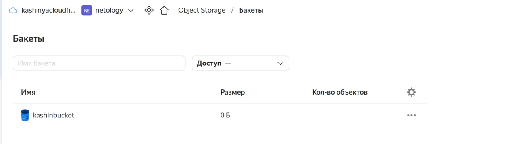

# Домашнее задание к занятию "7.3. Основы и принцип работы Терраформ"

## Задача 1. Создадим бэкэнд в S3 (необязательно, но крайне желательно).

Если в рамках предыдущего задания у вас уже есть аккаунт AWS, то давайте продолжим знакомство со взаимодействием
терраформа и aws. 

1. Создайте s3 бакет, iam роль и пользователя от которого будет работать терраформ. Можно создать отдельного пользователя,
а можно использовать созданного в рамках предыдущего задания, просто добавьте ему необходимы права, как описано 
[здесь](https://www.terraform.io/docs/backends/types/s3.html).
1. Зарегистрируйте бэкэнд в терраформ проекте как описано по ссылке выше. 

### Ответ:   
Работать в AWS по прежнему возможности нет, поэтому будем все делать в YandexCloud по инструкции - https://cloud.yandex.ru/docs/tutorials/infrastructure-management/terraform-state-storage.
- Создал бакет по инструкции - https://cloud.yandex.ru/docs/storage/operations/buckets/create

  

- Роль взял из предыдущих ДЗ, сгенерировал статический ключ.
- Файлы tf взял из предыдущего ДЗ, дополнил файл `privider.tf` информацией о `backend "s3"`
    ```
    terraform {
      required_providers {
        yandex = {
          source = "terraform-registry.storage.yandexcloud.net/yandex-cloud/yandex"
        }
      }
      required_version = ">= 0.13"
      
      backend "s3" {
        endpoint   = "storage.yandexcloud.net"
        bucket     = "kashinbucket"
        region     = "ru-central1"
        key        = "trf/terraform.tfstate"
        access_key = "..."
        secret_key = "..."
    
        skip_region_validation      = true
        skip_credentials_validation = true
      }
    }
    
    # <настройки провайдера с нашими переменными >
    
    provider "yandex" {
      token = var.yc_token
      cloud_id  = var.yc_cloud_id
      folder_id = var.yc_folder_id
      zone = var.yc_zone
    }
    ```
- Выполнил `terraform init`, `terraform plan`, `terraform apply`
    ```
    Apply complete! Resources: 3 added, 0 changed, 0 destroyed.
    ```
- Проверил что в бакет лег файл сетейтов.
  
  
- Выполнил `terraform destroy`.
    ```
    Destroy complete! Resources: 3 destroyed.
    ```

## Задача 2. Инициализируем проект и создаем воркспейсы. 

1. Выполните `terraform init`:
    * если был создан бэкэнд в S3, то терраформ создат файл стейтов в S3 и запись в таблице 
dynamodb.
    * иначе будет создан локальный файл со стейтами.  
1. Создайте два воркспейса `stage` и `prod`.
1. В уже созданный `aws_instance` добавьте зависимость типа инстанса от вокспейса, что бы в разных ворскспейсах 
использовались разные `instance_type`.
1. Добавим `count`. Для `stage` должен создаться один экземпляр `ec2`, а для `prod` два. 
1. Создайте рядом еще один `aws_instance`, но теперь определите их количество при помощи `for_each`, а не `count`.
1. Что бы при изменении типа инстанса не возникло ситуации, когда не будет ни одного инстанса добавьте параметр
жизненного цикла `create_before_destroy = true` в один из рессурсов `aws_instance`.
1. При желании поэкспериментируйте с другими параметрами и рессурсами.

В виде результата работы пришлите:
* Вывод команды `terraform workspace list`.
* Вывод команды `terraform plan` для воркспейса `prod`.  

### Ответ:  
доделаю завтра