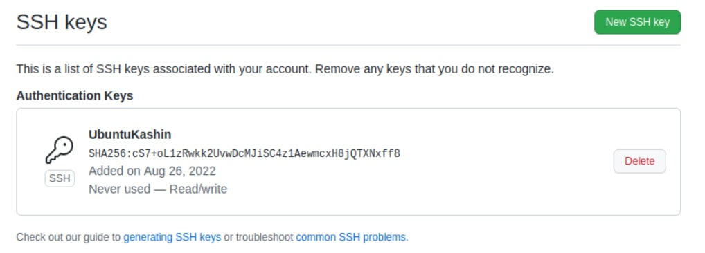

# Домашнее задание к занятию "08.03 Работа с Roles"

## Подготовка к выполнению
1. Создайте два пустых публичных репозитория в любом своём проекте: elastic-role и kibana-role.
   >Готово
2. Скачайте [role](./roles/) из репозитория с домашним заданием и перенесите его в свой репозиторий elastic-role.
   >Готово
3. Скачайте дистрибутив [java](https://www.oracle.com/java/technologies/javase-jdk11-downloads.html) и положите его в директорию `playbook/files/`. 
   >Готово
4. Установите molecule: `pip3 install molecule`

   >  
   >  ```shell
   >   ruslan@ruslan-notebook:~$ pip3 install molecule
   >   Defaulting to user installation because normal site-packages is not writeable
   >   Collecting molecule
   >     Downloading molecule-4.0.1-py3-none-any.whl (248 kB)
   >        ━━━━━━━━━━━━━━━━━━━━━━━━━━━━━━━━━━━━━━━ 248.1/248.1 KB 1.2 MB/s eta 0:00:00
   >   Collecting enrich>=1.2.7
   >     Downloading enrich-1.2.7-py3-none-any.whl (8.7 kB)
   >   ...
   >   Successfully installed ansible-compat-2.2.0 arrow-1.2.2 binaryornot-0.4.4 cerberus-1.3.2 click-help-colors-0.9.1 cookiecutter-2.1.1 enrich-1.2.7 jinja2-time-0.2.0 jsonschema-4.14.0 molecule-4.0.1 pluggy-1.0.0 python-slugify-6.1.2 subprocess-tee-0.3.5 text-unidecode-1.3
   >   ruslan@ruslan-notebook:~$ molecule --version
   >   molecule 4.0.1 using python 3.10 
   >      ansible:2.12.8
   >      delegated:4.0.1 from molecule
   >      docker:2.0.0 from molecule_docker requiring collections: community.docker>=3.0.0-a2
   >   ```
   >

5. Добавьте публичную часть своего ключа к своему профилю в github.

   >


## Основная часть

Наша основная цель - разбить наш playbook на отдельные roles. Задача: сделать roles для elastic, kibana и написать playbook для использования этих ролей. Ожидаемый результат: существуют два ваших репозитория с roles и один репозиторий с playbook.

1. Создать в старой версии playbook файл `requirements.yml` и заполнить его следующим содержимым:
   ```yaml
   ---
     - src: git@github.com:netology-code/mnt-homeworks-ansible.git
       scm: git
       version: "1.0.1"
       name: java 
   ```
   ### Ответ:  
   >Готово.


2. При помощи `ansible-galaxy` скачать себе эту роль. Запустите  `molecule test`, посмотрите на вывод команды.
   ### Ответ:
-  ```shell
   ruslan@ruslan-notebook:~/myData/DevOps/DevopsHomework/src_08.03/Playbook_old$ ansible-galaxy install -r requirements.yml
   Starting galaxy role install process
   - extracting java to /home/ruslan/.ansible/roles/java
   - java (1.0.1) was installed successfully
   ```
-  получил ошибку при выполнении `molecule test`
   ```shell
   ruslan@ruslan-notebook:~/.ansible/roles/java$ molecule test
   INFO     default scenario test matrix: dependency, lint, cleanup, destroy, syntax, create, prepare, converge, idempotence, side_effect, verify, cleanup, destroy
   INFO     Performing prerun with role_name_check=0...
   INFO     Set ANSIBLE_LIBRARY=/home/ruslan/.cache/ansible-compat/38a096/modules:/home/ruslan/.ansible/plugins/modules:/usr/share/ansible/plugins/modules
   INFO     Set ANSIBLE_COLLECTIONS_PATH=/home/ruslan/.cache/ansible-compat/38a096/collections:/home/ruslan/.ansible/collections:/usr/share/ansible/collections
   INFO     Set ANSIBLE_ROLES_PATH=/home/ruslan/.cache/ansible-compat/38a096/roles:/home/ruslan/.ansible/roles:/usr/share/ansible/roles:/etc/ansible/roles
   ERROR    Computed fully qualified role name of java does not follow current galaxy requirements.
   Please edit meta/main.yml and assure we can correctly determine full role name:
   
   galaxy_info:
   role_name: my_name  # if absent directory name hosting role is used instead
   namespace: my_galaxy_namespace  # if absent, author is used instead
   
   Namespace: https://galaxy.ansible.com/docs/contributing/namespaces.html#galaxy-namespace-limitations
   Role: https://galaxy.ansible.com/docs/contributing/creating_role.html#role-names
   ...
   ```
- Отредактировал файл `meta/main.yml`, дописал туда роль и неймспейс:
   ```yaml
   galaxy_info:
     role_name: java
     namespace: netology
     author: Alexey Metlyakov
     description: simple install openjdk from remote url
     company: Netology
     license: BSD-3-Clause
     min_ansible_version: 2.1
     platforms:
       - name: CentOS
         versions:
           - 7
           - 8
       - name: ubuntu
         versions: all
     galaxy_tags: [java, openjdk]
   dependencies: []
   ```
- Отредактировал файл `/roles/java/molecule/default/converge.yml`, переименовал роль в "java"
   ```yaml
   ---
   - name: Converge
     hosts: all
     tasks:
       - name: "Include java"
         include_role:
           name: "java"
   ```
- Под `root` установил `pip3 install ansible molecule molecule-docker`
- Запустилось:
   ```shell
   ruslan@ruslan-notebook:~/myData/DevOps/DevopsHomework/src_08.03/roles/java$ sudo molecule test
   INFO     default scenario test matrix: dependency, lint, cleanup, destroy, syntax, create, prepare, converge, idempotence, side_effect, verify, cleanup, destroy
   INFO     Performing prerun with role_name_check=0...
   INFO     Set ANSIBLE_LIBRARY=/root/.cache/ansible-compat/38a096/modules:/root/.ansible/plugins/modules:/usr/share/ansible/plugins/modules
   INFO     Set ANSIBLE_COLLECTIONS_PATH=/root/.cache/ansible-compat/38a096/collections:/root/.ansible/collections:/usr/share/ansible/collections
   INFO     Set ANSIBLE_ROLES_PATH=/root/.cache/ansible-compat/38a096/roles:/root/.ansible/roles:/usr/share/ansible/roles:/etc/ansible/roles
   INFO     Using /root/.cache/ansible-compat/38a096/roles/netology.java symlink to current repository in order to enable Ansible to find the role using its expected full name.
   INFO     Running default > dependency
   WARNING  Skipping, missing the requirements file.
   WARNING  Skipping, missing the requirements file.
   INFO     Running default > lint
   INFO     Lint is disabled.
   INFO     Running default > cleanup
   WARNING  Skipping, cleanup playbook not configured.
   INFO     Running default > destroy
   INFO     Sanity checks: 'docker'
   
   PLAY [Destroy] *****************************************************************
   
   TASK [Destroy molecule instance(s)] ********************************************
   changed: [localhost] => (item=centos8)
   changed: [localhost] => (item=centos7)
   changed: [localhost] => (item=ubuntu)
   
   TASK [Wait for instance(s) deletion to complete] *******************************
   ok: [localhost] => (item=centos8)
   ok: [localhost] => (item=centos7)
   ok: [localhost] => (item=ubuntu)
   
   TASK [Delete docker networks(s)] ***********************************************
   
   PLAY RECAP *********************************************************************
   localhost                  : ok=2    changed=1    unreachable=0    failed=0    skipped=1    rescued=0    ignored=0
   
   INFO     Running default > syntax
   
   playbook: /home/ruslan/myData/DevOps/DevopsHomework/src_08.03/roles/java/molecule/default/converge.yml
   INFO     Running default > create
   
   PLAY [Create] ******************************************************************
   
   TASK [Log into a Docker registry] **********************************************
   skipping: [localhost] => (item=None) 
   skipping: [localhost] => (item=None) 
   skipping: [localhost] => (item=None) 
   skipping: [localhost]
   
   TASK [Check presence of custom Dockerfiles] ************************************
   ok: [localhost] => (item={'image': 'docker.io/pycontribs/centos:8', 'name': 'centos8', 'pre_build_image': True})
   ok: [localhost] => (item={'image': 'docker.io/pycontribs/centos:7', 'name': 'centos7', 'pre_build_image': True})
   ok: [localhost] => (item={'image': 'docker.io/pycontribs/ubuntu:latest', 'name': 'ubuntu', 'pre_build_image': True})
   
   TASK [Create Dockerfiles from image names] *************************************
   skipping: [localhost] => (item={'image': 'docker.io/pycontribs/centos:8', 'name': 'centos8', 'pre_build_image': True}) 
   skipping: [localhost] => (item={'image': 'docker.io/pycontribs/centos:7', 'name': 'centos7', 'pre_build_image': True}) 
   skipping: [localhost] => (item={'image': 'docker.io/pycontribs/ubuntu:latest', 'name': 'ubuntu', 'pre_build_image': True}) 
   
   TASK [Discover local Docker images] ********************************************
   ok: [localhost] => (item={'changed': False, 'skipped': True, 'skip_reason': 'Conditional result was False', 'item': {'image': 'docker.io/pycontribs/centos:8', 'name': 'centos8', 'pre_build_image': True}, 'ansible_loop_var': 'item', 'i': 0, 'ansible_index_var': 'i'})
   ok: [localhost] => (item={'changed': False, 'skipped': True, 'skip_reason': 'Conditional result was False', 'item': {'image': 'docker.io/pycontribs/centos:7', 'name': 'centos7', 'pre_build_image': True}, 'ansible_loop_var': 'item', 'i': 1, 'ansible_index_var': 'i'})
   ok: [localhost] => (item={'changed': False, 'skipped': True, 'skip_reason': 'Conditional result was False', 'item': {'image': 'docker.io/pycontribs/ubuntu:latest', 'name': 'ubuntu', 'pre_build_image': True}, 'ansible_loop_var': 'item', 'i': 2, 'ansible_index_var': 'i'})
   
   TASK [Build an Ansible compatible image (new)] *********************************
   skipping: [localhost] => (item=molecule_local/docker.io/pycontribs/centos:8) 
   skipping: [localhost] => (item=molecule_local/docker.io/pycontribs/centos:7) 
   skipping: [localhost] => (item=molecule_local/docker.io/pycontribs/ubuntu:latest) 
   
   TASK [Create docker network(s)] ************************************************
   
   TASK [Determine the CMD directives] ********************************************
   ok: [localhost] => (item={'image': 'docker.io/pycontribs/centos:8', 'name': 'centos8', 'pre_build_image': True})
   ok: [localhost] => (item={'image': 'docker.io/pycontribs/centos:7', 'name': 'centos7', 'pre_build_image': True})
   ok: [localhost] => (item={'image': 'docker.io/pycontribs/ubuntu:latest', 'name': 'ubuntu', 'pre_build_image': True})
   
   TASK [Create molecule instance(s)] *********************************************
   changed: [localhost] => (item=centos8)
   changed: [localhost] => (item=centos7)
   changed: [localhost] => (item=ubuntu)
   
   TASK [Wait for instance(s) creation to complete] *******************************
   changed: [localhost] => (item={'failed': 0, 'started': 1, 'finished': 0, 'ansible_job_id': '271299589331.33394', 'results_file': '/root/.ansible_async/271299589331.33394', 'changed': True, 'item': {'image': 'docker.io/pycontribs/centos:8', 'name': 'centos8', 'pre_build_image': True}, 'ansible_loop_var': 'item'})
   FAILED - RETRYING: [localhost]: Wait for instance(s) creation to complete (300 retries left).
   changed: [localhost] => (item={'failed': 0, 'started': 1, 'finished': 0, 'ansible_job_id': '691124367325.33420', 'results_file': '/root/.ansible_async/691124367325.33420', 'changed': True, 'item': {'image': 'docker.io/pycontribs/centos:7', 'name': 'centos7', 'pre_build_image': True}, 'ansible_loop_var': 'item'})
   changed: [localhost] => (item={'failed': 0, 'started': 1, 'finished': 0, 'ansible_job_id': '473842019525.33445', 'results_file': '/root/.ansible_async/473842019525.33445', 'changed': True, 'item': {'image': 'docker.io/pycontribs/ubuntu:latest', 'name': 'ubuntu', 'pre_build_image': True}, 'ansible_loop_var': 'item'})
   
   PLAY RECAP *********************************************************************
   localhost                  : ok=5    changed=2    unreachable=0    failed=0    skipped=4    rescued=0    ignored=0
   
   INFO     Running default > prepare
   WARNING  Skipping, prepare playbook not configured.
   INFO     Running default > converge
   
   PLAY [Converge] ****************************************************************
   
   TASK [Gathering Facts] *********************************************************
   ok: [ubuntu]
   ok: [centos8]
   ok: [centos7]
   
   TASK [Include java] ************************************************************
   
   TASK [java : Upload .tar.gz file containing binaries from local storage] *******
   skipping: [centos7]
   skipping: [centos8]
   skipping: [ubuntu]
   
   TASK [java : Upload .tar.gz file conaining binaries from remote storage] *******
   changed: [centos7]
   changed: [ubuntu]
   changed: [centos8]
   
   TASK [java : Ensure installation dir exists] ***********************************
   changed: [ubuntu]
   changed: [centos7]
   changed: [centos8]
   
   TASK [java : Extract java in the installation directory] ***********************
   changed: [ubuntu]
   changed: [centos8]
   changed: [centos7]
   
   TASK [java : Export environment variables] *************************************
   changed: [centos7]
   changed: [ubuntu]
   changed: [centos8]
   
   PLAY RECAP *********************************************************************
   centos7                    : ok=5    changed=4    unreachable=0    failed=0    skipped=1    rescued=0    ignored=0
   centos8                    : ok=5    changed=4    unreachable=0    failed=0    skipped=1    rescued=0    ignored=0
   ubuntu                     : ok=5    changed=4    unreachable=0    failed=0    skipped=1    rescued=0    ignored=0
   
   INFO     Running default > idempotence
   
   PLAY [Converge] ****************************************************************
   
   TASK [Gathering Facts] *********************************************************
   ok: [ubuntu]
   ok: [centos8]
   ok: [centos7]
   
   TASK [Include java] ************************************************************
   
   TASK [java : Upload .tar.gz file containing binaries from local storage] *******
   skipping: [centos7]
   skipping: [centos8]
   skipping: [ubuntu]
   
   TASK [java : Upload .tar.gz file conaining binaries from remote storage] *******
   ok: [centos7]
   ok: [ubuntu]
   ok: [centos8]
   
   TASK [java : Ensure installation dir exists] ***********************************
   ok: [centos7]
   ok: [ubuntu]
   ok: [centos8]
   
   TASK [java : Extract java in the installation directory] ***********************
   skipping: [centos7]
   skipping: [ubuntu]
   skipping: [centos8]
   
   TASK [java : Export environment variables] *************************************
   ok: [centos7]
   ok: [centos8]
   ok: [ubuntu]
   
   PLAY RECAP *********************************************************************
   centos7                    : ok=4    changed=0    unreachable=0    failed=0    skipped=2    rescued=0    ignored=0
   centos8                    : ok=4    changed=0    unreachable=0    failed=0    skipped=2    rescued=0    ignored=0
   ubuntu                     : ok=4    changed=0    unreachable=0    failed=0    skipped=2    rescued=0    ignored=0
   
   INFO     Idempotence completed successfully.
   INFO     Running default > side_effect
   WARNING  Skipping, side effect playbook not configured.
   INFO     Running default > verify
   INFO     Running Ansible Verifier
   
   PLAY [Verify] ******************************************************************
   
   TASK [Check Java can running] **************************************************
   ok: [centos8]
   ok: [ubuntu]
   ok: [centos7]
   
   PLAY RECAP *********************************************************************
   centos7                    : ok=1    changed=0    unreachable=0    failed=0    skipped=0    rescued=0    ignored=0
   centos8                    : ok=1    changed=0    unreachable=0    failed=0    skipped=0    rescued=0    ignored=0
   ubuntu                     : ok=1    changed=0    unreachable=0    failed=0    skipped=0    rescued=0    ignored=0
   
   INFO     Verifier completed successfully.
   INFO     Running default > cleanup
   WARNING  Skipping, cleanup playbook not configured.
   INFO     Running default > destroy
   
   PLAY [Destroy] *****************************************************************
   
   TASK [Destroy molecule instance(s)] ********************************************
   changed: [localhost] => (item=centos8)
   changed: [localhost] => (item=centos7)
   changed: [localhost] => (item=ubuntu)
   
   TASK [Wait for instance(s) deletion to complete] *******************************
   changed: [localhost] => (item=centos8)
   changed: [localhost] => (item=centos7)
   changed: [localhost] => (item=ubuntu)
   
   TASK [Delete docker networks(s)] ***********************************************
   
   PLAY RECAP *********************************************************************
   localhost                  : ok=2    changed=2    unreachable=0    failed=0    skipped=1    rescued=0    ignored=0
   
   INFO     Pruning extra files from scenario ephemeral directory
   ```

3. Перейдите в каталог с ролью elastic-role и создайте сценарий тестирования по умолчаню при помощи `molecule init scenario --driver-name docker`.
    ### Ответ:  

- Сначала ругнулось на наличие папки, удалил папку и все прошло корректно:
    ```shell
    ruslan@ruslan-notebook:~/myData/DevOps/DevopsHomework/src_08.03/elastic-role/roles$ molecule init scenario --driver-name docker
    INFO     Initializing new scenario default...
    INFO     Initialized scenario in /home/ruslan/myData/DevOps/DevopsHomework/src_08.03/elastic-role/roles/molecule/default successfully.
    ```

4. Добавьте несколько разных дистрибутивов (centos:8, ubuntu:latest) для инстансов и протестируйте роль, исправьте найденные ошибки, если они есть.
### Ответ:  
- Добавил инстансов. Файл `molecule.yml`:
    ```yaml
    ---
    dependency:
      name: galaxy
    driver:
      name: docker
    platforms:
      - name: centos8
        image: docker.io/pycontribs/centos:8
        pre_build_image: true
      - name: ubuntu
        image: docker.io/pycontribs/ubuntu:latest
        pre_build_image: true
    provisioner:
      name: ansible
    verifier:
      name: ansible
    ```
- добавил роль и неймспейс:
    ```yaml
    galaxy_info:
      role_name: elastic_role
      namespace: netology
    ```
- переделал task (`elastic-role/roles/tasks/main.yml`) чтобы elasticsearch подгружался из локальной директории
```yaml
  - name: Upload tar.gz Elasticsearch from local storage
    copy:
      src: "{{ elastic_package }}"
      dest: "/tmp/elasticsearch-{{ elastic_version }}-linux-x86_64.tar.gz"
    register: get_elastic
    until: get_elastic is succeeded
    tags: elastic
```
- запустилось:
    ```shell
    ruslan@ruslan-notebook:~/myData/DevOps/DevopsHomework/src_08.03/elastic-role/roles$ sudo molecule test
    INFO     default scenario test matrix: dependency, lint, cleanup, destroy, syntax, create, prepare, converge, idempotence, side_effect, verify, cleanup, destroy
    INFO     Performing prerun with role_name_check=0...
    INFO     Set ANSIBLE_LIBRARY=/root/.cache/ansible-compat/66cf55/modules:/root/.ansible/plugins/modules:/usr/share/ansible/plugins/modules
    INFO     Set ANSIBLE_COLLECTIONS_PATH=/root/.cache/ansible-compat/66cf55/collections:/root/.ansible/collections:/usr/share/ansible/collections
    INFO     Set ANSIBLE_ROLES_PATH=/root/.cache/ansible-compat/66cf55/roles:/root/.ansible/roles:/usr/share/ansible/roles:/etc/ansible/roles
    INFO     Using /root/.cache/ansible-compat/66cf55/roles/netology.elastic_role symlink to current repository in order to enable Ansible to find the role using its expected full name.
    INFO     Running default > dependency
    WARNING  Skipping, missing the requirements file.
    WARNING  Skipping, missing the requirements file.
    INFO     Running default > lint
    INFO     Lint is disabled.
    INFO     Running default > cleanup
    WARNING  Skipping, cleanup playbook not configured.
    INFO     Running default > destroy
    INFO     Sanity checks: 'docker'
    
    PLAY [Destroy] *****************************************************************
    
    TASK [Destroy molecule instance(s)] ********************************************
    changed: [localhost] => (item=centos8)
    changed: [localhost] => (item=ubuntu)
    
    TASK [Wait for instance(s) deletion to complete] *******************************
    ok: [localhost] => (item=centos8)
    ok: [localhost] => (item=ubuntu)
    
    TASK [Delete docker networks(s)] ***********************************************
    
    PLAY RECAP *********************************************************************
    localhost                  : ok=2    changed=1    unreachable=0    failed=0    skipped=1    rescued=0    ignored=0
    
    INFO     Running default > syntax
    
    playbook: /home/ruslan/myData/DevOps/DevopsHomework/src_08.03/elastic-role/roles/molecule/default/converge.yml
    INFO     Running default > create
    
    PLAY [Create] ******************************************************************
    
    TASK [Log into a Docker registry] **********************************************
    skipping: [localhost] => (item=None) 
    skipping: [localhost] => (item=None) 
    skipping: [localhost]
    
    TASK [Check presence of custom Dockerfiles] ************************************
    ok: [localhost] => (item={'image': 'docker.io/pycontribs/centos:8', 'name': 'centos8', 'pre_build_image': True})
    ok: [localhost] => (item={'image': 'docker.io/pycontribs/ubuntu:latest', 'name': 'ubuntu', 'pre_build_image': True})
    
    TASK [Create Dockerfiles from image names] *************************************
    skipping: [localhost] => (item={'image': 'docker.io/pycontribs/centos:8', 'name': 'centos8', 'pre_build_image': True}) 
    skipping: [localhost] => (item={'image': 'docker.io/pycontribs/ubuntu:latest', 'name': 'ubuntu', 'pre_build_image': True}) 
    
    TASK [Discover local Docker images] ********************************************
    ok: [localhost] => (item={'changed': False, 'skipped': True, 'skip_reason': 'Conditional result was False', 'item': {'image': 'docker.io/pycontribs/centos:8', 'name': 'centos8', 'pre_build_image': True}, 'ansible_loop_var': 'item', 'i': 0, 'ansible_index_var': 'i'})
    ok: [localhost] => (item={'changed': False, 'skipped': True, 'skip_reason': 'Conditional result was False', 'item': {'image': 'docker.io/pycontribs/ubuntu:latest', 'name': 'ubuntu', 'pre_build_image': True}, 'ansible_loop_var': 'item', 'i': 1, 'ansible_index_var': 'i'})
    
    TASK [Build an Ansible compatible image (new)] *********************************
    skipping: [localhost] => (item=molecule_local/docker.io/pycontribs/centos:8) 
    skipping: [localhost] => (item=molecule_local/docker.io/pycontribs/ubuntu:latest) 
    
    TASK [Create docker network(s)] ************************************************
    
    TASK [Determine the CMD directives] ********************************************
    ok: [localhost] => (item={'image': 'docker.io/pycontribs/centos:8', 'name': 'centos8', 'pre_build_image': True})
    ok: [localhost] => (item={'image': 'docker.io/pycontribs/ubuntu:latest', 'name': 'ubuntu', 'pre_build_image': True})
    
    TASK [Create molecule instance(s)] *********************************************
    changed: [localhost] => (item=centos8)
    changed: [localhost] => (item=ubuntu)
    
    TASK [Wait for instance(s) creation to complete] *******************************
    FAILED - RETRYING: [localhost]: Wait for instance(s) creation to complete (300 retries left).
    changed: [localhost] => (item={'failed': 0, 'started': 1, 'finished': 0, 'ansible_job_id': '968279164854.65587', 'results_file': '/root/.ansible_async/968279164854.65587', 'changed': True, 'item': {'image': 'docker.io/pycontribs/centos:8', 'name': 'centos8', 'pre_build_image': True}, 'ansible_loop_var': 'item'})
    changed: [localhost] => (item={'failed': 0, 'started': 1, 'finished': 0, 'ansible_job_id': '449539287427.65613', 'results_file': '/root/.ansible_async/449539287427.65613', 'changed': True, 'item': {'image': 'docker.io/pycontribs/ubuntu:latest', 'name': 'ubuntu', 'pre_build_image': True}, 'ansible_loop_var': 'item'})
    
    PLAY RECAP *********************************************************************
    localhost                  : ok=5    changed=2    unreachable=0    failed=0    skipped=4    rescued=0    ignored=0
    
    INFO     Running default > prepare
    WARNING  Skipping, prepare playbook not configured.
    INFO     Running default > converge
    
    PLAY [Converge] ****************************************************************
    
    TASK [Gathering Facts] *********************************************************
    ok: [centos8]
    ok: [ubuntu]
    
    TASK [Include roles] ***********************************************************
    
    TASK [roles : Upload tar.gz Elasticsearch from local storage] ******************
    changed: [ubuntu]
    changed: [centos8]
    
    TASK [roles : Create directrory for Elasticsearch] *****************************
    changed: [ubuntu]
    changed: [centos8]
    
    TASK [roles : Extract Elasticsearch in the installation directory] *************
    changed: [ubuntu]
    changed: [centos8]
    
    TASK [roles : Set environment Elastic] *****************************************
    changed: [centos8]
    changed: [ubuntu]
    
    PLAY RECAP *********************************************************************
    centos8                    : ok=5    changed=4    unreachable=0    failed=0    skipped=0    rescued=0    ignored=0
    ubuntu                     : ok=5    changed=4    unreachable=0    failed=0    skipped=0    rescued=0    ignored=0
    
    INFO     Running default > idempotence
    
    PLAY [Converge] ****************************************************************
    
    TASK [Gathering Facts] *********************************************************
    ok: [centos8]
    ok: [ubuntu]
    
    TASK [Include roles] ***********************************************************
    
    TASK [roles : Upload tar.gz Elasticsearch from local storage] ******************
    ok: [ubuntu]
    ok: [centos8]
    
    TASK [roles : Create directrory for Elasticsearch] *****************************
    ok: [ubuntu]
    ok: [centos8]
    
    TASK [roles : Extract Elasticsearch in the installation directory] *************
    skipping: [centos8]
    skipping: [ubuntu]
    
    TASK [roles : Set environment Elastic] *****************************************
    ok: [ubuntu]
    ok: [centos8]
    
    PLAY RECAP *********************************************************************
    centos8                    : ok=4    changed=0    unreachable=0    failed=0    skipped=1    rescued=0    ignored=0
    ubuntu                     : ok=4    changed=0    unreachable=0    failed=0    skipped=1    rescued=0    ignored=0
    
    INFO     Idempotence completed successfully.
    INFO     Running default > side_effect
    WARNING  Skipping, side effect playbook not configured.
    INFO     Running default > verify
    INFO     Running Ansible Verifier
    
    PLAY [Verify] ******************************************************************
    
    TASK [Example assertion] *******************************************************
    ok: [centos8] => {
        "changed": false,
        "msg": "All assertions passed"
    }
    ok: [ubuntu] => {
        "changed": false,
        "msg": "All assertions passed"
    }
    
    PLAY RECAP *********************************************************************
    centos8                    : ok=1    changed=0    unreachable=0    failed=0    skipped=0    rescued=0    ignored=0
    ubuntu                     : ok=1    changed=0    unreachable=0    failed=0    skipped=0    rescued=0    ignored=0
    
    INFO     Verifier completed successfully.
    INFO     Running default > cleanup
    WARNING  Skipping, cleanup playbook not configured.
    INFO     Running default > destroy
    
    PLAY [Destroy] *****************************************************************
    
    TASK [Destroy molecule instance(s)] ********************************************
    changed: [localhost] => (item=centos8)
    changed: [localhost] => (item=ubuntu)
    
    TASK [Wait for instance(s) deletion to complete] *******************************
    FAILED - RETRYING: [localhost]: Wait for instance(s) deletion to complete (300 retries left).
    changed: [localhost] => (item=centos8)
    changed: [localhost] => (item=ubuntu)
    
    TASK [Delete docker networks(s)] ***********************************************
    
    PLAY RECAP *********************************************************************
    localhost                  : ok=2    changed=2    unreachable=0    failed=0    skipped=1    rescued=0    ignored=0
    
    INFO     Pruning extra files from scenario ephemeral directory
    ```
5. Создайте новый каталог с ролью при помощи `molecule init role --driver-name docker kibana-role`. Можете использовать другой драйвер, который более удобен вам.
    ### Ответ:  
    ```shell
    ruslan@ruslan-notebook:~/myData/DevOps/DevopsHomework/src_08.03$ molecule init role 'netology.kibana_role' --driver-name docker
    INFO     Initializing new role kibana_role...
    Invalid -W option ignored: unknown warning category: 'CryptographyDeprecationWarning'
    Using /etc/ansible/ansible.cfg as config file
    - Role kibana_role was created successfully
    Invalid -W option ignored: unknown warning category: 'CryptographyDeprecationWarning'
    [WARNING]: Error accessing plugin paths: [Errno 13] Permission denied:
    b'/usr/lib/python3/dist-packages/ansible/plugins/action/__pycache__'
    localhost | CHANGED => {"backup": "","changed": true,"msg": "line added"}
    INFO     Initialized role in /home/ruslan/myData/DevOps/DevopsHomework/src_08.03/kibana_role successfully.
    ```
6. На основе tasks из старого playbook заполните новую role. Разнесите переменные между `vars` и `default`. Проведите тестирование на разных дистрибитивах (centos:7, centos:8, ubuntu).
    ### Ответ:  
    ```shell
    ruslan@ruslan-notebook:~/myData/DevOps/DevopsHomework/src_08.03/kibana-role/roles$ sudo molecule test
    [sudo] password for ruslan: 
    INFO     default scenario test matrix: dependency, lint, cleanup, destroy, syntax, create, prepare, converge, idempotence, side_effect, verify, cleanup, destroy
    INFO     Performing prerun with role_name_check=0...
    INFO     Set ANSIBLE_LIBRARY=/root/.cache/ansible-compat/66cf55/modules:/root/.ansible/plugins/modules:/usr/share/ansible/plugins/modules
    INFO     Set ANSIBLE_COLLECTIONS_PATH=/root/.cache/ansible-compat/66cf55/collections:/root/.ansible/collections:/usr/share/ansible/collections
    INFO     Set ANSIBLE_ROLES_PATH=/root/.cache/ansible-compat/66cf55/roles:/root/.ansible/roles:/usr/share/ansible/roles:/etc/ansible/roles
    INFO     Using /root/.cache/ansible-compat/66cf55/roles/netology.kibana_role symlink to current repository in order to enable Ansible to find the role using its expected full name.
    INFO     Running default > dependency
    WARNING  Skipping, missing the requirements file.
    WARNING  Skipping, missing the requirements file.
    INFO     Running default > lint
    INFO     Lint is disabled.
    INFO     Running default > cleanup
    WARNING  Skipping, cleanup playbook not configured.
    INFO     Running default > destroy
    INFO     Sanity checks: 'docker'
    
    PLAY [Destroy] *****************************************************************
    
    TASK [Destroy molecule instance(s)] ********************************************
    changed: [localhost] => (item=centos8)
    changed: [localhost] => (item=ubuntu)
    changed: [localhost] => (item=centos7)
    
    TASK [Wait for instance(s) deletion to complete] *******************************
    ok: [localhost] => (item=centos8)
    ok: [localhost] => (item=ubuntu)
    ok: [localhost] => (item=centos7)
    
    TASK [Delete docker networks(s)] ***********************************************
    
    PLAY RECAP *********************************************************************
    localhost                  : ok=2    changed=1    unreachable=0    failed=0    skipped=1    rescued=0    ignored=0
    
    INFO     Running default > syntax
    
    playbook: /home/ruslan/myData/DevOps/DevopsHomework/src_08.03/kibana-role/roles/molecule/default/converge.yml
    INFO     Running default > create
    
    PLAY [Create] ******************************************************************
    
    TASK [Log into a Docker registry] **********************************************
    skipping: [localhost] => (item=None) 
    skipping: [localhost] => (item=None) 
    skipping: [localhost] => (item=None) 
    skipping: [localhost]
    
    TASK [Check presence of custom Dockerfiles] ************************************
    ok: [localhost] => (item={'image': 'docker.io/pycontribs/centos:8', 'name': 'centos8', 'pre_build_image': True})
    ok: [localhost] => (item={'image': 'docker.io/pycontribs/ubuntu:latest', 'name': 'ubuntu', 'pre_build_image': True})
    ok: [localhost] => (item={'image': 'docker.io/pycontribs/centos:7', 'name': 'centos7', 'pre_build_image': True})
    
    TASK [Create Dockerfiles from image names] *************************************
    skipping: [localhost] => (item={'image': 'docker.io/pycontribs/centos:8', 'name': 'centos8', 'pre_build_image': True}) 
    skipping: [localhost] => (item={'image': 'docker.io/pycontribs/ubuntu:latest', 'name': 'ubuntu', 'pre_build_image': True}) 
    skipping: [localhost] => (item={'image': 'docker.io/pycontribs/centos:7', 'name': 'centos7', 'pre_build_image': True}) 
    
    TASK [Discover local Docker images] ********************************************
    ok: [localhost] => (item={'changed': False, 'skipped': True, 'skip_reason': 'Conditional result was False', 'item': {'image': 'docker.io/pycontribs/centos:8', 'name': 'centos8', 'pre_build_image': True}, 'ansible_loop_var': 'item', 'i': 0, 'ansible_index_var': 'i'})
    ok: [localhost] => (item={'changed': False, 'skipped': True, 'skip_reason': 'Conditional result was False', 'item': {'image': 'docker.io/pycontribs/ubuntu:latest', 'name': 'ubuntu', 'pre_build_image': True}, 'ansible_loop_var': 'item', 'i': 1, 'ansible_index_var': 'i'})
    ok: [localhost] => (item={'changed': False, 'skipped': True, 'skip_reason': 'Conditional result was False', 'item': {'image': 'docker.io/pycontribs/centos:7', 'name': 'centos7', 'pre_build_image': True}, 'ansible_loop_var': 'item', 'i': 2, 'ansible_index_var': 'i'})
    
    TASK [Build an Ansible compatible image (new)] *********************************
    skipping: [localhost] => (item=molecule_local/docker.io/pycontribs/centos:8) 
    skipping: [localhost] => (item=molecule_local/docker.io/pycontribs/ubuntu:latest) 
    skipping: [localhost] => (item=molecule_local/docker.io/pycontribs/centos:7) 
    
    TASK [Create docker network(s)] ************************************************
    
    TASK [Determine the CMD directives] ********************************************
    ok: [localhost] => (item={'image': 'docker.io/pycontribs/centos:8', 'name': 'centos8', 'pre_build_image': True})
    ok: [localhost] => (item={'image': 'docker.io/pycontribs/ubuntu:latest', 'name': 'ubuntu', 'pre_build_image': True})
    ok: [localhost] => (item={'image': 'docker.io/pycontribs/centos:7', 'name': 'centos7', 'pre_build_image': True})
    
    TASK [Create molecule instance(s)] *********************************************
    changed: [localhost] => (item=centos8)
    changed: [localhost] => (item=ubuntu)
    changed: [localhost] => (item=centos7)
    
    TASK [Wait for instance(s) creation to complete] *******************************
    FAILED - RETRYING: [localhost]: Wait for instance(s) creation to complete (300 retries left).
    changed: [localhost] => (item={'failed': 0, 'started': 1, 'finished': 0, 'ansible_job_id': '222905493780.75811', 'results_file': '/root/.ansible_async/222905493780.75811', 'changed': True, 'item': {'image': 'docker.io/pycontribs/centos:8', 'name': 'centos8', 'pre_build_image': True}, 'ansible_loop_var': 'item'})
    changed: [localhost] => (item={'failed': 0, 'started': 1, 'finished': 0, 'ansible_job_id': '756259791836.75837', 'results_file': '/root/.ansible_async/756259791836.75837', 'changed': True, 'item': {'image': 'docker.io/pycontribs/ubuntu:latest', 'name': 'ubuntu', 'pre_build_image': True}, 'ansible_loop_var': 'item'})
    changed: [localhost] => (item={'failed': 0, 'started': 1, 'finished': 0, 'ansible_job_id': '955071029882.75862', 'results_file': '/root/.ansible_async/955071029882.75862', 'changed': True, 'item': {'image': 'docker.io/pycontribs/centos:7', 'name': 'centos7', 'pre_build_image': True}, 'ansible_loop_var': 'item'})
    
    PLAY RECAP *********************************************************************
    localhost                  : ok=5    changed=2    unreachable=0    failed=0    skipped=4    rescued=0    ignored=0
    
    INFO     Running default > prepare
    WARNING  Skipping, prepare playbook not configured.
    INFO     Running default > converge
    
    PLAY [Converge] ****************************************************************
    
    TASK [Gathering Facts] *********************************************************
    ok: [centos8]
    ok: [ubuntu]
    ok: [centos7]
    
    TASK [Include roles] ***********************************************************
    
    TASK [roles : Upload tar.gz Kibana from local storage] *************************
    changed: [ubuntu]
    changed: [centos7]
    changed: [centos8]
    
    TASK [roles : Create directrory for Kibana] ************************************
    changed: [centos7]
    changed: [centos8]
    changed: [ubuntu]
    
    TASK [roles : Extract Kibana in the installation directory] ********************
    changed: [ubuntu]
    changed: [centos8]
    changed: [centos7]
    
    TASK [roles : Set environment Kibana] ******************************************
    changed: [centos7]
    changed: [centos8]
    changed: [ubuntu]
    
    PLAY RECAP *********************************************************************
    centos7                    : ok=5    changed=4    unreachable=0    failed=0    skipped=0    rescued=0    ignored=0
    centos8                    : ok=5    changed=4    unreachable=0    failed=0    skipped=0    rescued=0    ignored=0
    ubuntu                     : ok=5    changed=4    unreachable=0    failed=0    skipped=0    rescued=0    ignored=0
    
    INFO     Running default > idempotence
    
    PLAY [Converge] ****************************************************************
    
    TASK [Gathering Facts] *********************************************************
    ok: [ubuntu]
    ok: [centos8]
    ok: [centos7]
    
    TASK [Include roles] ***********************************************************
    
    TASK [roles : Upload tar.gz Kibana from local storage] *************************
    ok: [centos7]
    ok: [ubuntu]
    ok: [centos8]
    
    TASK [roles : Create directrory for Kibana] ************************************
    ok: [centos7]
    ok: [centos8]
    ok: [ubuntu]
    
    TASK [roles : Extract Kibana in the installation directory] ********************
    skipping: [centos7]
    skipping: [ubuntu]
    skipping: [centos8]
    
    TASK [roles : Set environment Kibana] ******************************************
    ok: [centos7]
    ok: [ubuntu]
    ok: [centos8]
    
    PLAY RECAP *********************************************************************
    centos7                    : ok=4    changed=0    unreachable=0    failed=0    skipped=1    rescued=0    ignored=0
    centos8                    : ok=4    changed=0    unreachable=0    failed=0    skipped=1    rescued=0    ignored=0
    ubuntu                     : ok=4    changed=0    unreachable=0    failed=0    skipped=1    rescued=0    ignored=0
    
    INFO     Idempotence completed successfully.
    INFO     Running default > side_effect
    WARNING  Skipping, side effect playbook not configured.
    INFO     Running default > verify
    INFO     Running Ansible Verifier
    
    PLAY [Verify] ******************************************************************
    
    TASK [Example assertion] *******************************************************
    ok: [centos7] => {
        "changed": false,
        "msg": "All assertions passed"
    }
    ok: [centos8] => {
        "changed": false,
        "msg": "All assertions passed"
    }
    ok: [ubuntu] => {
        "changed": false,
        "msg": "All assertions passed"
    }
    
    PLAY RECAP *********************************************************************
    centos7                    : ok=1    changed=0    unreachable=0    failed=0    skipped=0    rescued=0    ignored=0
    centos8                    : ok=1    changed=0    unreachable=0    failed=0    skipped=0    rescued=0    ignored=0
    ubuntu                     : ok=1    changed=0    unreachable=0    failed=0    skipped=0    rescued=0    ignored=0
    
    INFO     Verifier completed successfully.
    INFO     Running default > cleanup
    WARNING  Skipping, cleanup playbook not configured.
    INFO     Running default > destroy
    
    PLAY [Destroy] *****************************************************************
    
    TASK [Destroy molecule instance(s)] ********************************************
    changed: [localhost] => (item=centos8)
    changed: [localhost] => (item=ubuntu)
    changed: [localhost] => (item=centos7)
    
    TASK [Wait for instance(s) deletion to complete] *******************************
    FAILED - RETRYING: [localhost]: Wait for instance(s) deletion to complete (300 retries left).
    changed: [localhost] => (item=centos8)
    changed: [localhost] => (item=ubuntu)
    changed: [localhost] => (item=centos7)
    
    TASK [Delete docker networks(s)] ***********************************************
    
    PLAY RECAP *********************************************************************
    localhost                  : ok=2    changed=2    unreachable=0    failed=0    skipped=1    rescued=0    ignored=0
    
    INFO     Pruning extra files from scenario ephemeral directory
    ```
7. Выложите все roles в репозитории. Проставьте тэги, используя семантическую нумерацию.
    ### Ответ:  
    [elastic-role](https://github.com/RuslanKashin/elastic-role.git)

    [kibana-role](https://github.com/RuslanKashin/kibana-role.git)

8. Добавьте roles в `requirements.yml` в playbook.
    ### Ответ:  
    ```yaml
    ---
    - src: git@github.com:RuslanKashin/elastic-role.git
      scm: git
      version: "1.0.1"
      name: elastic-role
    
    - src: git@github.com:RuslanKashin/kibana-role.git
      scm: git
      version: "1.0.1"
      name: kibana-role
    ```
9. Переработайте playbook на использование roles.
    ### Ответ:  
    ```yaml
    ---
    - name: Install Java
      hosts: all
      roles:
        - java
    - name: Install Elasticsearch
      hosts: elastic_host
      roles:
        - elastic-role
    - name: Install Kibana
      hosts: kibana_host
      roles:
        - kibana-role
    ```
10. Выложите playbook в репозиторий.
    ### Ответ:  

11. В ответ приведите ссылки на оба репозитория с roles и одну ссылку на репозиторий с playbook.
    ### Ответ:  
    [elastic-role](https://github.com/RuslanKashin/DevopsHomework/tree/main/src_08.03/elastic-role/roles)

    [kibana-role](https://github.com/RuslanKashin/DevopsHomework/tree/main/src_08.03/kibana-role/roles)

