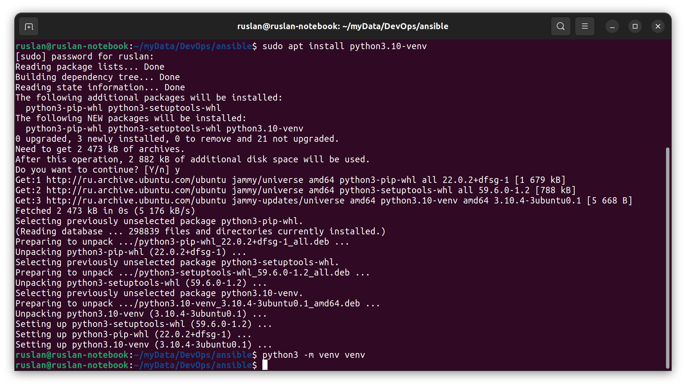
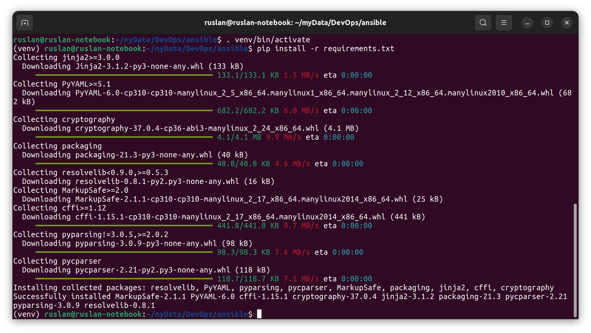
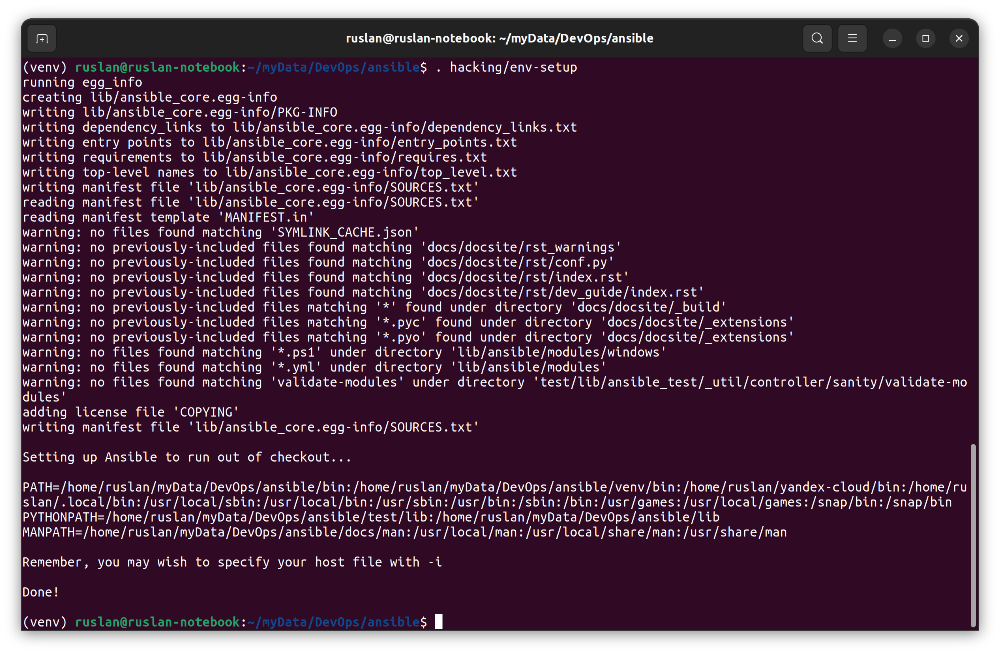
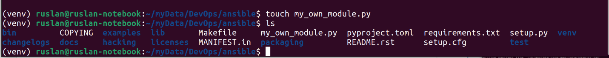
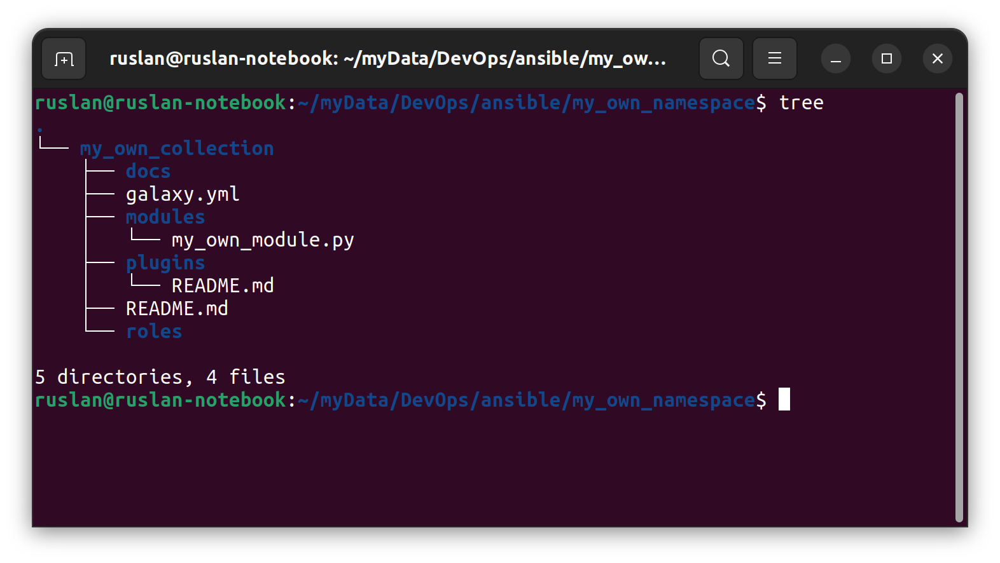

# Домашнее задание к занятию "08.04 Создание собственных modules"

## Подготовка к выполнению
1. Создайте пустой публичных репозиторий в любом своём проекте: `my_own_collection`
   > https://github.com/RuslanKashin/my_own_collection.git
2. Скачайте репозиторий ansible: `git clone https://github.com/ansible/ansible.git` по любому удобному вам пути
   > Готово
3. Зайдите в директорию ansible: `cd ansible`
   > ruslan@ruslan-notebook:~$ cd /home/ruslan/myData/DevOps/ansible
   > ruslan@ruslan-notebook:~/myData/DevOps/ansible$
4. Создайте виртуальное окружение: `python3 -m venv venv`
   > 
5. Активируйте виртуальное окружение: `. venv/bin/activate`. Дальнейшие действия производятся только в виртуальном окружении
   >    ruslan@ruslan-notebook:~/myData/DevOps/ansible$ . venv/bin/activate
   > (venv) ruslan@ruslan-notebook:~/myData/DevOps/ansible$ 
6. Установите зависимости `pip install -r requirements.txt`
   > 
7. Запустить настройку окружения `. hacking/env-setup`
   > 
8. Если все шаги прошли успешно - выйти из виртуального окружения `deactivate`
   > (venv) ruslan@ruslan-notebook:~/myData/DevOps/ansible$ deactivate
   > ruslan@ruslan-notebook:~/myData/DevOps/ansible$ 
9. Ваше окружение настроено, для того чтобы запустить его, нужно находиться в директории `ansible` и выполнить конструкцию `. venv/bin/activate && . hacking/env-setup`
   > Ok
## Основная часть

Наша цель - написать собственный module, который мы можем использовать в своей role, через playbook. Всё это должно быть собрано в виде collection и отправлено в наш репозиторий.

1. В виртуальном окружении создать новый `my_own_module.py` файл
    > 
2. Наполнить его содержимым:
    ```python
    #!/usr/bin/python
    
    # Copyright: (c) 2018, Terry Jones <terry.jones@example.org>
    # GNU General Public License v3.0+ (see COPYING or https://www.gnu.org/licenses/gpl-3.0.txt)
    from __future__ import (absolute_import, division, print_function)
    __metaclass__ = type
    
    DOCUMENTATION = r'''
    ---
    module: my_test
    
    short_description: This is my test module
    
    # If this is part of a collection, you need to use semantic versioning,
    # i.e. the version is of the form "2.5.0" and not "2.4".
    version_added: "1.0.0"
    
    description: This is my longer description explaining my test module.
    
    options:
        name:
            description: This is the message to send to the test module.
            required: true
            type: str
        new:
            description:
                - Control to demo if the result of this module is changed or not.
                - Parameter description can be a list as well.
            required: false
            type: bool
    # Specify this value according to your collection
    # in format of namespace.collection.doc_fragment_name
    extends_documentation_fragment:
        - my_namespace.my_collection.my_doc_fragment_name
    
    author:
        - Your Name (@yourGitHubHandle)
    '''
    
    EXAMPLES = r'''
    # Pass in a message
    - name: Test with a message
      my_namespace.my_collection.my_test:
        name: hello world
    
    # pass in a message and have changed true
    - name: Test with a message and changed output
      my_namespace.my_collection.my_test:
        name: hello world
        new: true
    
    # fail the module
    - name: Test failure of the module
      my_namespace.my_collection.my_test:
        name: fail me
    '''
    
    RETURN = r'''
    # These are examples of possible return values, and in general should use other names for return values.
    original_message:
        description: The original name param that was passed in.
        type: str
        returned: always
        sample: 'hello world'
    message:
        description: The output message that the test module generates.
        type: str
        returned: always
        sample: 'goodbye'
    '''
    
    from ansible.module_utils.basic import AnsibleModule
    
    
    def run_module():
        # define available arguments/parameters a user can pass to the module
        module_args = dict(
            name=dict(type='str', required=True),
            new=dict(type='bool', required=False, default=False)
        )
    
        # seed the result dict in the object
        # we primarily care about changed and state
        # changed is if this module effectively modified the target
        # state will include any data that you want your module to pass back
        # for consumption, for example, in a subsequent task
        result = dict(
            changed=False,
            original_message='',
            message=''
        )
    
        # the AnsibleModule object will be our abstraction working with Ansible
        # this includes instantiation, a couple of common attr would be the
        # args/params passed to the execution, as well as if the module
        # supports check mode
        module = AnsibleModule(
            argument_spec=module_args,
            supports_check_mode=True
        )
    
        # if the user is working with this module in only check mode we do not
        # want to make any changes to the environment, just return the current
        # state with no modifications
        if module.check_mode:
            module.exit_json(**result)
    
        # manipulate or modify the state as needed (this is going to be the
        # part where your module will do what it needs to do)
        result['original_message'] = module.params['name']
        result['message'] = 'goodbye'
    
        # use whatever logic you need to determine whether or not this module
        # made any modifications to your target
        if module.params['new']:
            result['changed'] = True
    
        # during the execution of the module, if there is an exception or a
        # conditional state that effectively causes a failure, run
        # AnsibleModule.fail_json() to pass in the message and the result
        if module.params['name'] == 'fail me':
            module.fail_json(msg='You requested this to fail', **result)
    
        # in the event of a successful module execution, you will want to
        # simple AnsibleModule.exit_json(), passing the key/value results
        module.exit_json(**result)
    
    
    def main():
        run_module()
    
    
    if __name__ == '__main__':
        main()
    ```
    Или возьмите данное наполнение из [статьи](https://docs.ansible.com/ansible/latest/dev_guide/developing_modules_general.html#creating-a-module).


3. Заполните файл в соответствии с требованиями ansible так, чтобы он выполнял основную задачу: module должен создавать текстовый файл на удалённом хосте по пути, определённом в параметре `path`, с содержимым, определённым в параметре `content`.
    ```python
    #!/usr/bin/python
    
    # Copyright: (c) 2022, Ruslan Kashin <ruslan.kashin@gmail.com>
    # GNU General Public License v3.0+ (see COPYING or https://www.gnu.org/licenses/gpl-3.0.txt)
    from __future__ import (absolute_import, division, print_function)
    __metaclass__ = type
    
    DOCUMENTATION = r'''
    ---
    module: create_file
    
    short_description: This is homework for Netology.
    
    version_added: "1.0.0"
    
    description: This is 8.4 homework for Netology, DVPSPDC-3.
    
    options:
        path:
            description: Path to new file.
            required: true
            type: str
        content:
            description: New file content.
            required: true
            type: str
    
    author:
        - Ruslan Kashin (@RuslanKashin)
    '''
    
    EXAMPLES = r'''
    # Create file
    - name: Create file with content
      create_file:
        path: "/tmp/my_file_name.txt"
        content: "My file content"
    '''
    
    RETURN = r'''
    # These are examples of possible return values, and in general should use other names for return values.
    message:
        description: The output message that the module generates.
        type: str
        returned: always
        sample: 'File /tmp/my_file_name.txt was created successfully!'
    '''
    
    from ansible.module_utils.basic import AnsibleModule
    
    import os
    import os.path
    
    def main():
    
        module_args = {
            "path": {"type": "str", "required": True},
            "content": {"type": "str", "required": True},
        }
    
        result = {
            "message": "Wrong path. File not accessible."
        }
    
        module = AnsibleModule(
            argument_spec=module_args,
            supports_check_mode=True
        )    
        
        if module.check_mode:
            module.exit_json(**result)
    
        # file handling
        #---------------------------------------------------
        my_path = module.params["path"]
        my_content = module.params["content"]
        
        if os.path.isfile(my_path):
           read_file = open(my_path,"r")
           if my_content == read_file.read():
              result["message"] = "A file with this content already exists. Creation is not required."
              read_file.close()
           else:
              read_file.close()
              write_file = open(my_path, "w+")
              write_file.write(my_content)
              write_file.close()
              result["message"] = "File content updated."
        else:
           try:
              new_file = open(my_path, "w+")
           except IOError:
              result["message"] = "Wrong path. File not accessible."
           else:
              new_file.write(my_content)
              result["message"] = "Created a new file with the given content."
              new_file.close()
        #----------------------------------------------------     
    
        module.exit_json(**result)    
    
    if __name__ == '__main__':
        main()
    ```

5. Проверьте module на исполняемость локально.
    > Создал `input.json`:
    ```json
    {
        "ANSIBLE_MODULE_ARGS": {
            "path": "/tmp/my_file.txt",
            "content": "My file content!"
        }
    }
    ```
    > Запустил модуль:
    ```shell
    (venv) ruslan@ruslan-notebook:~/myData/DevOps/ansible$ python -m my_own_module input.json
    {"message": "Created a new file with the given content.", "invocation": {"module_args": {"path": "/tmp/my_file.txt", "content": "My file content!"}}}

   (venv) ruslan@ruslan-notebook:~/myData/DevOps/ansible$ python -m my_own_module input.json
   {"message": "A file with this content already exists. Creation is not required.", "invocation": {"module_args": {"path": "/tmp/my_file.txt", "content": "My file content!"}}}

   // "Изменил /tmp/my_file.txt и повторил запуск"
   (venv) ruslan@ruslan-notebook:~/myData/DevOps/ansible$ nano /tmp/my_file.txt
   (venv) ruslan@ruslan-notebook:~/myData/DevOps/ansible$ python -m my_own_module input.json
   {"message": "File content updated.", "invocation": {"module_args": {"path": "/tmp/my_file.txt", "content": "My file content!"}}}

   // "Указал некорректный path в input.json и повторил запуск"
   (venv) ruslan@ruslan-notebook:~/myData/DevOps/ansible$ python -m my_own_module input.json
   {"message": "Wrong path. File not accessible.", "invocation": {"module_args": {"path": "tmp/myfile", "content": "My file content!"}}}
   ```
   
5. Напишите single task playbook и используйте module в нём.
    ```shell
    (venv) ruslan@ruslan-notebook:~/myData/DevOps/ansible$ mkdir playbook
    (venv) ruslan@ruslan-notebook:~/myData/DevOps/ansible$ nano playbook/site.yml
    (venv) ruslan@ruslan-notebook:~/myData/DevOps/ansible$ cat playbook/site.yml
    - name: test create file module
      hosts: localhost
      tasks:
      - name: run the new module
        my_own_module:
          path: '/tmp/my_file2.txt'
          content: 'My file2 content!'
        register: testout
      - name: dump test output
        debug:
          msg: '{{ testout }}'
    ```
    ```
    (venv) ruslan@ruslan-notebook:~/myData/DevOps/ansible$ ansible-playbook playbook/site.yml
    [WARNING]: You are running the development version of Ansible. You should only run Ansible from "devel" if you are modifying the Ansible engine, or trying out
    features under development. This is a rapidly changing source of code and can become unstable at any point.
    [WARNING]: provided hosts list is empty, only localhost is available. Note that the implicit localhost does not match 'all'
    ERROR! couldn't resolve module/action 'my_own_module'. This often indicates a misspelling, missing collection, or incorrect module path.
    
    The error appears to be in '/home/ruslan/myData/DevOps/ansible/playbook/site.yml': line 4, column 5, but may
    be elsewhere in the file depending on the exact syntax problem.
    
    The offending line appears to be:
    
      tasks:
      - name: run the new module
        ^ here
    ```
    > Перенес файл с модулем в правильное место (`lib/ansible/modules/my_own_module.py`)
    ```
    (venv) ruslan@ruslan-notebook:~/myData/DevOps/ansible$ ansible-playbook playbook/site.yml
    [WARNING]: You are running the development version of Ansible. You should only run Ansible from "devel" if you are modifying the Ansible engine, or trying out
    features under development. This is a rapidly changing source of code and can become unstable at any point.
    [WARNING]: provided hosts list is empty, only localhost is available. Note that the implicit localhost does not match 'all'
    
    PLAY [test create file module] *********************************************************************************************************************************
    
    TASK [Gathering Facts] *****************************************************************************************************************************************
    ok: [localhost]
    
    TASK [run the new module] **************************************************************************************************************************************
    ok: [localhost]
    
    TASK [dump test output] ****************************************************************************************************************************************
    ok: [localhost] => {
        "msg": {
            "changed": false,
            "failed": false,
            "message": "Created a new file with the given content."
        }
    }
    
    PLAY RECAP *****************************************************************************************************************************************************
    localhost                  : ok=3    changed=0    unreachable=0    failed=0    skipped=0    rescued=0    ignored=0   
    
    (venv) ruslan@ruslan-notebook:~/myData/DevOps/ansible$ 
    ```
6. Проверьте через playbook на идемпотентность.
    ```shell
    (venv) ruslan@ruslan-notebook:~/myData/DevOps/ansible$ ansible-playbook playbook/site.yml
    [WARNING]: You are running the development version of Ansible. You should only run Ansible from "devel" if you are modifying the Ansible engine, or trying out
    features under development. This is a rapidly changing source of code and can become unstable at any point.
    [WARNING]: provided hosts list is empty, only localhost is available. Note that the implicit localhost does not match 'all'
    
    PLAY [test create file module] *********************************************************************************************************************************
    
    TASK [Gathering Facts] *****************************************************************************************************************************************
    ok: [localhost]
    
    TASK [run the new module] **************************************************************************************************************************************
    ok: [localhost]
    
    TASK [dump test output] ****************************************************************************************************************************************
    ok: [localhost] => {
        "msg": {
            "changed": false,
            "failed": false,
            "message": "A file with this content already exists. Creation is not required."
        }
    }
    
    PLAY RECAP *****************************************************************************************************************************************************
    localhost                  : ok=3    changed=0    unreachable=0    failed=0    skipped=0    rescued=0    ignored=0   
    ```
7. Выйдите из виртуального окружения.
    ```
    (venv) ruslan@ruslan-notebook:~/myData/DevOps/ansible$ deactivate
    ruslan@ruslan-notebook:~/myData/DevOps/ansible$ 
    ```
8. Инициализируйте новую collection: `ansible-galaxy collection init my_own_namespace.my_own_collection`
    ```shell
    ruslan@ruslan-notebook:~/myData/DevOps/ansible$ sudo ansible-galaxy collection init my_own_namespace.my_own_collection
    [sudo] password for ruslan: 
    - Collection my_own_namespace.my_own_collection was created successfully
    ```
9. В данную collection перенесите свой module в соответствующую директорию.
   > 
11. Single task playbook преобразуйте в single task role и перенесите в collection. У role должны быть default всех параметров module
   > Ok
12. Создайте playbook для использования этой role.
   ```
   - name: Run my own role
     hosts: localhost
     roles:
       - my_own_role
   ```
12. Заполните всю документацию по collection, выложите в свой репозиторий, поставьте тег `1.0.0` на этот коммит.
   > Ok
13. Создайте .tar.gz этой collection: `ansible-galaxy collection build` в корневой директории collection.
   ```
   ruslan@ruslan-notebook:~/myData/DevOps/ansible/my_own_namespace/my_own_collection$ sudo ansible-galaxy collection build
   [sudo] password for ruslan: 
   Created collection for my_own_namespace.my_own_collection at /home/ruslan/myData/DevOps/ansible/my_own_namespace/my_own_collection/my_own_namespace-my_own_coller
   ```
14. Создайте ещё одну директорию любого наименования, перенесите туда single task playbook и архив c collection.
   > Ok
15. Установите collection из локального архива: `ansible-galaxy collection install <archivename>.tar.gz`
   ```
   ruslan@ruslan-notebook:~/myData/DevOps/DevopsHomework/src_08.04/Test$ ansible-galaxy collection install my_own_namespace-my_own_collection-1.0.0.tar.gz
   Starting galaxy collection install process
   Process install dependency map
   Starting collection install process
   Installing 'my_own_namespace.my_own_collection:1.0.0' to '/home/ruslan/.ansible/collections/ansible_collections/my_own_namespace/my_own_collection'
   my_own_namespace.my_own_collection:1.0.0 was installed successfully
   ```
16. Запустите playbook, убедитесь, что он работает.
   ```shell
    ruslan@ruslan-notebook:~/myData/DevOps/DevopsHomework/src_08.04/Test$ sudo ansible-playbook site.yml
    [WARNING]: You are running the development version of Ansible. You should only run Ansible from "devel" if you are modifying the Ansible engine, or trying out
    features under development. This is a rapidly changing source of code and can become unstable at any point.
    [WARNING]: provided hosts list is empty, only localhost is available. Note that the implicit localhost does not match 'all'
    
    PLAY [test create file module] *********************************************************************************************************************************
    
    TASK [Gathering Facts] *****************************************************************************************************************************************
    ok: [localhost]
    
    TASK [run the new module] **************************************************************************************************************************************
    ok: [localhost]
    
    TASK [dump test output] ****************************************************************************************************************************************
    ok: [localhost] => {
        "msg": {
            "changed": false,
            "failed": false,
            "message": "Created a new file with the given content."
        }
    }
    
    PLAY RECAP *****************************************************************************************************************************************************
    localhost                  : ok=3    changed=0    unreachable=0    failed=0    skipped=0    rescued=0    ignored=0   
   
   ```
17. В ответ необходимо прислать ссылку на репозиторий с collection
   > [https://github.com/RuslanKashin/my_own_collection.git](https://github.com/RuslanKashin/my_own_collection.git)