# Домашнее задание к занятию "09.02 CI\CD"

## Знакомоство с SonarQube

### Подготовка к выполнению

1. Выполняем `docker pull sonarqube:8.7-community`
   ```shell
   ruslan@ruslan-notebook:~$ sudo docker pull sonarqube:8.7-community
   [sudo] password for ruslan: 
   8.7-community: Pulling from library/sonarqube
   22599d3e9e25: Pull complete 
   00bb4d95f2aa: Pull complete 
   3ef8cf8a60c8: Pull complete 
   928990dd1bda: Pull complete 
   07cca701c22e: Pull complete 
   Digest: sha256:70496f44067bea15514f0a275ee898a7e4a3fedaaa6766e7874d24a39be336dc
   Status: Downloaded newer image for sonarqube:8.7-community
   docker.io/library/sonarqube:8.7-community
   ```
2. Выполняем `docker run -d --name sonarqube -e SONAR_ES_BOOTSTRAP_CHECKS_DISABLE=true -p 9000:9000 sonarqube:8.7-community`
   ```shell
   ruslan@ruslan-notebook:~$ sudo docker run -d --name sonarqube -e SONAR_ES_BOOTSTRAP_CHECKS_DISABLE=true -p 9000:9000 sonarqube:8.7-community
   ec78d5d00014650cb0bbe1a272088e7c17523201e3a5e1b228635d958b708d88
   ```
3. Ждём запуск, смотрим логи через `docker logs -f sonarqube`
   ```shell
   ruslan@ruslan-notebook:~$ sudo docker logs -f sonarqube
   2022.09.06 15:44:48 INFO  app[][o.s.a.AppFileSystem] Cleaning or creating temp directory /opt/sonarqube/temp
   2022.09.06 15:44:48 INFO  app[][o.s.a.es.EsSettings] Elasticsearch listening on [HTTP: 127.0.0.1:9001, TCP: 127.0.0.1:35283]
   2022.09.06 15:44:48 INFO  app[][o.s.a.ProcessLauncherImpl] Launch process[[key='es', ipcIndex=1, logFilenamePrefix=es]] from [/opt/sonarqube/elasticsearch]: /opt/sonarqube/elasticsearch/bin/elasticsearch
   2022.09.06 15:44:48 INFO  app[][o.s.a.SchedulerImpl] Waiting for Elasticsearch to be up and running
   warning: no-jdk distributions that do not bundle a JDK are deprecated and will be removed in a future release
   OpenJDK 64-Bit Server VM warning: Option UseConcMarkSweepGC was deprecated in version 9.0 and will likely be removed in a future release.
   2022.09.06 15:44:50 INFO  es[][o.e.n.Node] version[7.10.2], pid[38], build[oss/tar/747e1cc71def077253878a59143c1f785afa92b9/2021-01-13T00:42:12.435326Z], OS[Linux/5.15.0-47-generic/amd64], JVM[AdoptOpenJDK/OpenJDK 64-Bit Server VM/11.0.10/11.0.10+9]
   ...
   ```
4. Проверяем готовность сервиса через [браузер](http://localhost:9000)
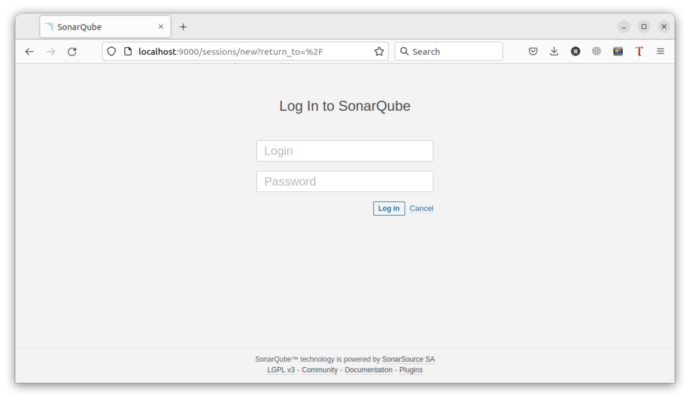

5. Заходим под admin\admin, меняем пароль на свой
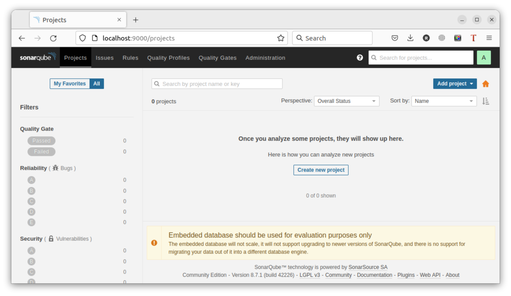

В целом, в [этой статье](https://docs.sonarqube.org/latest/setup/install-server/) описаны все варианты установки, включая и docker, но так как нам он нужен разово, то достаточно того набора действий, который я указал выше.

### Основная часть

1. Создаём новый проект, название произвольное
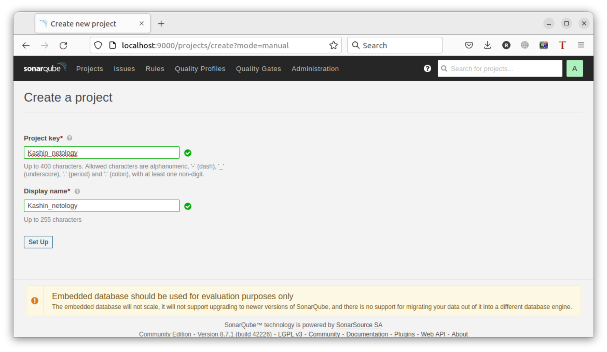
2. Скачиваем пакет sonar-scanner, который нам предлагает скачать сам sonarqube
https://docs.sonarqube.org/latest/analysis/scan/sonarscanner/  


3. Делаем так, чтобы binary был доступен через вызов в shell (или меняем переменную PATH или любой другой удобный вам способ)
4. Проверяем `sonar-scanner --version`
   ```shell
   ruslan@ruslan-notebook:~$ install_directory=/home/ruslan/sonar-scanner-4.7.0.2747-linux
   ruslan@ruslan-notebook:~$ export PATH="/home/ruslan/sonar-scanner-4.7.0.2747-linux/bin:$PATH"
   ruslan@ruslan-notebook:~$ sonar-scanner --version
   INFO: Scanner configuration file: /home/ruslan/sonar-scanner-4.7.0.2747-linux/conf/sonar-scanner.properties
   INFO: Project root configuration file: NONE
   INFO: SonarScanner 4.7.0.2747
   INFO: Java 11.0.14.1 Eclipse Adoptium (64-bit)
   INFO: Linux 5.15.0-47-generic amd64
   ``` 
7. Запускаем анализатор против кода из директории [example](./example) с дополнительным ключом `-Dsonar.coverage.exclusions=fail.py`
```
ruslan@ruslan-notebook:~/myData/DevOps/DevopsHomework/src_09.02$ sonar-scanner \
  -Dsonar.projectKey=Kashin_netology \
  -Dsonar.sources=. \
  -Dsonar.host.url=http://localhost:9000 \
  -Dsonar.login=ab0ebe25737018f2239c4557be51fad478bdd5c6
INFO: Scanner configuration file: /home/ruslan/sonar-scanner-4.7.0.2747-linux/conf/sonar-scanner.properties
INFO: Project root configuration file: NONE
INFO: SonarScanner 4.7.0.2747
INFO: Java 11.0.14.1 Eclipse Adoptium (64-bit)
INFO: Linux 5.15.0-47-generic amd64
INFO: User cache: /home/ruslan/.sonar/cache
INFO: Scanner configuration file: /home/ruslan/sonar-scanner-4.7.0.2747-linux/conf/sonar-scanner.properties
INFO: Project root configuration file: NONE
INFO: Analyzing on SonarQube server 8.7.1
INFO: Default locale: "en_US", source code encoding: "UTF-8" (analysis is platform dependent)
INFO: Load global settings
INFO: Load global settings (done) | time=89ms
INFO: Server id: BF41A1F2-AYMTefI98tsy9P16bghz
INFO: User cache: /home/ruslan/.sonar/cache
INFO: Load/download plugins
INFO: Load plugins index
INFO: Load plugins index (done) | time=40ms
INFO: Load/download plugins (done) | time=156ms
INFO: Process project properties
INFO: Process project properties (done) | time=7ms
INFO: Execute project builders
INFO: Execute project builders (done) | time=2ms
INFO: Project key: Kashin_netology
INFO: Base dir: /home/ruslan/myData/DevOps/DevopsHomework/src_09.02
INFO: Working dir: /home/ruslan/myData/DevOps/DevopsHomework/src_09.02/.scannerwork
INFO: Load project settings for component key: 'Kashin_netology'
INFO: Load project settings for component key: 'Kashin_netology' (done) | time=14ms
INFO: Load quality profiles
INFO: Load quality profiles (done) | time=65ms
INFO: Load active rules
INFO: Load active rules (done) | time=1371ms
INFO: Indexing files...
INFO: Project configuration:
INFO: 2 files indexed
INFO: 0 files ignored because of scm ignore settings
INFO: Quality profile for py: Sonar way
INFO: Quality profile for xml: Sonar way
INFO: ------------- Run sensors on module Kashin_netology
INFO: Load metrics repository
INFO: Load metrics repository (done) | time=41ms
INFO: Sensor Python Sensor [python]
INFO: Starting global symbols computation
INFO: 1 source files to be analyzed
INFO: Load project repositories
INFO: Load project repositories (done) | time=21ms
INFO: 1/1 source files have been analyzed
INFO: Starting rules execution
INFO: 1 source files to be analyzed
INFO: 1/1 source files have been analyzed
INFO: Sensor Python Sensor [python] (done) | time=6487ms
INFO: Sensor Cobertura Sensor for Python coverage [python]
INFO: Sensor Cobertura Sensor for Python coverage [python] (done) | time=9ms
INFO: Sensor PythonXUnitSensor [python]
INFO: Sensor PythonXUnitSensor [python] (done) | time=1ms
INFO: Sensor CSS Rules [cssfamily]
INFO: No CSS, PHP, HTML or VueJS files are found in the project. CSS analysis is skipped.
INFO: Sensor CSS Rules [cssfamily] (done) | time=1ms
INFO: Sensor JaCoCo XML Report Importer [jacoco]
INFO: 'sonar.coverage.jacoco.xmlReportPaths' is not defined. Using default locations: target/site/jacoco/jacoco.xml,target/site/jacoco-it/jacoco.xml,build/reports/jacoco/test/jacocoTestReport.xml
INFO: No report imported, no coverage information will be imported by JaCoCo XML Report Importer
INFO: Sensor JaCoCo XML Report Importer [jacoco] (done) | time=2ms
INFO: Sensor C# Properties [csharp]
INFO: Sensor C# Properties [csharp] (done) | time=1ms
INFO: Sensor JavaXmlSensor [java]
INFO: 1 source files to be analyzed
INFO: 1/1 source files have been analyzed
INFO: Sensor JavaXmlSensor [java] (done) | time=197ms
INFO: Sensor HTML [web]
INFO: Sensor HTML [web] (done) | time=2ms
INFO: Sensor XML Sensor [xml]
INFO: 1 source files to be analyzed
INFO: Sensor XML Sensor [xml] (done) | time=115ms
INFO: 1/1 source files have been analyzed
INFO: Sensor VB.NET Properties [vbnet]
INFO: Sensor VB.NET Properties [vbnet] (done) | time=1ms
INFO: ------------- Run sensors on project
INFO: Sensor Zero Coverage Sensor
INFO: Sensor Zero Coverage Sensor (done) | time=6ms
INFO: SCM Publisher SCM provider for this project is: git
INFO: SCM Publisher 2 source files to be analyzed
INFO: SCM Publisher 0/2 source files have been analyzed (done) | time=153ms
WARN: Missing blame information for the following files:
WARN:   * example/fail.py
WARN:   * mvn/pom.xml
WARN: This may lead to missing/broken features in SonarQube
INFO: CPD Executor Calculating CPD for 1 file
INFO: CPD Executor CPD calculation finished (done) | time=6ms
INFO: Analysis report generated in 80ms, dir size=93 KB
INFO: Analysis report compressed in 14ms, zip size=14 KB
INFO: Analysis report uploaded in 52ms
INFO: ANALYSIS SUCCESSFUL, you can browse http://localhost:9000/dashboard?id=Kashin_netology
INFO: Note that you will be able to access the updated dashboard once the server has processed the submitted analysis report
INFO: More about the report processing at http://localhost:9000/api/ce/task?id=AYMTqM6Z8tsy9P16blhB
INFO: Analysis total time: 10.751 s
INFO: ------------------------------------------------------------------------
INFO: EXECUTION SUCCESS
INFO: ------------------------------------------------------------------------
INFO: Total time: 12.071s
INFO: Final Memory: 7M/30M
INFO: ------------------------------------------------------------------------
```
6. Смотрим результат в интерфейсе
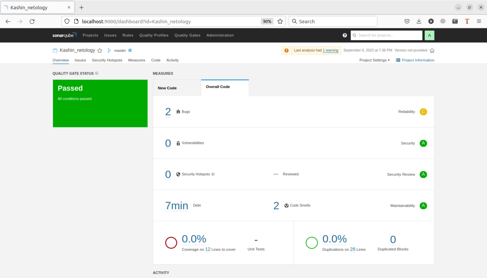
7. Исправляем ошибки, которые он выявил(включая warnings)
8. Запускаем анализатор повторно - проверяем, что QG пройдены успешно
9. Делаем скриншот успешного прохождения анализа, прикладываем к решению ДЗ
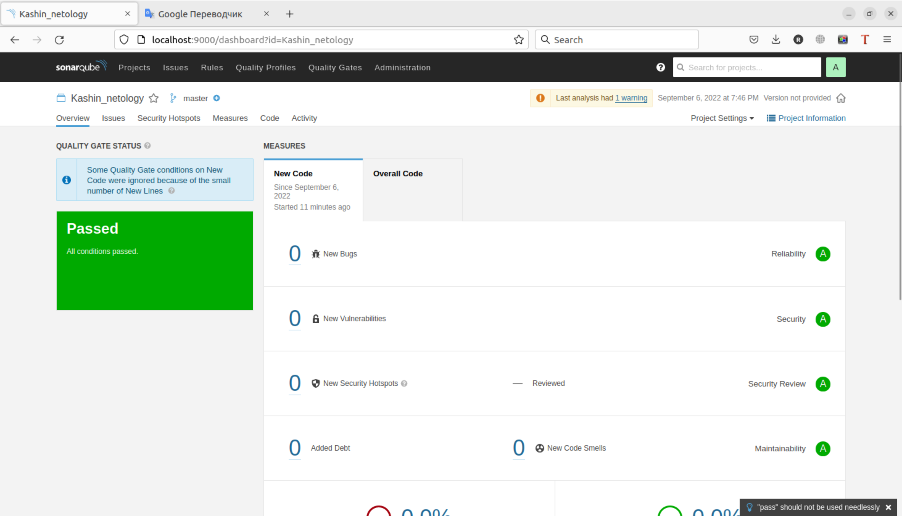
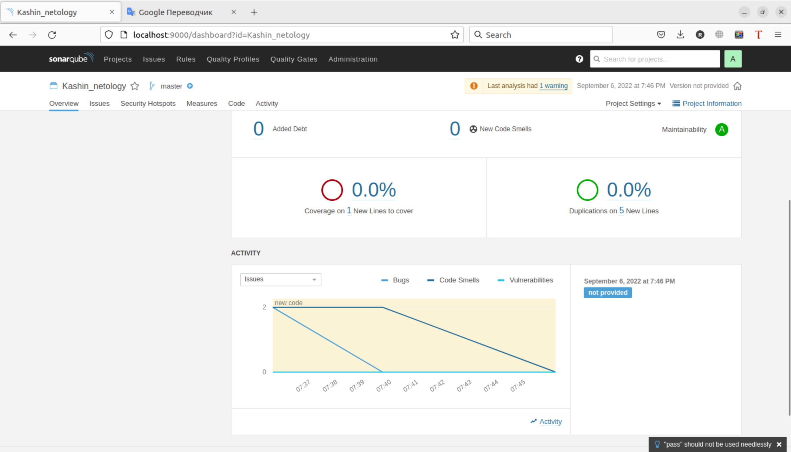

## Знакомство с Nexus

### Подготовка к выполнению

1. Выполняем `docker pull sonatype/nexus3`
   ```shell
   ruslan@ruslan-notebook:~/myData/DevOps/DevopsHomework/src_09.02$ sudo docker pull sonatype/nexus3
   [sudo] password for ruslan: 
   Using default tag: latest
   latest: Pulling from sonatype/nexus3
   a96e4e55e78a: Pull complete 
   67d8ef478732: Pull complete 
   5dab04a94e74: Pull complete 
   f18da266a531: Pull complete 
   8eaab91b309d: Pull complete 
   9191b3fc4348: Pull complete 
   16516688603a: Pull complete 
   Digest: sha256:45e9800b14b97bbde60a6aef12842d2ed666f64cead6a6118c151f2fc2973f55
   Status: Downloaded newer image for sonatype/nexus3:latest
   docker.io/sonatype/nexus3:latest
   ```
2. Выполняем `docker run -d -p 8081:8081 --name nexus sonatype/nexus3`
   ```
   ruslan@ruslan-notebook:~$ sudo docker run -d -p 8081:8081 --name nexus sonatype/nexus3
   b9435e65cebae4e6535294f1a137b166402a10e1535de7543e946a767865d2ca
   ```
3. Ждём запуск, смотрим логи через `docker logs -f nexus`
4. Проверяем готовность сервиса через [бразуер](http://localhost:8081)
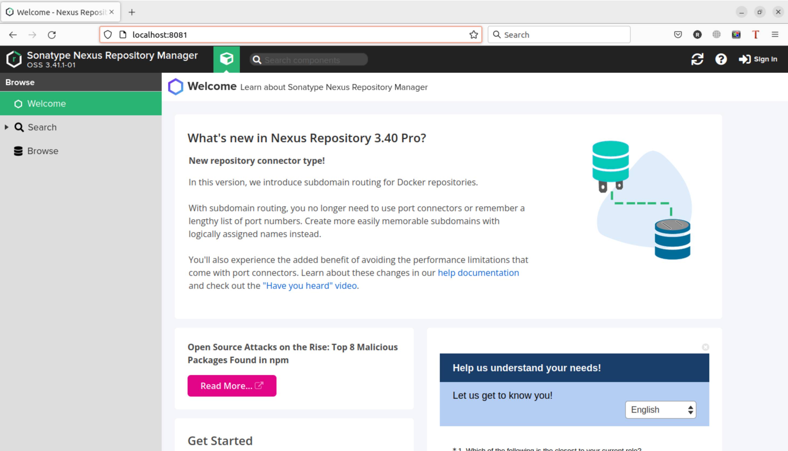

5. Узнаём пароль от admin через `docker exec -it nexus /bin/bash`
   ```shell
   ruslan@ruslan-notebook:~$ sudo docker exec -it nexus /bin/bash
   bash-4.4$ nano /nexus-data/admin.password
   bash: nano: command not found
   bash-4.4$ cat /nexus-data/admin.password
   1cdd72cc-528a-466b-a534-534160288bfc
   ```
6. Подключаемся под админом, меняем пароль, сохраняем анонимный доступ
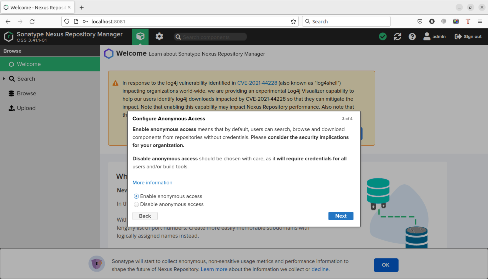
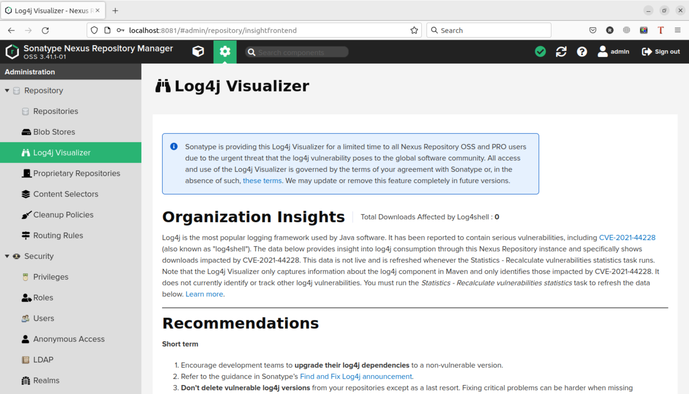

### Основная часть

1. В репозиторий `maven-public` загружаем артефакт с GAV параметрами:
   1. groupId: netology
   2. artifactId: java
   3. version: 8_282
   4. classifier: distrib
   5. type: tar.gz
2. В него же загружаем такой же артефакт, но с version: 8_102
3. Проверяем, что все файлы загрузились успешно

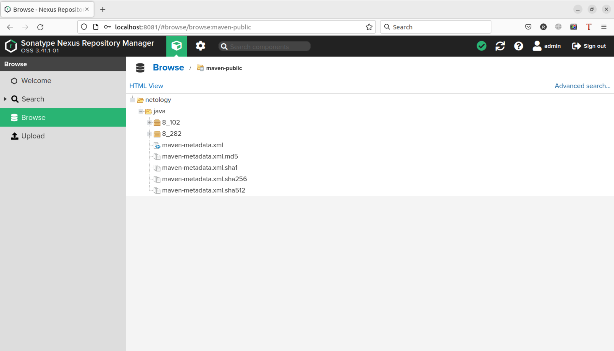

4. В ответе присылаем файл `maven-metadata.xml` для этого артефекта  
[maven-metadata.xml](src_09.02/maven-metadata.xml)

### Знакомство с Maven

### Подготовка к выполнению

1. Скачиваем дистрибутив с [maven](https://maven.apache.org/download.cgi)
2. Разархивируем, делаем так, чтобы binary был доступен через вызов в shell (или меняем переменную PATH или любой другой удобный вам способ)
3. Проверяем `mvn --version`
   ```shell
   ruslan@ruslan-notebook:~$ install_directory=/home/ruslan/apache-maven-3.8.6
   ruslan@ruslan-notebook:~$ export PATH="/home/ruslan/apache-maven-3.8.6/bin:$PATH"
   ruslan@ruslan-notebook:~$ mvn --version
   The JAVA_HOME environment variable is not defined correctly,
   this environment variable is needed to run this program.
   ruslan@ruslan-notebook:~$ sudo apt install default-jre
   Reading package lists... Done
   Building dependency tree... Done
   Reading state information... Done
   ...
   done.
   ruslan@ruslan-notebook:~$ mvn --version
   Apache Maven 3.8.6 (84538c9988a25aec085021c365c560670ad80f63)
   Maven home: /home/ruslan/apache-maven-3.8.6
   Java version: 11.0.16, vendor: Ubuntu, runtime: /usr/lib/jvm/java-11-openjdk-amd64
   Default locale: en_US, platform encoding: UTF-8
   OS name: "linux", version: "5.15.0-47-generic", arch: "amd64", family: "unix"
   ```
4. Забираем директорию [mvn](./mvn) с pom

### Основная часть

1. Меняем в `pom.xml` блок с зависимостями под наш артефакт из первого пункта задания для Nexus (java с версией 8_282)
   ```xml
   <project xmlns="http://maven.apache.org/POM/4.0.0" xmlns:xsi="http://www.w3.org/2001/XMLSchema-instance"
     xsi:schemaLocation="http://maven.apache.org/POM/4.0.0 http://maven.apache.org/xsd/maven-4.0.0.xsd">
     <modelVersion>4.0.0</modelVersion>
    
     <groupId>com.netology.app</groupId>
     <artifactId>simple-app</artifactId>
     <version>1.0-SNAPSHOT</version>
      <repositories>
       <repository>
         <id>my-repo</id>
         <name>maven-public</name>
         <url>http://localhost:8081/repository/maven-public/</url>
       </repository>
     </repositories>
     <dependencies>
       <dependency>
         <groupId>netology</groupId>
         <artifactId>java</artifactId>
         <version>8_282</version>
         <classifier>distrib</classifier>
         <type>tar.gz</type>
       </dependency>
     </dependencies>  
   </project>
   ```
2. Запускаем команду `mvn package` в директории с `pom.xml`, ожидаем успешного окончания
   ```shell
   ruslan@ruslan-notebook:~/myData/DevOps/DevopsHomework/src_09.02/mvn$ mvn package
   [INFO] Scanning for projects...
   [INFO] 
   [INFO] --------------------< com.netology.app:simple-app >---------------------
   [INFO] Building simple-app 1.0-SNAPSHOT
   [INFO] --------------------------------[ jar ]---------------------------------
   Downloading from central: https://repo.maven.apache.org/maven2/org/apache/maven/plugins/maven-resources-plugin/2.6/maven-resources-plugin-2.6.pom
   ...
   [INFO] Building jar: /home/ruslan/myData/DevOps/DevopsHomework/src_09.02/mvn/target/simple-app-1.0-SNAPSHOT.jar
   [INFO] ------------------------------------------------------------------------
   [INFO] BUILD SUCCESS
   [INFO] ------------------------------------------------------------------------
   [INFO] Total time:  14.049 s
   [INFO] Finished at: 2022-09-07T12:11:57+03:00
   [INFO] ------------------------------------------------------------------------
   ```
3. Проверяем директорию `~/.m2/repository/`, находим наш артефакт
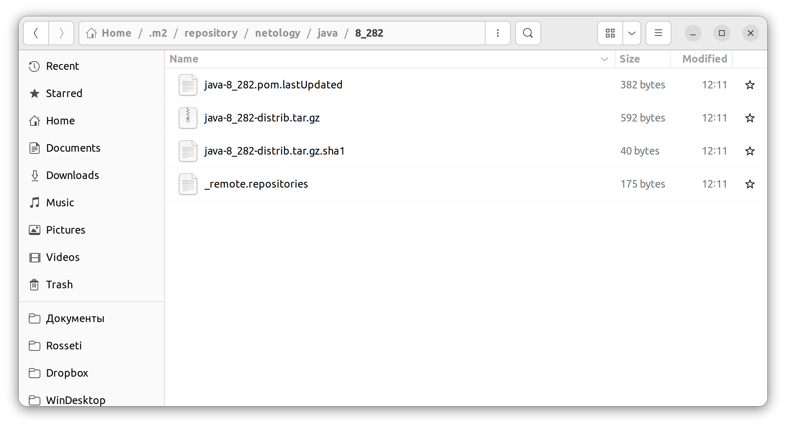
4. В ответе присылаем исправленный файл `pom.xml`  
[pom.xml](src_09.02/mvn/pom.xml)

