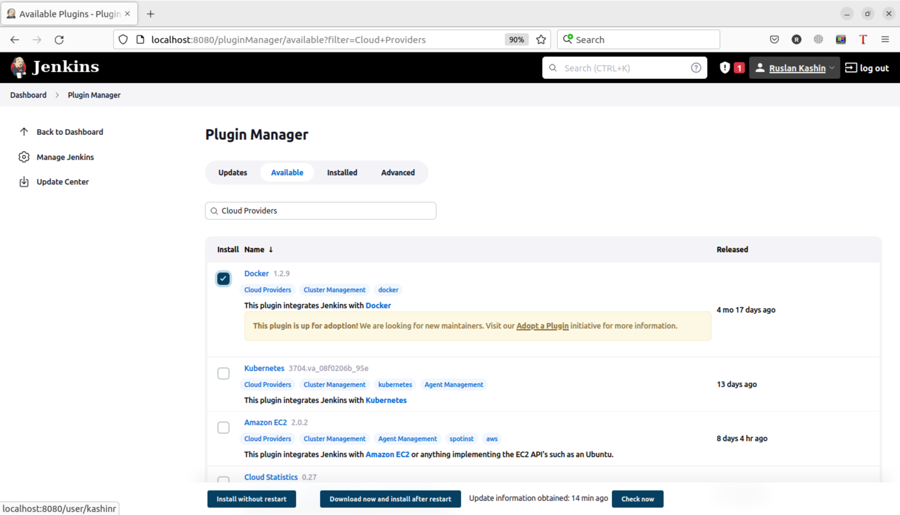
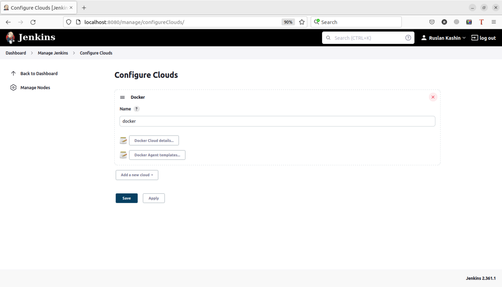

# Домашнее задание к занятию "09.03 Jenkins"

## Подготовка к выполнению

1. Установить jenkins по любой из [инструкций](https://www.jenkins.io/download/)
```shell
ruslan@ruslan-notebook:~$ sudo docker pull jenkins/jenkins:lts-jdk11
[sudo] password for ruslan: 
lts-jdk11: Pulling from jenkins/jenkins
1671565cc8df: Pull complete 
1e010a8344e7: Pull complete 
f7406b2e1315: Pull complete 
a7516ebe83d2: Pull complete 
a51dca64e82b: Pull complete 
77ef07b6a141: Pull complete 
2ac030a719df: Pull complete 
263bf74244c0: Pull complete 
620f54e03b44: Pull complete 
59e43d37c904: Pull complete 
c9dbe2415122: Pull complete 
2c049b4765e9: Pull complete 
c2b2538c867b: Pull complete 
57c5d5e596fd: Pull complete 
Digest: sha256:5508cb1317aa0ede06cb34767fb1ab3860d1307109ade577d5df871f62170214
Status: Downloaded newer image for jenkins/jenkins:lts-jdk11
docker.io/jenkins/jenkins:lts-jdk11
```
2. Запустить и проверить работоспособность
```shell
ruslan@ruslan-notebook:~$ sudo docker run -d -p 8080:8080 -p 50000:50000 --name my_jenkins jenkins/jenkins:lts-jdk11
cad70bf2908813165e3a6f1fed41fcea2796494a26d029aadfab449eacb0cec8
```

```
ruslan@ruslan-notebook:~$ sudo docker logs my_jenkins
Running from: /usr/share/jenkins/jenkins.war
...
*************************************************************
*************************************************************
*************************************************************

Jenkins initial setup is required. An admin user has been created and a password generated.
Please use the following password to proceed to installation:

67b75da68d4844bca4f329d5c3ce7022

This may also be found at: /var/jenkins_home/secrets/initialAdminPassword

*************************************************************
*************************************************************
*************************************************************
...
```


3. Сделать первоначальную настройку




4. Настроить под свои нужды
5. Поднять отдельный cloud


6. Для динамических агентов можно использовать [образ](https://hub.docker.com/repository/docker/aragast/agent)


7. Обязательный параметр: поставить label для динамических агентов: `ansible_docker`


8. Сделать форк репозитория с [playbook](https://github.com/aragastmatb/example-playbook)  
9. https://github.com/RuslanKashin/example-playbook

## Основная часть

1. Сделать Freestyle Job, который будет запускать `ansible-playbook` из форка репозитория
2. Сделать Declarative Pipeline, который будет выкачивать репозиторий с плейбукой и запускать её
3. Перенести Declarative Pipeline в репозиторий в файл `Jenkinsfile`
4. Перенастроить Job на использование `Jenkinsfile` из репозитория
5. Создать Scripted Pipeline, наполнить его скриптом из [pipeline](./pipeline)
6. Заменить credentialsId на свой собственный
7. Проверить работоспособность, исправить ошибки, исправленный Pipeline вложить в репозитрий в файл `ScriptedJenkinsfile`
8. Отправить ссылку на репозиторий в ответе

