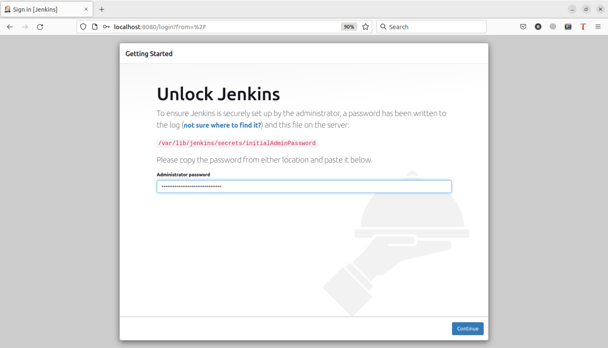
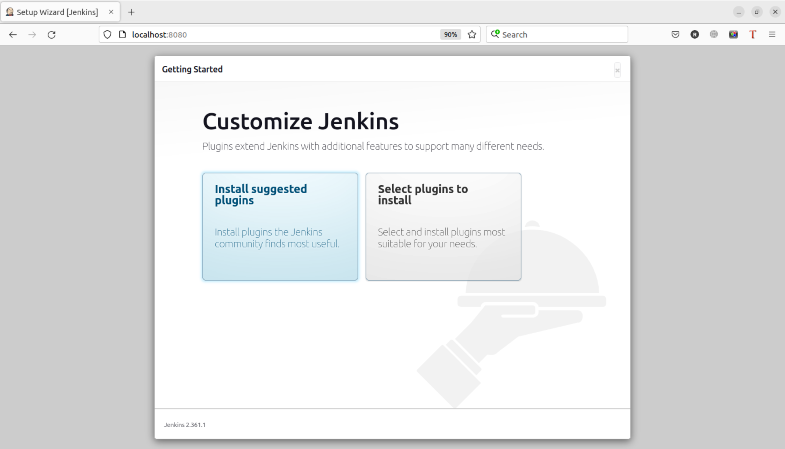

# Домашнее задание к занятию "09.03 Jenkins"

## Подготовка к выполнению

1. Установить jenkins по любой из [инструкций](https://www.jenkins.io/download/)
```shell
ruslan@ruslan-notebook:~$ curl -fsSL https://pkg.jenkins.io/debian-stable/jenkins.io.key | sudo tee \
    /usr/share/keyrings/jenkins-keyring.asc > /dev/null
ruslan@ruslan-notebook:~$ echo deb [signed-by=/usr/share/keyrings/jenkins-keyring.asc] \
    https://pkg.jenkins.io/debian-stable binary/ | sudo tee \
    /etc/apt/sources.list.d/jenkins.list > /dev/null
ruslan@ruslan-notebook:~$ sudo apt-get update
...
ruslan@ruslan-notebook:~$ sudo apt-get install fontconfig openjdk-11-jre
...
ruslan@ruslan-notebook:~$ sudo apt-get install jenkins
...
```
2. Запустить и проверить работоспособность
```shell
ruslan@ruslan-notebook:~$ jenkins --version
2.361.1
ruslan@ruslan-notebook:~$ sudo cat /var/lib/jenkins/secrets/initialAdminPassword
6ffeb1b6a2544a63adb29f8f83bb7302
```



3. Сделать первоначальную настройку


4. Настроить под свои нужды
5. Поднять отдельный cloud


```
ruslan@ruslan-notebook:~$ sudo chmod 777 /var/run/docker.sock
```


6. Для динамических агентов можно использовать [образ](https://hub.docker.com/repository/docker/aragast/agent)
7. Обязательный параметр: поставить label для динамических агентов: `ansible_docker`
```
ruslan@ruslan-notebook:~$ sudo docker pull aragast/agent:7
7: Pulling from aragast/agent
Digest: sha256:ebf0a78bcb580c8497efdc256c8b9a9b8293e50adc1e05a7549e7d861c93edf8
Status: Image is up to date for aragast/agent:7
docker.io/aragast/agent:7
```


8. Сделать форк репозитория с [playbook](https://github.com/aragastmatb/example-playbook)  
https://github.com/RuslanKashin/example-playbook

## Основная часть

1. Сделать Freestyle Job, который будет запускать `ansible-playbook` из форка репозитория


дальше никак не получается пройти ошибку `All nodes of label ‘ansible_docker’ are offline)`

Лог:
```
Connecting to docker container 5e0a98be5a015e1595acd99925cc1bf599d34bbc41a5e2944ca3264a36ba30c7, running command java -jar //remoting-3044.vb_940a_a_e4f72e.jar -noReconnect -noKeepAlive -agentLog //agent.log
HTTP/1.1 101 UPGRADED
Content-Type: application/vnd.docker.raw-stream
Connection: Upgrade
Upgrade: tcp
Api-Version: 1.41
Docker-Experimental: false
Ostype: linux
Server: Docker/20.10.12 (linux)
ERROR: Unexpected error in launching an agent. This is probably a bug in Jenkins
Also:   java.lang.Throwable: launched here
	at hudson.slaves.SlaveComputer._connect(SlaveComputer.java:287)
	at hudson.model.Computer.connect(Computer.java:445)
	at com.nirima.jenkins.plugins.docker.strategy.DockerOnceRetentionStrategy.start(DockerOnceRetentionStrategy.java:146)
	at com.nirima.jenkins.plugins.docker.strategy.DockerOnceRetentionStrategy.start(DockerOnceRetentionStrategy.java:51)
	at hudson.model.AbstractCIBase.createNewComputerForNode(AbstractCIBase.java:180)
	at hudson.model.AbstractCIBase.updateNewComputer(AbstractCIBase.java:222)
	at jenkins.model.Jenkins.updateNewComputer(Jenkins.java:1668)
	at jenkins.model.Nodes.addNode(Nodes.java:146)
	at jenkins.model.Jenkins.addNode(Jenkins.java:2210)
	at com.nirima.jenkins.plugins.docker.DockerCloud.robustlyAddNodeToJenkins(DockerCloud.java:446)
	at com.nirima.jenkins.plugins.docker.DockerCloud.access$000(DockerCloud.java:68)
	at com.nirima.jenkins.plugins.docker.DockerCloud$1.run(DockerCloud.java:382)
	at jenkins.util.ContextResettingExecutorService$1.run(ContextResettingExecutorService.java:30)
	at jenkins.security.ImpersonatingExecutorService$1.run(ImpersonatingExecutorService.java:70)
	at java.base/java.util.concurrent.Executors$RunnableAdapter.call(Executors.java:515)
	at java.base/java.util.concurrent.FutureTask.run(FutureTask.java:264)
	at java.base/java.util.concurrent.ThreadPoolExecutor.runWorker(ThreadPoolExecutor.java:1128)
	at java.base/java.util.concurrent.ThreadPoolExecutor$Worker.run(ThreadPoolExecutor.java:628)
	at java.base/java.lang.Thread.run(Thread.java:829)
java.io.EOFException: unexpected stream termination
	at hudson.remoting.ChannelBuilder.negotiate(ChannelBuilder.java:459)
	at hudson.remoting.ChannelBuilder.build(ChannelBuilder.java:404)
	at hudson.slaves.SlaveComputer.setChannel(SlaveComputer.java:437)
	at hudson.slaves.SlaveComputer.setChannel(SlaveComputer.java:404)
	at io.jenkins.docker.connector.DockerComputerAttachConnector$DockerAttachLauncher.launch(DockerComputerAttachConnector.java:321)
	at hudson.slaves.DelegatingComputerLauncher.launch(DelegatingComputerLauncher.java:64)
	at io.jenkins.docker.connector.DockerDelegatingComputerLauncher.launch(DockerDelegatingComputerLauncher.java:37)
	at hudson.slaves.SlaveComputer.lambda$_connect$0(SlaveComputer.java:298)
	at jenkins.util.ContextResettingExecutorService$2.call(ContextResettingExecutorService.java:48)
	at jenkins.security.ImpersonatingExecutorService$2.call(ImpersonatingExecutorService.java:82)
	at java.base/java.util.concurrent.FutureTask.run(FutureTask.java:264)
	at java.base/java.util.concurrent.ThreadPoolExecutor.runWorker(ThreadPoolExecutor.java:1128)
	at java.base/java.util.concurrent.ThreadPoolExecutor$Worker.run(ThreadPoolExecutor.java:628)
	at java.base/java.lang.Thread.run(Thread.java:829)
```

2. Сделать Declarative Pipeline, который будет выкачивать репозиторий с плейбукой и запускать её
3. Перенести Declarative Pipeline в репозиторий в файл `Jenkinsfile`
4. Перенастроить Job на использование `Jenkinsfile` из репозитория
5. Создать Scripted Pipeline, наполнить его скриптом из [pipeline](./pipeline)
6. Заменить credentialsId на свой собственный
7. Проверить работоспособность, исправить ошибки, исправленный Pipeline вложить в репозитрий в файл `ScriptedJenkinsfile`
8. Отправить ссылку на репозиторий в ответе

