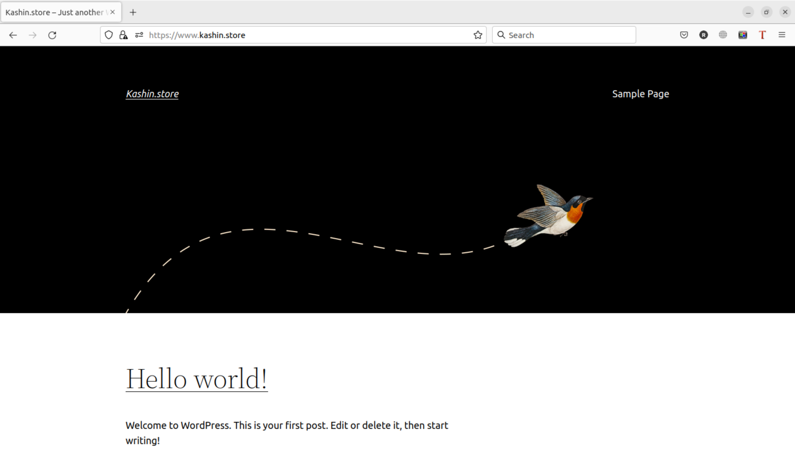
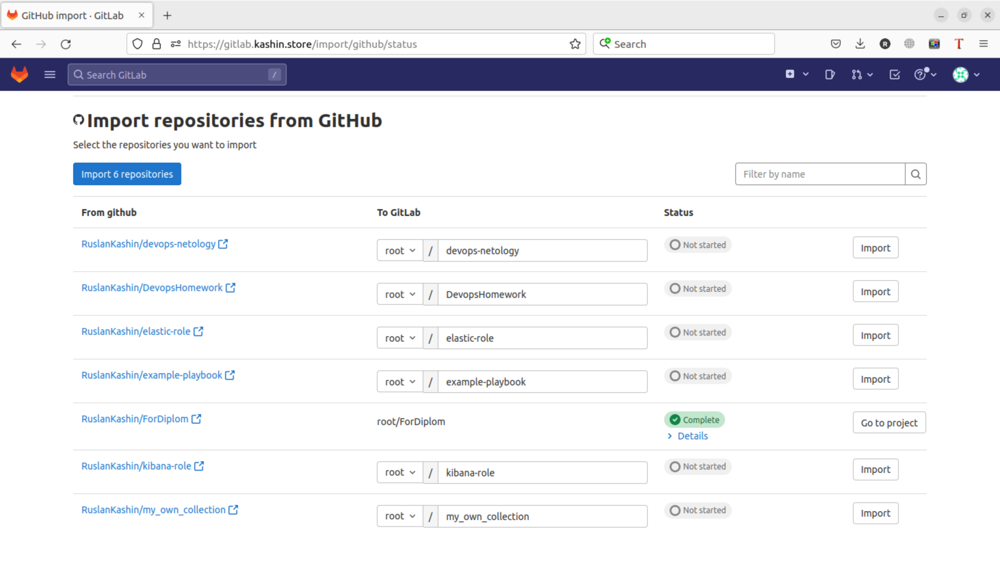

# Дипломный практикум в YandexCloud

---
## Этапы выполнения:

## 1. Регистрация доменного имени

Подойдет любое доменное имя на ваш выбор в любой доменной зоне.

ПРИМЕЧАНИЕ: Далее в качестве примера используется домен `you.domain` замените его вашим доменом.

Рекомендуемые регистраторы:
  - [nic.ru](https://nic.ru)
  - [reg.ru](https://reg.ru)

Цель:

1. Получить возможность выписывать [TLS сертификаты](https://letsencrypt.org) для веб-сервера.

Ожидаемые результаты:

1. У вас есть доступ к личному кабинету на сайте регистратора.
2. Вы зарезистрировали домен и можете им управлять (редактировать dns записи в рамках этого домена).

----------------------------------
> ## Результат 1 этапа:  
> Зарегистрировал домен `kashin.store`
> 
> 

----------------------------------
## 2. Создание инфраструктуры

Для начала необходимо подготовить инфраструктуру в YC при помощи [Terraform](https://www.terraform.io/).

Особенности выполнения:

- Бюджет купона ограничен, что следует иметь в виду при проектировании инфраструктуры и использовании ресурсов;
- Следует использовать последнюю стабильную версию [Terraform](https://www.terraform.io/).

Предварительная подготовка:

1. Создайте сервисный аккаунт, который будет в дальнейшем использоваться Terraform для работы с инфраструктурой с необходимыми и достаточными правами. Не стоит использовать права суперпользователя
2. Подготовьте [backend](https://www.terraform.io/docs/language/settings/backends/index.html) для Terraform:
   а. Рекомендуемый вариант: [Terraform Cloud](https://app.terraform.io/)  
   б. Альтернативный вариант: S3 bucket в созданном YC аккаунте.
3. Настройте [workspaces](https://www.terraform.io/docs/language/state/workspaces.html)
   а. Рекомендуемый вариант: создайте два workspace: *stage* и *prod*. В случае выбора этого варианта все последующие шаги должны учитывать факт существования нескольких workspace.  
   б. Альтернативный вариант: используйте один workspace, назвав его *stage*. Пожалуйста, не используйте workspace, создаваемый Terraform-ом по-умолчанию (*default*).
4. Создайте VPC с подсетями в разных зонах доступности.
5. Убедитесь, что теперь вы можете выполнить команды `terraform destroy` и `terraform apply` без дополнительных ручных действий.
6. В случае использования [Terraform Cloud](https://app.terraform.io/) в качестве [backend](https://www.terraform.io/docs/language/settings/backends/index.html) убедитесь, что применение изменений успешно проходит, используя web-интерфейс Terraform cloud.

Цель:

1. Повсеместно применять IaaC подход при организации (эксплуатации) инфраструктуры.
2. Иметь возможность быстро создавать (а также удалять) виртуальные машины и сети. С целью экономии денег на вашем аккаунте в YandexCloud.

Ожидаемые результаты:

1. Terraform сконфигурирован и создание инфраструктуры посредством Terraform возможно без дополнительных ручных действий.
2. Полученная конфигурация инфраструктуры является предварительной, поэтому в ходе дальнейшего выполнения задания возможны изменения.

----------------------------------
> ## Результат 2 этапа:  
> 1. Установил свежую версию Terraform
>   ```shell
>   ruslan@ruslan-notebook:~$ terraform -v
>   Terraform v1.2.9
>   on linux_amd64
>   ```
> 2. Создал сервисный аккаунт с ролью `editor`.
> 
> Сгенерировал в файл ключ доступа
>   ```
>   ruslan@ruslan-notebook:~$ yc iam key create --service-account-name kashindiplom --output /home/ruslan/myData/DevOps/DevopsHomework/Diplom/terraform/key.json
>   ```
> 3. Подготовил backend для Terraform: Создал S3 bucket в YC аккаунте.
> 
> 4. Написал конфигурацию terraform для создания VPC с подсетями в разных зонах доступности.
> 5. Cоздал Статический ключ доступа в Сервисной роли в YC. Скопировал access_key и secret_key из него. Создал файл **keyS3.conf** с таким содержанием:
>   ```
>   bucket     = "s3bucketkashindiplom"
>   access_key = "..."
>   secret_key = "..."
>   ``` 
> 
> 5. Выполнил:
>    ```shell
>    terraform init -backend-config=keyS3.conf
>    ```
> 6. Создал два воркспейса stage и prod
>   ```shell
>   ruslan@ruslan-notebook:~/myData/DevOps/DevopsHomework/Diplom/terraform$ terraform workspace list
>   * default
>   ruslan@ruslan-notebook:~/myData/DevOps/DevopsHomework/Diplom/terraform$ terraform workspace new stage
>   Created and switched to workspace "stage"!
>   ruslan@ruslan-notebook:~/myData/DevOps/DevopsHomework/Diplom/terraform$ terraform workspace new prod
>   Created and switched to workspace "prod"!
>   ruslan@ruslan-notebook:~/myData/DevOps/DevopsHomework/Diplom/terraform$ terraform workspace select stage
>   Switched to workspace "stage".
>   ruslan@ruslan-notebook:~/myData/DevOps/DevopsHomework/Diplom/terraform$ terraform workspace list
>     default
>     prod
>   * stage
>   ```
> 7. Выполнил terraform plan, terraform apply в воркспейсе prod и stage. Проверил что создалось в Облаке (для каждого воркспейса создалась сеть и 2 подсети, в S3 bucket пишется состояние конфигурации terraform). Проверил корректность работы `terraform destroy` и `terraform apply`.  
> Результат для `stage`:
> 
> 
> 
----------------------------------

## 3. Установка Nginx и LetsEncrypt

Необходимо разработать Ansible роль для установки Nginx и LetsEncrypt.

**Для получения LetsEncrypt сертификатов во время тестов своего кода пользуйтесь [тестовыми сертификатами](https://letsencrypt.org/docs/staging-environment/), так как количество запросов к боевым серверам LetsEncrypt [лимитировано](https://letsencrypt.org/docs/rate-limits/).**

Рекомендации:
  - Имя сервера: `you.domain`
  - Характеристики: 2vCPU, 2 RAM, External address (Public) и Internal address.

Цель:

1. Создать reverse proxy с поддержкой TLS для обеспечения безопасного доступа к веб-сервисам по HTTPS.

Ожидаемые результаты:

1. В вашей доменной зоне настроены все A-записи на внешний адрес этого сервера:
    - `https://www.you.domain` (WordPress)
    - `https://gitlab.you.domain` (Gitlab)
    - `https://grafana.you.domain` (Grafana)
    - `https://prometheus.you.domain` (Prometheus)
    - `https://alertmanager.you.domain` (Alert Manager)
2. Настроены все upstream для выше указанных URL, куда они сейчас ведут на этом шаге не важно, позже вы их отредактируете и укажите верные значения.
2. В браузере можно открыть любой из этих URL и увидеть ответ сервера (502 Bad Gateway). На текущем этапе выполнение задания это нормально!

_________________________________________
> ## Результат 3 этапа:  
> 1. Буду использовать DNS от YC. Домен делегирован под управление ns1.yandexcloud.net и ns2.yandexcloud.net.
> 
> 2. Сервер на котором будет работать Nginx должен иметь внешний статический IP адрес, чтобы можно было останавливать ВМ и включать когда нужно, для экономии средств в облаке. IP создал средствами terraform. Также средствами terraform создадал публичную зону DNS, и добавим в нее ресурсные записи.
> 3. Выполнил `terraform apply`. В YC создался статический внешний IP адрес и ресурсные записи в DNS.
> 
> 
> 4. Создам сразу всю тербуемую инфраструктуру:
>    * Main server (Nginx и LetsEncrypt)
>      - Имя сервера: vm01nginx  
>      - Характеристики: 2vCPU, 2 RAM, External address (Public) и Internal address. 
>    * MySQL cluster (2 сервера: Master/Slave):
>      - Имена серверов: vm02db01 и vm03db02  
>      - Характеристики: 4vCPU, 4 RAM, Internal address. 
>    * WordPress Server:
>      - Имя сервера: vm04app  
>      - Характеристики: 4vCPU, 4 RAM, Internal address.
>    * Gitlab и Gitlab-runner:
>      - Имя сервера: vm05gitlab и vm06runner  
>      - Характеристики: 4vCPU, 4 RAM, Internal address. 
>    * Metrics Server (Prometheus, Alert Manager, Node Exporter и Grafana):
>      - Имя сервера: vm07monitoring  
>      - Характеристики: 4vCPU, 4 RAM, Internal address.  
> 
>   Для `stage` задал 20% мощности, для `prod` - 100%.  
>   Результат после выполнения на `stage`:
>   
> 5. Вся полученная инфраструктура передается в папку `ansible` в автоматически сгенерированном файле `inventory.ini`. Файл этот генерируем terraform с помощию `inventory.tf` команды которого отрабатывают после того как в облаке будут созданы все сервера.
> 6. Выполнил роль `nginx` которая устанавливает `Nginx`, `Letsencrypt`, генерирует сертификаты для всех созданных доменов (если `workspace = stage`, то сертификаты тестовые), подкладывает файл с настроками.
> 7. Также устанавливаем на этом сервере `Node_exporter`, и далее будем его устаналвливать на всех серверах для сбора метрик.
> 8. Результат:
> 
> 
> 
> 
> 
> 
_________________________________________

## 4. Установка кластера MySQL

Необходимо разработать Ansible роль для установки кластера MySQL.

Рекомендации:
  - Имена серверов: `db01.you.domain` и `db02.you.domain`
  - Характеристики: 4vCPU, 4 RAM, Internal address.

Цель:

1. Получить отказоустойчивый кластер баз данных MySQL.

Ожидаемые результаты:

1. MySQL работает в режиме репликации Master/Slave.
2. В кластере автоматически создаётся база данных c именем `wordpress`.
3. В кластере автоматически создаётся пользователь `wordpress` с полными правами на базу `wordpress` и паролем `wordpress`.

_________________________________________
> ## Результат 4 этапа:  
> 1. Серверы уже были подготовлены на предыдущем этапе - `db01` и `db02`.
> 2. Разработана роль устанавливающая MySQL и выполняющая все последующие настройки.
> 3. В кластере автоматически создается база данных c именем `wordpress` и пользователь `wordpress` с полными правами на базу `wordpress` и паролем `wordpress`:
> 
> 4. MySQL в режиме репликации:
> 

___
## 5. Установка WordPress

Необходимо разработать Ansible роль для установки WordPress.

Рекомендации:
  - Имя сервера: `app.you.domain`
  - Характеристики: 4vCPU, 4 RAM, Internal address.

Цель:

1. Установить [WordPress](https://wordpress.org/download/). Это система управления содержимым сайта ([CMS](https://ru.wikipedia.org/wiki/Система_управления_содержимым)) с открытым исходным кодом.


По данным W3techs, WordPress используют 64,7% всех веб-сайтов, которые сделаны на CMS. Это 41,1% всех существующих в мире сайтов. Эту платформу для своих блогов используют The New York Times и Forbes. Такую популярность WordPress получил за удобство интерфейса и большие возможности.

Ожидаемые результаты:

1. Виртуальная машина на которой установлен WordPress и Nginx/Apache (на ваше усмотрение).
2. В вашей доменной зоне настроена A-запись на внешний адрес reverse proxy:
    - `https://www.you.domain` (WordPress)
3. На сервере `you.domain` отредактирован upstream для выше указанного URL и он смотрит на виртуальную машину на которой установлен WordPress.
4. В браузере можно открыть URL `https://www.you.domain` и увидеть главную страницу WordPress.
---
> ## Результат 5 этапа:  
> 1. Установлен `wordpress`.
> 
> 2. Связан с БД созданной на предыдущем шаге.
> 3. Если кластер выключен: 
> 4. Если кластер включен: 
---
## 6. Установка Gitlab CE и Gitlab Runner

Необходимо настроить CI/CD систему для автоматического развертывания приложения при изменении кода.

Рекомендации:
  - Имена серверов: `gitlab.you.domain` и `runner.you.domain`
  - Характеристики: 4vCPU, 4 RAM, Internal address.

Цель:
1. Построить pipeline доставки кода в среду эксплуатации, то есть настроить автоматический деплой на сервер `app.you.domain` при коммите в репозиторий с WordPress.

Подробнее об [Gitlab CI](https://about.gitlab.com/stages-devops-lifecycle/continuous-integration/)

Ожидаемый результат:

1. Интерфейс Gitlab доступен по https.
2. В вашей доменной зоне настроена A-запись на внешний адрес reverse proxy:
    - `https://gitlab.you.domain` (Gitlab)
3. На сервере `you.domain` отредактирован upstream для выше указанного URL и он смотрит на виртуальную машину на которой установлен Gitlab.
3. При любом коммите в репозиторий с WordPress и создании тега (например, v1.0.0) происходит деплой на виртуальную машину.
---
> ## Результат 6 этапа:  
> 1. Установлен `Gitlab`.
>
---

## 7. Установка Prometheus, Alert Manager, Node Exporter и Grafana

Необходимо разработать Ansible роль для установки Prometheus, Alert Manager и Grafana.

Рекомендации:
  - Имя сервера: `monitoring.you.domain`
  - Характеристики: 4vCPU, 4 RAM, Internal address.

Цель:

1. Получение метрик со всей инфраструктуры.

Ожидаемые результаты:

1. Интерфейсы Prometheus, Alert Manager и Grafana доступены по https.
2. В вашей доменной зоне настроены A-записи на внешний адрес reverse proxy:
  - `https://grafana.you.domain` (Grafana)
  - `https://prometheus.you.domain` (Prometheus)
  - `https://alertmanager.you.domain` (Alert Manager)
3. На сервере `you.domain` отредактированы upstreams для выше указанных URL и они смотрят на виртуальную машину на которой установлены Prometheus, Alert Manager и Grafana.
4. На всех серверах установлен Node Exporter и его метрики доступны Prometheus.
5. У Alert Manager есть необходимый [набор правил](https://awesome-prometheus-alerts.grep.to/rules.html) для создания алертов.
2. В Grafana есть дашборд отображающий метрики из Node Exporter по всем серверам.

---
> ## Результат 7 этапа:  
> 1. Установлены и настроены `Prometheus`, `Alert Manager` и `Grafana`.
>
---





